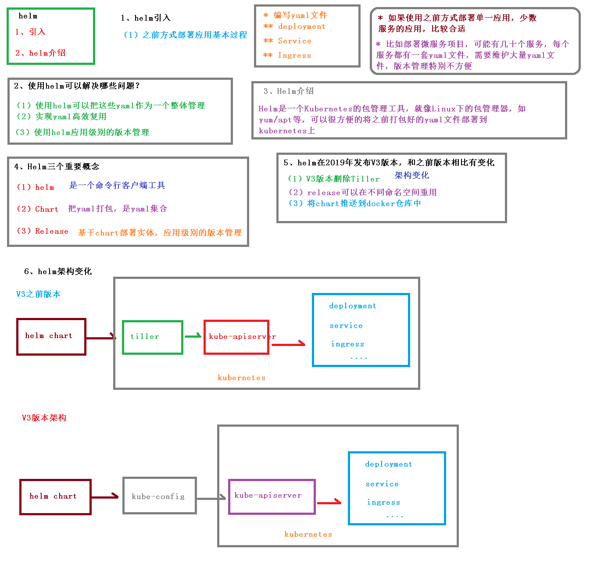
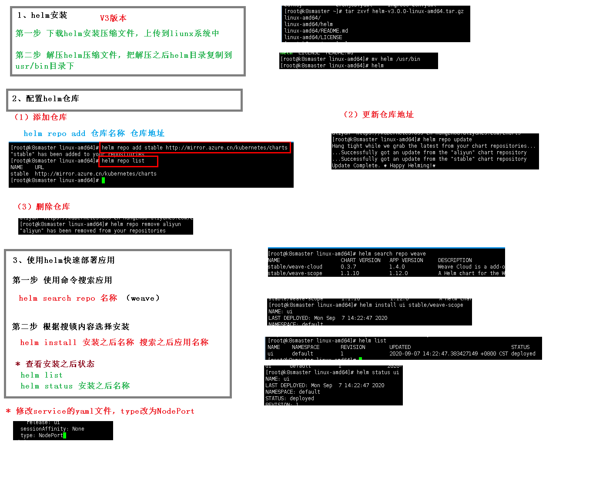
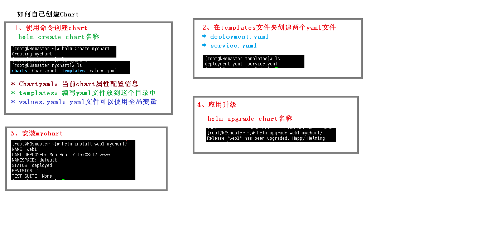
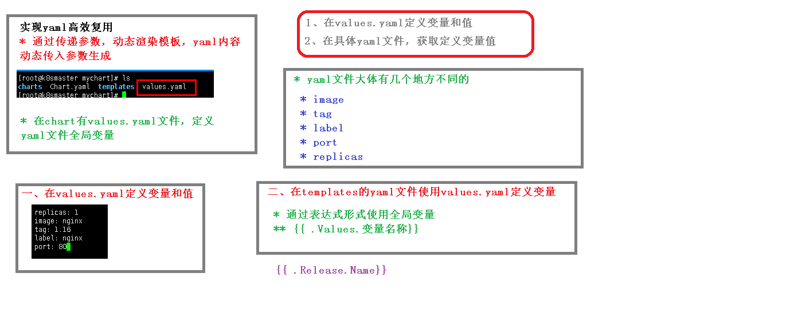

# Helm

> Helm 官方文档：https://helm.sh/docs/intro/quickstart/

## 一、简介

Helm 是 Kubernetes 的包管理器。包管理器类似于我们在 Ubuntu 中使用的 apt、Centos 中使用的 yum 或者 Python 中的 pip 一样，能快速查找、下载和安装软件包。Helm 由客户端组件 helm 和服务端组件 Tiller 组成, 能够将一组 K8S 资源打包统一管理, 是查找、共享和使用为 Kubernetes 构建的软件的最佳方式。

解决问题：

能对多个模板文件（yaml 文件）进行统一管理，设想一下，如果没有 helm，如何执行多个模板文件呢？那就得一个个的执行 kubectl apply -f xxx.yaml。而如今有了 helm，只需要将文件放入 chart 包中，然后一句 helm install xxx path 便可以执行所有的模板文件。当然 helm 的好处不仅于此，还有其他便利之处，有待大家挖掘。

### 1.1 基本使用

```js
//创建一个chart包模板
helm create xxx(chart包名)

//安装
helm install xxx -n namespace

//卸载
helm uninstall xxx -n namespace

//预填充变量/参数
helm install xxx -n namespace --dry-run
```

### 1.2 chart 包结构


### 1.3 架构介绍

组件

Helm 包含两个组件，分别是 helm 客户端 和 Tiller 服务器：

- helm 是一个命令行工具，用于本地开发及管理 chart，chart 仓库管理等
- Tiller 是 Helm 的服务端。Tiller 负责接收 Helm 的请求，与 k8s 的 apiserver 交互，根据 chart 来生成一个 release 并管理 release
- chart Helm 的打包格式叫做 chart，所谓 chart 就是一系列文件, 它描述了一组相关的 k8s 集群资源
- release 使用 helm install 命令在 Kubernetes 集群中部署的 Chart 称为 Release
- Repoistory Helm chart 的仓库，Helm 客户端通过 HTTP 协议来访问存储库中 chart 的索引文件和压缩包

原理

下面图描述了 Helm 的几个关键组件 Helm（客户端）、Tiller（服务器）、Repository（Chart 软件仓库）、Chart（软件包）之间的关系以及它们之间如何通信 ：


创建 release

- helm 客户端从指定的目录或本地 tar 文件或远程 repo 仓库解析出 chart 的结构信息
- helm 客户端指定的 chart 结构和 values 信息通过 gRPC 传递给 Tiller
- Tiller 服务端根据 chart 和 values 生成一个 release
- Tiller 将 install release 请求直接传递给 kube-apiserver
  删除 release

- helm 客户端从指定的目录或本地 tar 文件或远程 repo 仓库解析出 chart 的结构信息
- helm 客户端指定的 chart 结构和 values 信息通过 gRPC 传递给 Tiller
- Tiller 服务端根据 chart 和 values 生成一个 release
- Tiller 将 delete release 请求直接传递给 kube-apiserver
  更新 release

- helm 客户端将需要更新的 chart 的 release 名称 chart 结构和 value 信息传给 Tiller
- Tiller 将收到的信息生成新的 release，并同时更新这个 release 的 history
- Tiller 将新的 release 传递给 kube-apiserver 进行更新

### 1.4 Hook 机制

和 Kubernetes 里面的容器一样，Helm 也提供了 Hook 的机制，允许 chart 开发人员在 release 的生命周期中的某些节点来进行干预 。 可以在以下场景中得以使用：

- 在加载任何其他 chart 之前，在安装过程中加载 ConfigMap 或 Secret
- 在安装新 chart 之前执行作业以备份数据库，然后在升级后执行第二个作业以恢复数据
- 在删除 release 之前运行作业，以便在删除 release 之前优雅地停止服务

种类

- 预安装 pre-install：在模板渲染后，kubernetes 创建任何资源之前执行
- 安装后 post-install：在所有 kubernetes 资源安装到集群后执行
- 预删除 pre-delete：在从 kubernetes 删除任何资源之前执行删除请求
- 删除后 post-delete：删除所有 release 的资源后执行
- 升级前 pre-upgrade：在模板渲染后，但在任何资源升级之前执行
- 升级后 post-upgrade：在所有资源升级后执行
- 预回滚 pre-rollback：在模板渲染后，在任何资源回滚之前执行
- 回滚后 post-rollback：在修改所有资源后执行回滚请求
- crd-install：在运行其他检查之前添加 CRD 资源，只能用于 chart 中其他的资源清单定义的 CRD 资源。

流程

Hooks 允许开发人员在 release 的生命周期中的一些关键节点执行一些钩子函数，我们正常安装一个 chart 包的时候的生命周期如下所示：

- 用户运行 helm install foo
- chart 被加载到服务端 Tiller Server 中
- 经过一些验证，Tiller Server 渲染 foo 模板
- Tiller 将产生的资源加载到 kubernetes 中去
- Tiller 将 release 名称和其他数据返回给 Helm 客户端
- Helm 客户端退出

如果开发人员在 install 的生命周期中定义了两个 hook：pre-install 和 post-install，那么我们安装一个 chart 包的生命周期就会多一些步骤了：

- 用户运行 helm install foo
- chart 被加载到服务端 Tiller Server 中
- 经过一些验证，Tiller Server 渲染 foo 模板
- Tiller 将 hook 资源加载到 kubernetes 中，准备执行 pre-install hook
- Tiller 会根据权重对 hook 进行排序（默认分配权重 0，权重相同的 hook 按升序排序）
- Tiller 然后加载最低权重的 hook
- Tiller 等待，直到 hook 准备就绪
- Tiller 将产生的资源加载到 kubernetes 中
- Tiller 执行 post-install hook
- Tiller 等待，直到 hook 准备就绪
- Tiller 将 release 名称和其他数据返回给客户端
- Helm 客户端退出

等待 hook 准备就绪，这是一个阻塞的操作，如果 hook 中声明的是一个 Job 资源，那么 Tiller 将等待 Job 成功完成，如果失败，则发布失败，在这个期间，Helm 客户端是处于暂停状态的。

对于所有其他类型，只要 kubernetes 将资源标记为加载（添加或更新），资源就被视为就绪状态，当一个 hook 声明了很多资源是，这些资源是被串行执行的。

另外需要注意的是 hook 创建的资源不会作为 release 的一部分进行跟踪和管理，一旦 Tiller Server 验证了 hook 已经达到了就绪状态，它就不会去管它了。

所以，如果我们在 hook 中创建了资源，那么不能依赖 helm delete 去删除资源，因为 hook 创建的资源已经不受控制了，要销毁这些资源，需要在 pre-delete 或者 post-delete 这两个 hook 函数中去执行相关操作，或者将 helm.sh/hook-delete-policy 这个 annotation 添加到 hook 模板文件中。

使用方式

同样，通过模板（yaml 文件）的形式创建资源，通过资源来处理你想要履行的逻辑

```js
  apiVersion: batch/v1
    kind: Job
    metadata:
      name: post-install-job
      annotations:
        # 注意，如果没有下面的这个注释的话，当前的这个Job就会被当成release的一部分
        "helm.sh/hook": post-install
        "helm.sh/hook-weight": "-5" //权重，按升序对这些 hook 进行排序执行
        "helm.sh/hook-delete-policy": hook-succeeded
    spec:
      template:
        metadata:
          name: post-install-job-test
        spec:
          restartPolicy: Never
          containers:
          - name: post-install-job
            image: xxxxx
            command: ["/bin/sleep", "{ { default "20" .Values.sleepTime } }"]
```

上述模板放在 helm 包执行后，helm 安装的成功回显信息会在 20s 后才回显，而不会立马回显。

删除资源的策略

- hook-succeeded：表示 Tiller 在 hook 成功执行后删除 hook 资源
- hook-failed：表示如果 hook 在执行期间失败了，Tiller 应该删除 hook 资源
- before-hook-creation：表示在删除新的 hook 之前应该删除以前的 hook
  配置方式（在 annotations 中配置）

```js
annotations:
    "helm.sh/hook-delete-policy": hook-succeeded //配置单个策略
  ----------------------------------------------------------------
  annotations:
    "helm.sh/hook-delete-policy": "hook-succeeded,hook-failed" //配置多个策略

```

## 二、安装

安装包的下载地址：https://github.com/helm/helm/releases

下载软件包：helm-v3.6.2-linux-amd64.tar.gz

解压：

```js
[root@master ~]# tar zxf helm-v3.6.2-linux-amd64.tar.gz
[root@master ~]# cd linux-amd64/
[root@master linux-amd64]# ls
helm  LICENSE  README.md
[root@master linux-amd64]# cp helm /usr/bin/
```

使命令自动补齐：

```js
[root@master linux-amd64]# echo "source <(helm completion bash)" >> ~/.bashrc
[root@master linux-amd64]# source ~/.bashrc
```

helm 部署完成

```js
[root@master linux-amd64]# helm version
version.BuildInfo{Version:"v3.6.2", GitCommit:"ee407bdf364942bcb8e8c665f82e15aa28009b71", GitTreeState:"clean", GoVersion:"go1.16.5"}
```

## 三、使用

### 3.1 搜索官方 helm hub chart 库

```js
$ helm search hub redis
```

常用第三方库：

```js
1、微软的chart仓库，基本上官网有的chart这里都有。
http://mirror.azure.cn/kubernetes/charts/

2、阿里的chart仓库
https://apphub.aliyuncs.com/

3、Kubeapps Hub 官方chart仓库，国内有点不好使
https://hub.kubeapps.com/charts/incubator
```

### 3.2 将仓库添加到 helm

```js
$ helm repo add mychart https://apphub.aliyuncs.com/
Error: looks like "https://reg.westos.org/chartrepo/charts" is not a valid chart repository or cannot be reached: Get https://reg.westos.org/chartrepo/charts/index.yaml: x509: certificate signed by unknown authority
```

报错原因是缺少证书，可以将证书复制到 redhat 的全局证书地址

```js
$ cd /etc/docker/certs.d/harbor.com/
$ ls
ca.crt
$ cp ca.crt /etc/pki/ca-trust/source/anchors/
$ update-ca-trust      #更新证书
```

### 3.3 创建自定义 helm chart

```js
$ helm create mychart
Creating mychart
```

创建后会在目录创建一个 mychart 目录

```js
[root@master  helm]# ls
mychart  redis-ha
[root@master  helm]# tree mychart/      #查看结构
mychart/
├── charts
├── Chart.yaml
├── templates
│   ├── deployment.yaml
│   ├── _helpers.tpl
│   ├── hpa.yaml
│   ├── ingress.yaml
│   ├── NOTES.txt
│   ├── serviceaccount.yaml
│   ├── service.yaml
│   └── tests
│       └── test-connection.yaml
└── values.yaml
```

其中 mychart 目录下的 templates 目录中保存有部署的模板文件，values.yaml 中定义了部署的变量，Chart.yaml 文件包含有 version（chart 版本）和 appVersion（包含应用的版本）

查看并且更改变量文件 values.yaml

```js
$ vim values.yaml
```

选择镜像及标签和副本数（这里设置 1 个）

```js
replicaCount: 1;
image: repository: myapp;
tag: v1;
pullPolicy: IfNotPresent;
```

依赖和模板配置是否正确

```js
$ helm lint .
==> Linting .
[INFO] Chart.yaml: icon is recommended

1 chart(s) linted, no failures
```

### 3.4 将自定义应用打包

```js
$ ll
total 4
drwxr-xr-x 4 root root 4096 Jul  5 10:45 mychart
$ helm package mychart/
Successfully packaged chart and saved it to: /data/helm/mychart-0.1.0.tgz

# 打包后会在当前目录下生成一个名为mychart-0.1.0.tgz压缩包
$ ls
mychart  mychart-0.1.0.tgz
```

其中 0.1.0 为在 Chart.yaml 文件中定义的 version（chart 版本）信息

再次添加

```js
$ helm repo add mychart https://harbor域名:端口号/chartrepo/charts
"mychart" has been added to your repositories
```

添加成功，查看仓库

```js
$ helm repo list
NAME        URL
mychart     http://mirror.azure.cn/kubernetes/charts/
```

### 3.5 查询第三方库

```js
$ helm search repo redis -l
```

注意：加 -l 选项可以查看历史版本

### 3.6 删除第三方库

```js
$ helm repo remove testdata
"testdata" has been removed from your repositories
```

### 3.7 更新 repo 仓库资源

```js
$ helm repo update
```

### 3.8 更新 image

```js
$ helm upgrade --set image.tag='v2019-05-09-18-48-40' study-api-en-oral myharbor/study-api-en-oral
```

### 3.9 回滚 relase

```js
$ helm hist study-api-en-oral

$ helm rollback 4
```

## 四、笔记图





