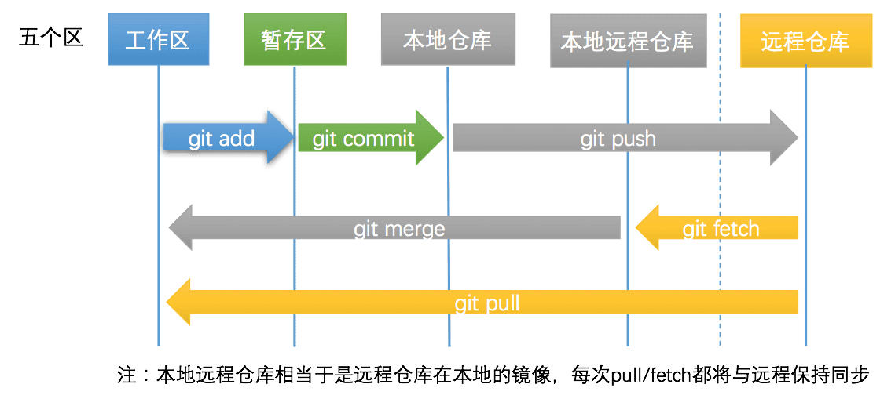
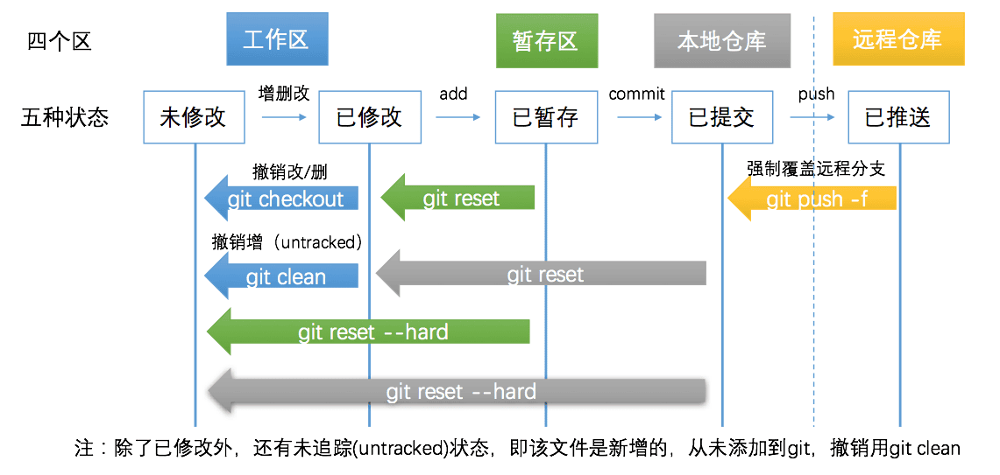

## Git 操作流程

> [在线学习网站](https://learngitbranching.js.org/)

### 代码提交和同步代码



### 代码撤销和撤销同步



## Git 常用操作命令

### 代码提交和同步代码

第零步: 工作区与仓库保持一致  
第一步: 文件增删改，变为已修改状态  
第二步: git add ，变为已暂存状态

```bash
$ git status
$ git add --all # 当前项目下的所有更改
$ git add .  # 当前目录下的所有更改
$ git add xx/xx.py xx/xx2.py  # 添加某几个文件
```

第三步: git commit，变为已提交状态

```bash
$ git commit -m"<这里写commit的描述>"
```

第四步: git push，变为已推送状态

```bash
$ git push -u origin master # 第一次需要关联上
$ git push # 之后再推送就不用指明应该推送的远程分支了
$ git branch # 可以查看本地仓库的分支
$ git branch -a # 可以查看本地仓库和本地远程仓库(远程仓库的本地镜像)的所有分支
```

::: tip
在某个分支下

```bash
$ git status
$ git add -a
$ git status
$ git commit -m 'xxx'
$ git pull --rebase
$ git push origin xxbranch
```

:::

### 代码撤销和撤销同步

#### 已修改，但未暂存

```bash
$ git diff # 列出所有的修改
$ git diff xx/xx.py xx/xx2.py # 列出某(几)个文件的修改

$ git checkout # 撤销项目下所有的修改
$ git checkout . # 撤销当前文件夹下所有的修改
$ git checkout xx/xx.py xx/xx2.py # 撤销某几个文件的修改
$ git clean -f # untracked状态，撤销新增的文件
$ git clean -df # untracked状态，撤销新增的文件和文件夹

# Untracked files:
#  (use "git add <file>..." to include in what will be committed)
#
#	xxx.py
```

#### 已暂存，未提交

> 这个时候已经执行过 git add，但未执行 git commit，但是用 git diff 已经看不到任何修改。 因为 git diff 检查的是工作区与暂存区之间的差异。

```bash
$ git diff --cached # 这个命令显示暂存区和本地仓库的差异

$ git reset # 暂存区的修改恢复到工作区
$ git reset --soft # 与git reset等价，回到已修改状态，修改的内容仍然在工作区中
$ git reset --hard # 回到未修改状态，清空暂存区和工作区
```

> git reset --hard 操作等价于 git reset 和 git checkout 2 步操作

#### 已提交，未推送

> 执行完 commit 之后，会在仓库中生成一个版本号(hash 值)，标志这次提交。之后任何时候，都可以借助这个 hash 值回退到这次提交。

```bash
$ git diff <branch-name1> <branch-name2> # 比较2个分支之间的差异
$ git diff master origin/master # 查看本地仓库与本地远程仓库的差异

$ git reset --hard origin/master # 回退与本地远程仓库一致
$ git reset --hard HEAD^ # 回退到本地仓库上一个版本
$ git reset --hard <hash code> # 回退到任意版本
$ git reset --soft/git reset # 回退且回到已修改状态，修改仍保留在工作区中。
```

#### 已推送到远程

```bash
$ git push -f orgin master # 强制覆盖远程分支
$ git push -f # 如果之前已经用 -u 关联过，则可省略分支名
```

> 慎用，一般情况下，本地分支比远程要新，所以可以直接推送到远程，但有时推送到远程后发现有问题，进行了版本回退，旧版本或者分叉版本推送到远程，需要添加 -f 参数，表示强制覆盖。

### 其他常用命令

#### 关联远程仓库

```bash
# 没有Git仓库需要初始化
$ git init

# 关联远程仓库
$ git remote add <name> <git-repo-url>
# 例如 git remote add origin https://github.com/xxxxxx # 是远程仓库的名称，通常为 origin

# 关联多个远程仓库
$ git remote add <name> <another-git-repo-url>
# 例如 git remote add coding https://coding.net/xxxxxx

# 查看管理的远程仓库
$ git remote -v

# 克隆到本地
$ git clone <git-repo-url>

# 把别人的仓库地址改为自己的
$ git remote set-url origin <your-git-url>
```

#### 切换分支

```bash
# 新建分支并切换
$ git checkout -b <new-branch-name>
# 例如 git checkout -b dev
# 如果仅新建，不切换，则去掉参数 -b

# 看看当前有哪些分支
$ git branch
# * dev
#   master # 标*号的代表当前所在的分支

# 看看当前本地&远程有哪些分支
$ git branch -a
# * dev
#   master
#   remotes/origin/master

# 切换到现有的分支
$ git checkout master

# 把dev分支合并到master分支
$ git merge <branch-name>
# 例如 git merge dev

# 把本地master分支推送到远程去
$ git push origin master
# 你可以使用git push -u origin master将本地分支与远程分支关联，之后仅需要使用git push即可。

# 远程分支被别人更新了，你需要更新代码
$ git pull origin <branch-name>
# 之前如果push时使用过-u，那么就可以省略为git pull

# 本地有修改，能不能先git pull
$ git stash # 工作区修改暂存
$ git pull  # 更新分支
$ git stash pop # 暂存修改恢复到工作区
```

#### 撤销操作

```bash
# 恢复暂存区文件到工作区
$ git checkout <file-name>

# 恢复暂存区的所有文件到工作区
$ git checkout .

# 重置暂存区的某文件，与上一次commit保持一致，但工作区不变
$ git reset <file-name>

# 重置暂存区与工作区，与上一次commit保持一致
$ git reset --hard <file-name>
# 如果是回退版本(commit)，那么file，变成commit的hash码就好了。

# 去掉某个commit
$ git revert <commit-hash>
# 实质是新建了一个与原来完全相反的commit，抵消了原来commit的效果

# reset回退错误恢复
$ git reflog #查看最近操作记录
$ git reset --hard HEAD{5} #恢复到前五笔操作
$ git pull origin backend-log #再次拉取代码
```

#### 版本回退与前进

```bash
# 查看历史版本
$ git log

# 这样的log不好看，试试这个
$ git log --graph --decorate --abbrev-commit --all

# 检出到任意版本
$ git checkout a5d88ea
# hash码很长，通常6-7位就够了

# 远程仓库的版本很新，但是你还是想用老版本覆盖
$ git push origin master --force
# 或者 git push -f origin master

# 觉得commit太多了? 多个commit合并为1个
$ git rebase -i HEAD~4
# 这个命令，将最近4个commit合并为1个，HEAD代表当前版本。将进入VIM界面，你可以修改提交信息。推送到远程分支的commit，不建议这样做，多人合作时，通常不建议修改历史。

# 想回退到某一个版本
$ git reset --hard <hash>
# 例如 git reset --hard a3hd73r
# --hard代表丢弃工作区的修改，让工作区与版本代码一模一样，与之对应，--soft参数代表保留工作区的修改。

# 想回退到上一个版本，有没有简便方法?
$ git reset --hard HEAD^

# 回退到上上个版本呢?
$ git reset --hard HEAD^^

# 回退错了，能不能前进呀
$ git reflog
# 这个命令保留了最近执行的操作及所处的版本，每条命令前的hash值，则是对应版本的hash值。使用上述的git checkout 或者 git reset命令 则可以检出或回退到对应版本。

# 刚才commit信息写错了，可以修改吗
$ git commit --amend

# 看看当前状态吧
$ git status
```

### 配置属于你的 Git

```bash
# 看看当前的配置
$ git config --list

# 配置你的名字
$ git config --global user.name "<name>"
#  --global为可选参数，该参数表示配置全局信息

# 希望别人看到你的commit可以联系到你
$ git config --global user.email "<email address>"

# 有些命令很长，能不能简化一下
$ git config --global alias.logg "log --graph --decorate --abbrev-commit --all"
# 之后就可以开心地使用 git log了
```
