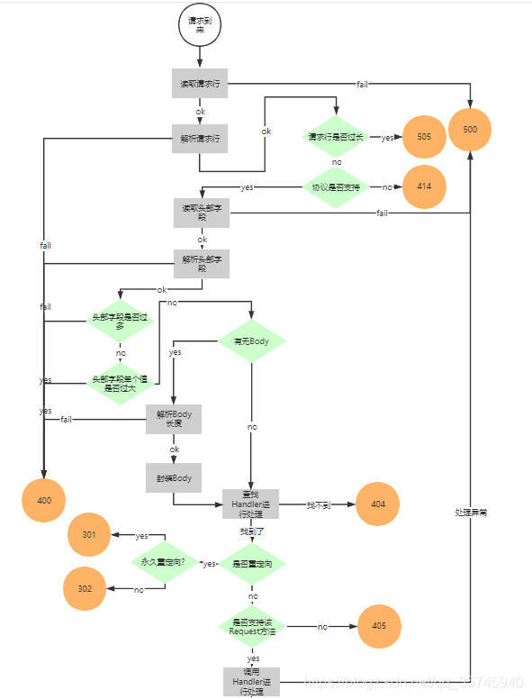
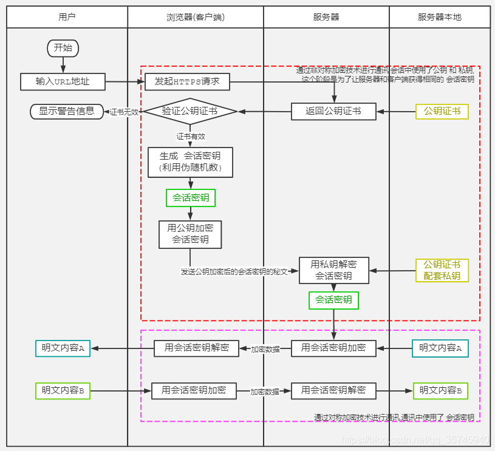
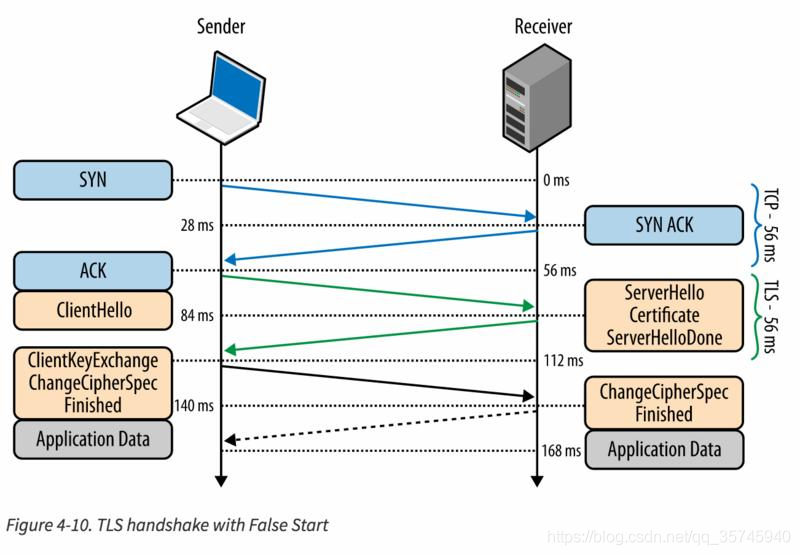
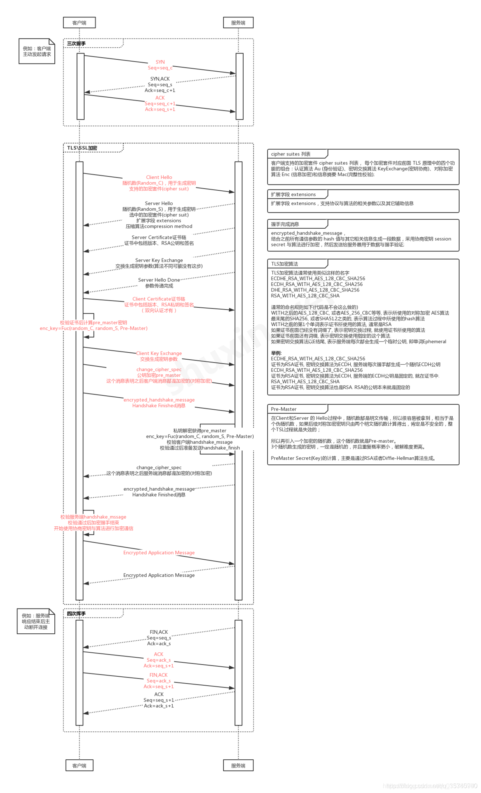

## 一、HTTP

HTTP 是超文本传输协议，全称“Hyper Text Transfer Protocol”，是一个基于`请求与响应`，`无状态`的，`应用层`的协议，常基于 TCP/IP 协议传输数据，互联网上应用最为广泛的一种网络协议,所有的 WWW 文件都必须遵守这个标准。设计 HTTP 的初衷是为了提供一种发布和接收 HTML 页面的方法。

### 1.1 HTTP 工作原理图

状态解释：

- 500 Internal Server Error 服务器内部错误，无法完成请求
- 505 HTTP Version not supported 服务器不支持请求的 HTTP 协议的版本，无法完成处理
- 414 Request-URI Too Large 请求的 URI 过长（URI 通常为网址），服务器无法处理
- 400 Bad Request 客户端请求的语法错误，服务器无法理解
- 404 Not Found 服务器无法根据客户端的请求找到资源（网页）。通过此代码，网站设计人员可设置"您所请求的资源无法找到"的个性页面
- 301 Moved Permanently 永久移动。请求的资源已被永久的移动到新 URI，返回信息会包括新的 URI，浏览器会自动定向到新 URI。今后任何新的请求都应使用新的 URI 代替
- 302 Found 临时移动。与 301 类似。但资源只是临时被移动。客户端应继续使用原有 URI
- 405 Method Not Allowed 客户端请求中的方法被禁止
- 200 ok 请求成功。图中没显示来。

## 二、HTTPS

HTTPS 协议是由 SSL/TLS+HTTP 协议构建的可进行加密传输、身份认证的网络协议，要比 http 协议安全  
HTTPS 协议的主要作用可以分为两种：一种是建立一个信息安全通道，来保证数据传输的安全；另一种就是确认网站的真实性。

### 2.1 HTTPS 工作原理图

## 三、HTTP 与 HTTPS 区别

- https 协议需要到 CA 申请证书，一般免费证书较少，因而需要一定费用。
- http 是超文本传输协议，信息是明文传输，https 则是具有安全性的 ssl/tls 加密传输协议。
- http 和 https 使用的是完全不同的连接方式，用的端口也不一样，前者是 80，后者是 443。
- http 的连接很简单，是无状态的；HTTPS 协议是由 SSL/TLS+HTTP 协议构建的可进行加密传输、身份认证的网络协议，比 http 协议安全。

### 3.1 HTTPS 的缺点

HTTPS 的优点就是安全，没什么可说的，虽然说 HTTPS 有很大的优势，但其相对来说，还是存在不足之处的：

- HTTPS 协议握手阶段比较费时，会使页面的加载时间延长近 50%，增加 10%到 20%的耗电；
- HTTPS 连接缓存不如 HTTP 高效，会增加数据开销和功耗，甚至已有的安全措施也会因此而受到影响；
- SSL 证书需要钱，功能越强大的证书费用越高，个人网站、小网站没有必要一般不会用。
- SSL 证书通常需要绑定 IP，不能在同一 IP 上绑定多个域名，IPv4 资源不可能支撑这个消耗。
- HTTPS 协议的加密范围也比较有限，在黑客攻击、拒绝服务攻击、服务器劫持等方面几乎起不到什么作用。最关键的，SSL 证书的信用链体系并不安全，特别是在某些国家可以控制 CA 根证书的情况下，中间人攻击一样可行。

### 3.2 SSL 与 TLS

#### 3.2.1 历史

> 1994 年，NetScape 公司设计了 SSL 协议（Secure Sockets Layer）的 1.0 版，但是未发布。  
> 1995 年，NetScape 公司发布 SSL 2.0 版，很快发现有严重漏洞。  
> 1996 年，SSL 3.0 版问世，得到大规模应用。  
> 1999 年，互联网标准化组织 ISOC 接替 NetScape 公司，发布了 SSL 的升级版 TLS 1.0 版。  
> 2006 年和 2008 年，TLS 进行了两次升级，分别为 TLS 1.1 版和 TLS 1.2 版。最新的变动是 2011 年 TLS 1.2 的修订版，在 2018 年也发布了 TLS1.3 版本。  
> TLS 1.0 通常被标示为 SSL 3.1，TLS 1.1 为 SSL 3.2，TLS 1.2 为 SSL 3.3。

#### 3.2.2 介绍

SSL：（Secure Socket Layer，安全套接字层），位于可靠的面向连接的网络层协议和应用层协议之间的一种协议层。SSL 通过互相认证、使用数字签名确保完整性、使用加密确保私密性，以实现客户端和服务器之间的安全通讯。该协议由两层组成：SSL 记录协议和 SSL 握手协议。  
TLS：(Transport Layer Security，传输层安全协议)，用于两个应用程序之间提供保密性和数据完整性。该协议由两层组成：TLS 记录协议和 TLS 握手协议。

目前应用的最广泛的 TLS 是 1.2，而之前的协议（TLS1.1/1.0、SSLv3/v2）都已经被认为是不安全的了。

#### 3.2.3 **SSL 与 TLS 的关系**

TLS 是 SSL 3.0 的后续版本。在 TLS 与 SSL3.0 之间存在着显著的差别，主要是它们所支持的加密算法不同，所以 TLS 与 SSL3.0 不能互操作。

> SSL 是 Netscape 开发的专门用户保护 Web 通讯的，目前版本为 3.0。最新版本的 TLS(Transport Layer Security，传输层安全协议)是 IETF(Internet Engineering Task Force，Internet 工程任务组)制定的一种新的协议。最新版本的 TLS 1.0，它建立在 SSL 3.0 协议规范之上，是 SSL 3.0 的后续版本。两者差别极小，可以理解为 SSL 3.1。

#### 3.2.4 SSL 与 TLS 的功能:

- 在互联网上传输加密过的资料以达到防窃取的目的。
- 保持从端点 A 到端点 B 的传送路途中资料的完整性。
- 透过 SSL 证书内的公共金钥加密资料传输至服务器端，服务器端用私密金钥解密来证明自己的身份。

### 3.3 HTTPS 优化

我们知道 Https 比 Http 慢的原因在于 tcp 三次握手之后，还有 TLS 握手，可以通过简化这部分的握手来优化。

TCP 三次握手和 TLS 握手流程图

详细图：

**优化点**

- 利用 session id，当我们第一次连接之后，客户端会生成 session id，当下一次客户端再次和服务端连接的时候，通过携带的 session id 如果在服务端可以找到，那么就认为客户端是可信赖的。
- 利用 session ticket，也在客户端连接的时候会附带上，当再次连接的时候，直接解密 session ticket，如果解密成功，则认为是可信赖，直接进行数据传输。
- 对于分布式系统，当在一个服务器生成的 session id，把它同步到其他服务器，那么当客户端连接其他服务器的时候，直接可以通过这个 id 判断是否可信赖。
- 利用 tcp 连接优化，前面介绍 tcp 三次握手的时候，数据域没有携带数据的，那么可以在 tcp 三次握手的时候，就携带数据，减少握手次数。
- 证书验证优化，TLS 握手过程中，客户端需要验证证书的有效性，这一部分可以直接通过服务器验证，将结果缓存，将验证结果返回给客户端，客户端在本地校验结果是否真实。
