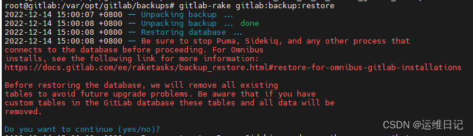

**简介：**

对 gitlab 进行备份将会创建一个包含所有库和附件的归档文件，对备份的恢复只能恢复到与备份时的 gitlab 相同的版本。将 gitlab 迁移到另一台服务器上的最佳方法就是通过备份和还原。Gitlab 提供了一个简单的命令行来备份整个 gitlab，并且能灵活的满足需求。

备份配置 备份文件将保存在配置文件中定义的 backup_path 中，文件名为 TIMESTAMP_GITLAB_BACKUP.TAR，TIMESTAMP 为备份的时间戳。TIMESTAMP 的格式为：EPOCH_YYYY_MM_DD_Gitlab-version。 默认的备份文件目录为：/var/opt/gitlab/backups，如果自定义备份目录需要赋予目录 git 权限，具体操作如下： 配置文件中加入：

```bash
root@test:~# cat /etc/gitlab/gitlab.rb | grep backup_path
# gitlab_rails['manage_backup_path'] = true
# gitlab_rails['backup_path'] = "/var/opt/gitlab/backups"
```

## 一. 备份操作

### 1.1 手动备份：

```bash
root@test:~# gitlab-rake gitlab:backup:create
```

### 1.2 定时备份:

```bash
root@test:~# crontab -e
 0 5 * * * /opt/gitlab/bin/gitlab-rake gitlab:backup:create CRON=1
 # 分时日月周
m： 表示分钟，可以是从0到59之间的任何整数。
h：表示小时，可以是从0到23之间的任何整数。
dom：表示日期，可以是从1到31之间的任何整数。
mon：表示月份，可以是从1到12之间的任何整数。
dow：表示星期几，可以是从0到7之间的任何整数，这里的0或7代表星期日。
user : 表示执行的用户。
command：要执行的命令，可以是系统命令，也可以是自己编写的脚本文件。
 # # systemctl restart crond 重启服务
```

## 二. 恢复操作：

**恢复的时候一定要选择相同版本的 gitlab**

```bash
root@test:~# gitlab-ctl stop unicorn
root@test:~# gitlab-ctl stop sideki
root@test:~# gitlab-ctl status
						# 停止数据写入服务
root@test:~# gitlab-rake gitlab:backup:restore
						# 恢复之前需要把备份文件放到 /var/opt/gitlab/backups/ 并加上权限 否则可能会报错
```


