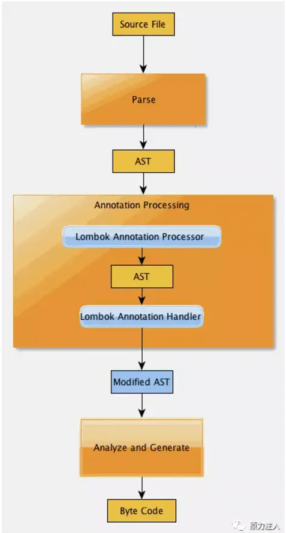

## 零、 历史

一个标准的 Java bean。一个典型的 Java bean 一般具有几个属性。每个属性具有一个  `accessor`  和  `mutator`（`getter`  和  `setter`）。通常还会有一个  `toString()`  方法、一个  `equals()`  方法和一个  `hashCode()`  方法。初看上去，其中可预见的冗余就已经非常多了。如果每个属性都具有一个 getter 和 setter，并且通常如此。

## 一、 概述

**Lombok 是一个可以大幅减少 java 模板代码的工具**。

## 二、 使用

### onX

> Sup dawg, we heard you like annotations, so we put annotations in your annotations so you can [annotate](https://so.csdn.net/so/search?q=annotate&spm=1001.2101.3001.7020) while you're annotating.
>
> 呦呵，我们听说你喜欢注解，所以我们将直接放入您的注解使得您可以在注解的时候注解你的方法。

- **JDK7 使用  `onMethod=@__({@xxx})`**
- **JDK8 使用  `onMethod_={@xxx}`**

这个方法是实验性的，因为不符合规范，仅仅用来解决不得不在其上加注释的问题。

### val

使用位置  
局部变量、ForEach

使用`val`可以作为局部变量和[foreach 循环](https://so.csdn.net/so/search?q=foreach%E5%BE%AA%E7%8E%AF&spm=1001.2101.3001.7020)的类型，它会执行类型推断，从初始化表达式推断出该变量的类型。

> 对于复合类型表达式如  `bool ? new HashSet() : new ArrayList()`， 结果又是  `AbstractCollection`  又是  `Serializable`， 推断的类型将是  `AbstractCollection`。因为它是类。  
> 如果很模糊的话 如  `null`  则为  `Object`

### var

非 final 本地变量的类型推断，在 JEP286 中建立了规范，它的工作原理与  `val`  完全相同，只是不是  `final`  的。

### @NonNull

使用位置：  
字段、方法、参数列表

**该注解会在方法的顶部添加空指针检查**。如果是空的话，抛出`NullPointerException("param is marked @NonNull but is null");`。在字段上使用时会生成一个包含该字段的构造器，它的 get 方法以及构造方法都会进行空指针检查。

> 会在方法的最顶部生成，如果是构造器，会在  `super()`  和  `this()`  之后生成检查方法。如果在方法的顶部已经有非空检查了，那么就不会创建。判断方法请查看官方文档。  
> @NonNull 也有文档角色的概念，不再会产生警告，您可以将方法注解为@NonNull;这是允许的，不产生警告，也不生成任何代码。基本类型参数上的@NonNull 会产生警告。不会生成空检查

#### 可配置项

<table><thead><tr><th style="width:161px;">配置项</th><th style="width:160px;">默认值</th><th style="width:201px;">可用值</th><th style="width:167px;">描述</th></tr></thead><tbody><tr><td style="width:161px;"><code>lombok.nonNull.exceptionType</code></td><td style="width:160px;"><code>NullPointerException</code></td><td style="width:201px;">
<code>NullPointerException</code>

<code>|IllegalArgumentException</code>

<code>|Assertion</code>
</td><td style="width:167px;">指定IF中抛出的异常</td></tr></tbody></table>

### @Cleanup

使用位置：局部变量

<table><thead><tr><th>可填写的值</th><th>类型</th><th>默认值</th><th>描述</th></tr></thead><tbody><tr><td>value</td><td><code>String</code></td><td><code>close</code></td><td>关闭资源时需要调用的方法名称，该方法必须无参。</td></tr></tbody></table>

使用该注解以确保在代码执行路径退出当前范围之前自动清理给定资源，可注释在任何变量上。

默认情况下会进行推断。有参的构造方法无法调用。

### @Getter/@Setter

使用位置：类、字段

**该注解会为标注的类、字段生成  `get/set`  方法，并且生成的方法名为驼峰命名法**。

刁钻的变量起名方式。。。

<table><tbody><tr><td></td><td>
<code id="hljs-0">// 完蛋的起法</code>
</td></tr><tr><td></td><td>
<code>String name;</code>
</td></tr><tr><td></td><td>
<code>String naMe;</code>
</td></tr><tr><td></td><td>
<code>String nAME;</code>
</td></tr></tbody></table>

可以通过指定访问级别  `AccessLevel`  来控制生成的  `Getter`  和  `Setter`  的访问权限。**合法访问级别为`PUBLIC`，`PROTECTED`，`PACKAGE`和`PRIVATE`**。也可以使用`None`来禁用`getter`  和  `setter`  的生成。

可以通过设置  `onMethod=@__({@Annotations})`  和  `onParam=@__({@AnnotationsHere})`  来规定注释在生成的方法上和字段上的注解。

> **对于以 is 开头且后面紧跟着大写字母的布尔字段，不会添加任何前缀来生成 getter 名称**。@Getter 也可用于枚举。@Setter 不能用于枚举。

#### 可配置项

<table><thead><tr><th style="width:101px;">配置项</th><th style="width:83px;">默认值</th><th style="width:104px;">可用值</th><th style="width:406px;">描述</th></tr></thead><tbody><tr><td style="width:101px;"><code>lombok.accessors.chain</code></td><td style="width:83px;"><code>false</code></td><td style="width:104px;"><code>true|false</code></td><td style="width:406px;"><code>true</code>，则生成的setter将返回&nbsp;<code>this</code>（而不是&nbsp;<code>void</code>）。&nbsp;<code>@Accessors</code>&nbsp;注解的显式配置的&nbsp;<code>chain</code>&nbsp;参数优先于此设置</td></tr><tr><td style="width:101px;"><code>lombok.accessors.fluent</code></td><td style="width:83px;"><code>false</code></td><td style="width:104px;"><code>true|false</code></td><td style="width:406px;">生成的getter和setter不会以bean标准&nbsp;<code>get</code>，<code>is</code>&nbsp;或&nbsp;<code>set</code>&nbsp;为前缀，会和属性名一样</td></tr><tr><td style="width:101px;"><code>lombok.accessors.prefix+=/-=</code></td><td style="width:83px;">空列表</td><td style="width:104px;">字段前缀</td><td style="width:406px;">可以使用&nbsp;<code>+=</code>&nbsp;添加前缀，或者使用&nbsp;<code>-=</code>&nbsp;删除前缀</td></tr><tr><td style="width:101px;"><code>lombok.getter.noIsPrefix</code></td><td style="width:83px;"><code>false</code></td><td style="width:104px;"><code>true|false</code></td><td style="width:406px;">为布尔字段生成的 getter 将使用&nbsp;<code>get</code>&nbsp;前缀而不是默认的&nbsp;<code>is</code>&nbsp;前缀，并且任何调用 getter 的生成代码, 如<code>@ToString</code>, 也将使用&nbsp;<code>get</code>&nbsp;而不是&nbsp;<code>is</code></td></tr><tr><td style="width:101px;"><code>lombok.copyableAnnotations</code></td><td style="width:83px;">空列表</td><td style="width:104px;">[完全限定类型列表]</td><td style="width:406px;">会将任何这些注解从字段复制到setter参数和getter方法。</td></tr></tbody></table>

### @ToString

使用位置：类

可以生成一个字符串：它会按顺序打印你的类名称以及每个字段，并以逗号分隔，**默认情况会打印所有的非静态字段**，也可通过配置来打印其他字段。

<table><thead><tr><th>可填写的值</th><th>类型</th><th>默认值</th><th>描述</th></tr></thead><tbody><tr><td>includeFieldNames</td><td><code>boolean</code></td><td><code>true</code></td><td>在打印时包括每个字段的名称</td></tr><tr><td>@Exclude</td><td>字段</td><td></td><td>在字段上标注以排除这个字段</td></tr><tr><td>@Include</td><td>字段、方法</td><td></td><td>在字段上标注以包括这个字段，可以标记方法，使用方法的返回值参与计算</td></tr><tr><td>callSuper</td><td><code>boolean</code></td><td><code>false</code></td><td>在输出中包含父类的结果</td></tr><tr><td>doNotUseGetters</td><td><code>boolean</code></td><td><code>false</code></td><td>调用/不调用<code>getters</code>方法</td></tr><tr><td>onlyExplicitlyIncluded</td><td><code>boolean</code></td><td><code>false</code></td><td>仅有显示注释包含的才会输出</td></tr><tr><td>exclude</td><td><code>String[]</code></td><td><code>{""}</code></td><td>这里列出的任何字段将不会被打印在生成的<code>toString</code>实现中。</td></tr><tr><td>of</td><td><code>String[]</code></td><td><code>{""}</code></td><td>如果存在，明确列出要打印的字段</td></tr></tbody></table>

> 1. 如果有`toString`签名的方法，则不会生成额外的方法。
> 2. 数组会通过  `Arrays.deepToString`  打印，如果包含自身，会导致栈溢出
> 3. 在一个方法上同时加上  `@ToString.Exclude`  和  `@ToString.Include`, 这种情况会被排除
> 4. 默认情况下，`$`  开头的字段会被忽略，只能通过  `@ToString.Include`  手动包含
> 5. 可用于枚举

#### 可配置项

<table><thead><tr><th>配置项</th><th style="width:67px;">默认值</th><th style="width:97px;">可用值</th><th style="width:408px;">描述</th></tr></thead><tbody><tr><td><code>lombok.toString.includeFieldNames</code></td><td style="width:67px;"><code>true</code></td><td style="width:97px;"><code>true|false</code></td><td style="width:408px;">设置为&nbsp;<code>false</code>&nbsp;，则<code>lombok</code>将省略该字段的名称，只需打印所有字段值的逗号分隔列表。如果明确指定，注解参数&nbsp;<code>includeFieldNames</code>&nbsp;优先于此设置。</td></tr><tr><td><code>lombok.toString.doNotUseGetters</code></td><td style="width:67px;"><code>false</code></td><td style="width:97px;"><code>true|false</code></td><td style="width:408px;">如果设置为&nbsp;<code>true</code>，则在生成&nbsp;<code>toString</code>&nbsp;方法时，<code>lombok</code>&nbsp;将直接访问字段，而不是使用getter（如果可用）。如果明确指定，注释参数&nbsp;<code>doNotUseGetters</code>&nbsp;优先于此设置。</td></tr><tr><td><code>lombok.toString.callSuper</code></td><td style="width:67px;"><code>skip</code></td><td style="width:97px;"><code>[ call | skip | warn ]</code></td><td style="width:408px;">1.&nbsp;<code>call</code>：会调用父类&nbsp;<code>toString</code> 2.&nbsp;<code>skip</code>：不会调用父类 3.&nbsp;<code>warn</code>：<code>lombok</code>会警告你</td></tr></tbody></table>

### @EqualsAndHashCode

使用位置：类

可以使用字段为该类生成  `Equals`  和  `HashCode`  方法。

<table><thead><tr><th>可填写的值</th><th>类型</th><th style="width:62px;">默认值</th><th style="width:371px;">描述</th></tr></thead><tbody><tr><td>callSuper</td><td><code>boolean</code></td><td style="width:62px;"><code>false</code></td><td style="width:371px;"></td></tr><tr><td>@Exclude</td><td>字段</td><td style="width:62px;"></td><td style="width:371px;">在字段上标注以排除这个字段</td></tr><tr><td>@Include</td><td>字段、方法</td><td style="width:62px;"></td><td style="width:371px;">在字段上标注以包括这个字段，可以标记方法，使用方法的返回值参与计算</td></tr><tr><td>doNotUseGetters</td><td><code>boolean</code></td><td style="width:62px;"><code>false</code></td><td style="width:371px;">调用/不调用<code>getters</code>方法</td></tr><tr><td>onParam</td><td><code>AnyAnnotation[]</code></td><td style="width:62px;"><code>{}</code></td><td style="width:371px;">规定注释在生成的方法上和字段上的注解</td></tr><tr><td>onlyExplicitlyIncluded</td><td><code>boolean</code></td><td style="width:62px;"><code>false</code></td><td style="width:371px;">仅有显示注释包含的才会参与计算</td></tr><tr><td>exclude</td><td><code>String[]</code></td><td style="width:62px;"><code>{""}</code></td><td style="width:371px;">这里列出的任何字段将不会被包含</td></tr><tr><td>of</td><td><code>String[]</code></td><td style="width:62px;"><code>{""}</code></td><td style="width:371px;">如果存在，明确列出要参与计算的字段</td></tr></tbody></table>

> 1. 默认情况下，它将使用所有非静态，非瞬时的字段来计算
> 2. 默认该注解不会使用超类的`Equals`和`HashCode`，可以通过  `callSuper=true`  来显式的调用超类的方法。可能会有某些自定义的  `Equals`  方法会造成意料外的效果，但是由  `lombok`  生成的  `hashCode`  和  `equals`  方法没有这个缺陷。所以推荐仅在子类无继承和  `lombok`  生成的方法上使用  `callSuper`。
> 3. TODO
> 4. 数组会通过  `Arrays.deepEquals`  和  `Arrays.deepHashCode`  计算，所以包含自身的数组会导致栈溢出
> 5. `NaN = NaN`
> 6. 如果已经有  `hashCode`  和  `equals`  方法，则该注解无论如何都不会生效
> 7. 如果方法标记为包含该字段的方法，则方法会覆盖字段。
> 8. 默认情况下，`$`  开头的字段会被忽略，只能通过  `@EqualsAndHashCode.Include`  手动包含

#### 可配置项

<table><thead><tr><th>配置项</th><th style="width:53px;">默认值</th><th style="width:93px;">可用值</th><th style="width:427px;">描述</th></tr></thead><tbody><tr><td><code>lombok.toString.doNotUseGetters</code></td><td style="width:53px;"><code>false</code></td><td style="width:93px;"><code>true|false</code></td><td style="width:427px;">如果设置为&nbsp;<code>true</code>，则在生成&nbsp;<code>equals</code>和&nbsp;<code>hashCode</code>&nbsp;方法时，<code>lombok</code>&nbsp;将直接访问字段，而不是使用<code>getter</code>（如果可用）。如果明确指定，注释参数&nbsp;<code>doNotUseGetters</code>&nbsp;优先于此设置。</td></tr><tr><td><code>lombok.equalsAndHashCode.callSuper</code></td><td style="width:53px;"><code>warn</code></td><td style="width:93px;"><code>[ call | skip | warn ]</code></td><td style="width:427px;">1.&nbsp;<code>call</code>：会调用父类&nbsp;<code>toString</code> 2.&nbsp;<code>skip</code>：不会调用父类 3.&nbsp;<code>warn</code>：<code>lombok</code>会警告你</td></tr></tbody></table>

### @XxxConstructor

使用位置：类

可以使用字段为该类生成各种各样的  `Constructor`。

<table><thead><tr><th>可填写的值</th><th>类型</th><th>默认值</th><th>描述</th></tr></thead><tbody><tr><td>staticName</td><td><code>String</code></td><td><code>""</code></td><td>静态工厂方法</td></tr><tr><td>onConstructor</td><td><code>AnyAnnotation[]</code></td><td><code>{}</code></td><td>规定注释在生成的构造器上的注解</td></tr><tr><td>access</td><td><code>AccessLevel</code></td><td><code>lombok.AccessLevel.PUBLIC</code></td><td>访问等级</td></tr><tr><td>@任意注解</td><td>注解</td><td></td><td></td></tr></tbody></table>

- `staticName`  生成的静态工厂方法拥有自动的类型推断，省去自己写反省的尴尬场景。使用该属性会使得构造方法变为私有的。

#### @NoArgsConstructor

为类生成无参的构造函数

<table><thead><tr><th>可填写的值</th><th>类型</th><th>默认值</th><th>描述</th></tr></thead><tbody><tr><td>force</td><td><code>boolean</code></td><td><code>false</code></td><td>使用&nbsp;<code>0</code>&nbsp;/&nbsp;<code>false</code>&nbsp;/&nbsp;<code>null</code>&nbsp;初始化所有&nbsp;<code>final</code>&nbsp;字段</td></tr></tbody></table>

> 1. 标记为  `force=true`  时约束字段不会生成任何检查
> 2. 某些框架需要使用无参构造器，该注解主要用来配合  `@Data`  或其他生成构造器的注解使用。

#### @RequiredArgsConstructor

为每个需要特殊处理的字段生成一个带有对应参数的构造函数。

> 所有未初始化的  `final`  字段，以及未初始化的用  `@NonNull`  标记的字段，都会获得一个参数。对于标有  `@NonNull`  的字段，还会生成显式空检查

#### @AllArgsConstructor

为类中的每个字段生成对应参数的构造函数。标有  `@NonNull`  的字段会导致对这些参数进行空检查

#### 可配置项

<table><thead><tr><th style="width:226px;">配置项</th><th style="width:66px;">默认值</th><th style="width:95px;">可用值</th><th>描述</th></tr></thead><tbody><tr><td style="width:226px;"><code>lombok.anyConstructor.addConstructorProperties</code></td><td style="width:66px;"><code>false</code></td><td style="width:95px;"><code>true | false</code></td><td>如果设置为&nbsp;<code>true</code>&nbsp;，则 Lombok 将向生成的构造函数添加&nbsp;<code>@ java.beans.ConstructorProperties</code></td></tr><tr><td style="width:226px;"><code>lombok.[allArgsConstructor | requiredArgsConstructor | noArgsConstructor] .flagUsage</code></td><td style="width:66px;">未设置</td><td style="width:95px;"><code>warning|error</code></td><td>配置后，Lombok 将标记相关注解的任何用法为警告或错误</td></tr><tr><td style="width:226px;"><code>lombok.anyConstructor.flagUsage</code></td><td style="width:66px;">未设置</td><td style="width:95px;"><code>warning|error</code></td><td>配置后，Lombok 将标记所有构造器注解的任何用法为警告或错</td></tr></tbody></table>

#### 注意

显示的构造函数**不会阻止**注解生成自己的构造函数。如果出现冲突，则会出现编译器错误

### @Data

使用位置：类

大融合！将  `@ToString`, `@EqualsAndHashCode`, 所有字段的  `Getter`, 所有非 final 字段的  `@Setter`  以及  `@RequiredArgsConstructor` ！它通常用来生成简单的  `POJO`  和  `Bean`

<table><thead><tr><th>可填写的值</th><th>类型</th><th>默认值</th><th>描述</th></tr></thead><tbody><tr><td><code>staticConstructor</code></td><td><code>String</code></td><td><code>""</code></td><td>静态工厂方法，等价于&nbsp;<code>staticName</code></td></tr></tbody></table>

- 无法使用  `callSuper`  等参数，如果需要使用，就需要显示的使用注解覆盖。
- 所生成的  `getter`  和  `setter`  都是私有的，要覆盖需要再写
- `hashCode`  与  `equals`  会跳过静态字段和  `transient`  字段。
- 与  `@RequiredConstructor`  不同，任何构造函数都会阻止  `@Data`  生成构造函数。
- 任何显式的  `equals`， `getter`， `setter`，`toString`  方法都会阻止生成这些方法，对于  `equals`，不同类型的签名也不会生成。

<table><thead><tr><th>配置项</th><th style="width:61px;">默认值</th><th style="width:94px;">可用值</th><th>描述</th></tr></thead><tbody><tr><td><code>lombok.data.flagUsage</code></td><td style="width:61px;">未设置</td><td style="width:94px;"><code>warning|error</code></td><td>配置后，Lombok 将标记所有构造器注解的任何用法为警告或错误</td></tr></tbody></table>

### @Value

使用位置：类

是`@Data`的不可变形式，相当于为属性添加 final 声明，只提供 getter 方法，而不提供 setter 方法

- 等价于  `final @ToString @EqualsAndHashCode @AllArgsConstructor @FieldDefaults(makeFinal = true, level = AccessLevel.PRIVATE) @Getter`
- 所有字段都是  `private final`  的
- 可使用  `@NonFinal`  来去掉  `final`
- 默认类本身也是  `final`  的
- 生成一个覆盖每个参数的构造函数（除显式初始化的字段外）

### @Builder

使用位置：类、方法、构造器

提供复杂的  `builder APIs`

<table><thead><tr><th>可填写的值</th><th style="width:100px;">类型</th><th style="width:86px;">默认值</th><th style="width:380px;">描述</th></tr></thead><tbody><tr><td><code>builderMethodName</code></td><td style="width:100px;"><code>String</code></td><td style="width:86px;"><code>"builder"</code></td><td style="width:380px;">builder 方法的名称</td></tr><tr><td><code>buildMethodName</code></td><td style="width:100px;"><code>String</code></td><td style="width:86px;"><code>"build"</code></td><td style="width:380px;">build 方法的名称</td></tr><tr><td><code>builderClassName</code></td><td style="width:100px;"><code>String</code></td><td style="width:86px;"><code>""</code></td><td style="width:380px;">构造器的类名</td></tr><tr><td><code>toBuilder</code></td><td style="width:100px;"><code>boolean</code></td><td style="width:86px;"><code>false</code></td><td style="width:380px;">生成一个在类中的&nbsp;<code>toBuilder</code>&nbsp;方法，返回包含当前类所有字段的&nbsp;<code>Builder</code></td></tr><tr><td><code>access</code></td><td style="width:100px;"><code>AccessLevel</code></td><td style="width:86px;"><code>PUBLIC</code></td><td style="width:380px;">生成元素的访问级别</td></tr><tr><td><code>setterPrefix</code></td><td style="width:100px;"><code>String</code></td><td style="width:86px;"><code>""</code></td><td style="width:380px;"><code>setter</code>&nbsp;的前缀名</td></tr></tbody></table>

#### @Builder 后的方法

1. 一个名为  `FooBuilder`  的内部静态类，与静态方法（称为 builder）具有相同的类型参数。
2. 静态类中：一个 non-static no-final 字段对应目标的一个参数
3. 静态类中：一个私有的不带参数的空构造函数
4. 静态类中：外部类的每个参数会获得一个类型和字段名都相同的类似  `setter`  的方法，返回构造器本身以供链式处理
5. 静态类中：一个  `build`  方法，调用外部的构造方法，传入每个参数。
6. 静态类中：一个  `toString`  方法
7. 外部类中：`builder()`  方法，返回构造器的实例

若上述内容已存在（只管方法名），则将跳过。

#### @Builder 后的类

效果类似于  `@AllArgsConstructor(access = AccessLevel.PACKAGE)`。如果有一个构造器，应该将  `@Builder`  放在构造器上

#### @Builder.Default

如果在  `build`  期间没有设置属性的任何值的化，它的值会为  `0/null/false`，可以在字段上添加  `@Builder.Default`  注释

#### @Builder.ObtainVia

使用位置：字段、参数

如果开启了  `toBuilder`  方法的生成，可以规定所属字段（参数）如何获取值，默认为通过  `this.xxx`  来获取

- 指定字段获取值  `this.value`
- 指定方法获取值  `this.method()`
- 指定通过静态方法获取值  `类.method(this)`

#### @Singular

使用此注解可以注释一个集合字段（参数）

1. 会生成两个方法：
   - 一个用于添加一个元素到集合中
   - 用于将另一集合中的所有元素添加到集合中。
2. 生成  `clearXxx`  方法，用于清空集合。

拥有该注解后的构造器非常的复杂，以满足以下条件

1. 调用  `build()`  时集合不可变
2. `build()`  之后调用添加或删除方法不会修改生成的对象
3. 生成的集合将被压缩

只能支持有限的类型，`List`，`Map`， `Set`  是其中较为典型的类型

如果注解不能单数化你的字段名，它将报错并要求你指定单数的名称

#### 注意

1. `@Builder.Default`  字段上的初始化程序将在编译过程中移动并存储在静态方法中，以确保在构建有值时不会执行该方法
2. 可将  `builderMethodName`  配置为空字符串，这将阻止  `builder()`  方法的生成
3. 上述特性可用于  `toBuilder().build()`  实现浅拷贝。

#### 可配置项

<table><thead><tr><th>配置项</th><th style="width:87px;">默认值</th><th style="width:108px;">可用值</th><th style="width:387px;">描述</th></tr></thead><tbody><tr><td><code>lombok.data.flagUsage</code></td><td style="width:87px;">未设置</td><td style="width:108px;"><code>warning|error</code></td><td style="width:387px;">配置后，Lombok 将标记所有构造器注解的任何用法为警告或错误</td></tr><tr><td><code>lombok.singular.useGuava</code></td><td style="width:87px;"><code>false</code></td><td style="width:108px;"><code>true|false</code></td><td style="width:387px;">是否使用&nbsp;<code>guava</code>&nbsp;的构造器实现&nbsp;<code>java.util</code>&nbsp;接口</td></tr><tr><td><code>lombok.singular.auto</code></td><td style="width:87px;"><code>true</code></td><td style="width:108px;"><code>true|false</code></td><td style="width:387px;">如果为&nbsp;<code>true</code>&nbsp;，<code>lombok</code>&nbsp;会自动尝试通过假设它是一个常见的英语复数来单数化你的标识符名称。如果为&nbsp;<code>false</code>&nbsp;，则必须始终显式指定单数名称</td></tr></tbody></table>

### @SneakyThrows

使用位置：方法、构造器

偷偷的抛出某些异常而不在方法上声明  `throws`，需要谨慎使用。实际上它时欺骗了编译器。原理是在 JVM 级别上，无论如何都可以抛出以常。

<table><thead><tr><th>可填写的值</th><th>类型</th><th>默认值</th><th>描述</th></tr></thead><tbody><tr><td><code>value</code></td><td><code>Class&lt;? extends Throwable&gt;[]</code></td><td><code>java.lang.Throwable.class</code></td><td>偷偷抛出的方法名称</td></tr></tbody></table>

常见使用情况

- 一个不必要的严格接口，`Runnable`  无论是否抛出异常，它都将被传递给  `Thread`
- 一个不可能的异常，如：`new String(SomeByteArray, "UTF-8")`  声明其可抛出  `UnsupportedEncodingException` ,但是根据 JVM 规范，UTF-8 必须始终可用。这里的  `UnsupportedEncodingException`  与使用 String 对象时的  `ClassNotFoundError`  差不多，你也没有必要捕获这些不可能的异常

#### 注意

在被抛出后就不能捕获了，因为编译器不允许你为  `try`  体中没有方法声明抛出的异常类型编写对应的  `catch`  块

### @Synchronized

使用位置：方法

是  `synchronized`  方法修饰符的更安全变体，与  `synchronized`  方法修饰符相似，只能用在静态方法上。 `synchronized`  锁定在  `this`  上，而注解锁定在  `$LOCK`  的静态字段。

<table><thead><tr><th>可填写的值</th><th>类型</th><th>默认值</th><th>描述</th></tr></thead><tbody><tr><td><code>value</code></td><td><code>String</code></td><td><code>""</code></td><td>选择锁定的字段名</td></tr></tbody></table>

可以自行创建  `$lock`  或  `$LOCK`  字段。

本注解的作用是：锁定  `this`  和类对象可能会产生一些副作用，因为其他人也能锁定这些对象，这样可能会导致竞争和其他讨厌的线程错误。

#### 注意

- 自动生成的  `$lock`或  `$LOCK`  会使用  `Object[]`数组初始化字段，`Lombok`  这样做是因为  `new Object()`  不可序列化，但是大小为 0 的数组可以序列化，使用  `@Synchronized`  不会阻止对象序列化
- 类中至少有一个  `@Synchronized`  方法意味着会有一个锁定字段，但是如果稍后删除所有这些方法，则不再有锁定字段。这意味着你预定的  `serialVersionUID`  会发生变化

### @With

使用位置：字段、类

用于生成一个  `withX(T newValue)`  方法，该方法判断传入值和原有值是否相等，不相等会返回一个其他字段都相同的新对象。

比如说，为  `final`  字段设置  `setter`  是没有意义的，name，使用  `@With`  是很好的办法，

<table><thead><tr><th>可填写的值</th><th style="width:202px;">类型</th><th style="width:131px;">默认值</th><th>描述</th></tr></thead><tbody><tr><td><code>value</code></td><td style="width:202px;"><code>AccessLevel</code></td><td style="width:131px;"><code>false</code></td><td>生成方法的访问类型</td></tr><tr><td><code>onMethod</code></td><td style="width:202px;"><code>With.AnyAnnotation[]</code></td><td style="width:131px;"><code>{}</code></td><td>在方法上生成的注解</td></tr><tr><td><code>onParam</code></td><td style="width:202px;"><code>With.AnyAnnotation[]</code></td><td style="width:131px;"><code>{}</code></td><td>在参数上生成的注解</td></tr></tbody></table>

#### 注意事项

- 该注解完全依赖构造方法克隆对象，所以要确保游泳构造方法
- 静态字段无法生成方法，因为没有任何意义
- 抽象类可用，会生成拥有适当签名的抽象方法
- 会跳过所有  `$`  开头的字段
- 同名方法会覆盖

### @Getter(lazy=true)

使用位置：字段

可以让  `Lombok`  生成一个  `getter`， 在第一次调用时会计算一次，之后缓存起来，如果计算该值需要占用大量 CPU，或者大量内存，则非常有用。

1. 创建一个  `private final`  的变量
2. 使用  `@Getter(lazy=true)`  注释字段

就算你的值为  `null`，也会被缓存，并且  `Lombok`  会为该方法加锁。

#### 注意

- 永远要使用  `getter`  访问字段，因为它是  `AtomicReference`  的，而且你无法分辨结果为  `null`  时到底为计算还是未计算。
- 即使你使用  `doNotUseGetters=true` ，其他 Lombok 注释（如`@ToString` ）也始终调用 getter

### @Log

使用位置：类

它将为你生成一个  `static final log = 你的类名`  字段

<table><thead><tr><th>注解类型</th><th>对应&nbsp;<code>Log</code>&nbsp;类</th></tr></thead><tbody><tr><td><code>@CommonsLog</code></td><td><code>org.apache.commons.logging.LogFactory.getLog(LogExample.class);</code></td></tr><tr><td><code>@Flogger</code></td><td><code>com.google.common.flogger.FluentLogger.forEnclosingClass();</code></td></tr><tr><td><code>@JBossLog</code></td><td><code>org.jboss.logging.Logger.getLogger(LogExample.class);</code></td></tr><tr><td><code>@Log</code></td><td><code>java.util.logging.Logger.getLogger(LogExample.class.getName());</code></td></tr><tr><td><code>@Log4j</code></td><td><code>org.apache.log4j.Logger.getLogger(LogExample.class);</code></td></tr><tr><td><code>@Log4j2</code></td><td><code>org.apache.logging.log4j.LogManager.getLogger(LogExample.class);</code></td></tr><tr><td><code>@Slf4j</code></td><td><code>org.slf4j.LoggerFactory.getLogger(LogExample.class);</code></td></tr><tr><td><code>@XSlf4j</code></td><td><code>org.slf4j.ext.XLoggerFactory.getXLogger(LogExample.class);</code></td></tr></tbody></table><table><thead><tr><th>可填写的值</th><th>类型</th><th>默认值</th><th>描述</th></tr></thead><tbody><tr><td><code>topic</code></td><td><code>String</code></td><td><code>""</code>&nbsp;代表当前类</td><td><code>Logger</code>&nbsp;的主题/名称</td></tr></tbody></table>

#### 可配置项

<table><thead><tr><th>配置项</th><th style="width:72px;">默认值</th><th style="width:118px;">可用值</th><th style="width:348px;">描述</th></tr></thead><tbody><tr><td><code>lombok.data.flagUsage</code></td><td style="width:72px;">未设置</td><td style="width:118px;"><code>warning|error</code></td><td style="width:348px;">配置后，Lombok 将标记所有注解的任何用法为警告或错误</td></tr><tr><td><code>lombok.log.fieldName</code></td><td style="width:72px;"><code>log</code></td><td style="width:118px;">其他名字</td><td style="width:348px;">生成的&nbsp;<code>logger</code>&nbsp;字段名称</td></tr><tr><td><code>lombok.log.fieldIsStatic</code></td><td style="width:72px;"><code>true</code></td><td style="width:118px;"><code>true| false</code></td><td style="width:348px;">生成的记录器logger是&nbsp;<code>static</code>&nbsp;字段。通过将此键设置为&nbsp;<code>false</code>，生成的字段将是实例字段</td></tr><tr><td><code>lombok.log.xxxxxx.flagUsage</code></td><td style="width:72px;">未设置</td><td style="width:118px;"><code>warning|error</code></td><td style="width:348px;">配置后，Lombok 将标记所有注解的任何用法为警告或错误</td></tr></tbody></table>

#### 注意事项

- 如果已存在名为  `log`  的字段，则将发出警告，并且不会生成任何代码。

### experimental

实验字段们，可以正常使用，但没有主要功能那么强大的支持。以下的注解意味着

- 没有经过完整测试
- 不会像核心功能那样快速修复错误
- 可能会发生变更
- 可能会完全消失
- 社区反馈积极的且看起来没有那么大破坏性，则可能会被接收为核心功能

<table><thead><tr><th style="width:125px;">注解</th><th style="width:506px;">作用</th><th>当前状态</th></tr></thead><tbody><tr><td style="width:125px;"><code>var</code></td><td style="width:506px;">本地变量，通过类型推断分配值</td><td></td></tr><tr><td style="width:125px;"><code>@Accessors</code></td><td style="width:506px;">支持三种模式 1.&nbsp;<code>fluent</code>:&nbsp;<code>getter</code>&nbsp;和&nbsp;<code>setter</code>&nbsp;的方法都是属性名，并且&nbsp;<code>setter</code>&nbsp;返回当前对象 2.&nbsp;<code>chain</code>：&nbsp;<code>setter</code>&nbsp;对象返回当前对象 3.&nbsp;<code>prefix</code>&nbsp;： 用于忽视指定前缀，如 字段中带&nbsp;<code>master_</code>，则可忽略为本身字段名</td><td><em>中性</em></td></tr><tr><td style="width:125px;"><code>@ExtensionMethod</code></td><td style="width:506px;">可以包含一些方法到类中，使得其像实例方法一样使用。</td><td><em>保持</em></td></tr><tr><td style="width:125px;"><code>@FieldDefaults</code></td><td style="width:506px;">通过该注解控制一些访问修饰符和访问级别</td><td><em>积极</em></td></tr><tr><td style="width:125px;"><code>@Delegate</code></td><td style="width:506px;">将某些访问指定类、字段的调用重定向到该字段上</td><td><em>消极</em></td></tr><tr><td style="width:125px;"><code>onX</code></td><td style="width:506px;">在最开始有所介绍</td><td><em>不确定</em></td></tr><tr><td style="width:125px;"><code>@UtilityClass</code></td><td style="width:506px;">表示该类是工具类，不存在任何实例，自动为该类生成一个私有构造器并在被调用时抛出异常。将所有的成员都自动转换为&nbsp;<code>static</code></td><td><em>积极</em></td></tr><tr><td style="width:125px;"><code>@Helper</code></td><td style="width:506px;">允许将方法放入方法，而不需要实例化内部类，直接调用</td><td><em>未知</em></td></tr><tr><td style="width:125px;"><code>@FieldNameConstants</code></td><td style="width:506px;">为类生成一个包含所有字段字段名的静态内部类</td><td><em>中性</em></td></tr><tr><td style="width:125px;"><code>@SuperBuilder</code></td><td style="width:506px;">为父类生成一个&nbsp;<code>builder</code></td><td></td></tr><tr><td style="width:125px;"><code>@Tolerate</code></td><td style="width:506px;">可在任何字段和方法标注，使<code>Lombok</code>忽略这些字段，例如本来<code>Lombok</code>&nbsp;认为已经有并且不再生成的方法，可以让其忽略并生成</td><td></td></tr><tr><td style="width:125px;"><code>@Jacksonized</code></td><td style="width:506px;">为<code>Jackson</code>&nbsp;准备的注解，自动配置生成的&nbsp;<code>Builder</code>&nbsp;用于&nbsp;<code>Jackson</code>&nbsp;的反序列化</td><td></td></tr></tbody></table>

## 三、[Lombok](https://so.csdn.net/so/search?q=Lombok&spm=1001.2101.3001.7020)配置

灵活的配置每个  `Lombok`  的配置项

1. 可以在任何目录中创建。作用于该目录和其子目录
2. `lombok.config`中配置项`config.stopBubbling=true`指明`lombok`的根目录为当前配置文件所在目录
3. 配置文件是分层的，原则是接近源文件的配置设置优先
4. 根目录的子目录中可以创建`lombok.config`配置文件，来覆盖根目录的配置文件
5. 在配置文件的顶部，可以导入其他配置文件。`import ../conf/aaa.config`

## 四、DeLombok

使用`Delombok`  命令把  `Lombok`  注解实现的类文件转换为不使用  `Lombok`  的  `Java`  源文件。如果是  `src`  整个目录，可以递归的实现转换，`Delombok`  会自动过滤非  `Lombok`  注解的文件进行原样拷贝。

不仅可以了解到 Lombok 的实现内幕，还可以很好的做系统升级，比如要生成  `javadoc`  或者使用  `Google Widget Toolkit`  都是不支持  `Lombok`  的，这时候就可以使用  `Delombok`  进行反编译，同时也能解决我们使用  `Lombok`  升级  `JDK`  带来的不兼容问题。

## 五、Lombok 深入

### 5.1 Lombok 是怎么实现的

lombok 是通过什么来实现在编译时的？**通过  `JSR 269: Pluggable Annotation Processing API`(Java 规范提案)**

通过分析和置换抽象语法树所生成全新的字节码

`**Javac**` **解析成抽象语法树之后(`AST`), `Lombok`  根据自己的注解处理器，动态的修改  `AST`，增加新的节点(所谓代码)，最终通过分析和生成字节码。**

### 5.2 Lombok 扩展

## 六、一些坏处

1. 使用  `Lombok`  会强行使别人也需要安装  `Lombok`插件，否则到处报错，不过现在  `IDEA`  已经内置支持了  `Lombok`，如果我们定义的一个 jar 包中使用了 Lombok，那么就要求所有依赖这个 jar 包的所有应用都必须安装插件，这种侵入性是很高的。
2. 代码可读性，可调试性低
3. 影响升级，`Lombok`对于代码有很强的侵入性，就可能带来一个比较大的问题，那就是会影响我们对 JDK 的升级。每次大升级都会使 一大票使用  `Lombok`  的发出哀嚎。
4. `Lombok`自身的升级也会受到限制，而每个`jar`包可能又要依赖不同版本的`Lombok`，这就导致在应用中需要做版本仲裁，`jar`包版本仲裁是没那么容易的，而且发生问题的概率也很高。
5. 破坏封装性，无脑使用  `getter`  和  `setter`  不如不使用。
6. 而其个类如果有嵌套引用，不做特殊处理，序列化的时候会死循环。
7. `Lombok`  违反了  `Java annotation processor`  的规定，使用 HACK 字节码的方式实现这些方法，可能会导致一些不好发现的问题，在多个  `JVM`  语言混用时容易出一些离奇的错误

## 七、拓展延伸

其于主流的代码生成工具

1. `AutoValue`
   - 谷歌出品
   - 生成  `Java源文件`
2. `Immutables`
   - 支持的特性较多
   - 提供了与`AutoValue`类似的功能，并添加了使用`@value.modiizable`生成可修改类的功能

<table><thead><tr><th>对比项</th><th>Lombok</th><th>AautoValue</th><th>Immutables</th></tr></thead><tbody><tr><td>License</td><td>MIT (also)</td><td>Apache 2</td><td>Apache 2</td></tr><tr><td>最低java版本</td><td>1.6</td><td>1.6</td><td>1.7</td></tr><tr><td>生成的文件</td><td>lombok修改了原class文件，加入生成的代码</td><td>生成了另外一个java子类，不侵入原有的java代码,完全遵循java的规范,可以看到两个java文件和两个class文件</td><td>生成了另外一个java子类，不侵入原有的java代码,完全遵循java的规范,可以看到两个java文件和两个class文件</td></tr><tr><td>生成类与模版类关系</td><td>Enhanced generated class replaces template source</td><td>Generated source extends template source</td><td>Generated source extends template source</td></tr><tr><td>查看生成类</td><td>使用delombok</td><td>默认可见</td><td>默认可见</td></tr><tr><td>使用方便性</td><td>为类或字段添加注解即可</td><td>加上注解的同时，需要按照一定的规范遍写代码</td><td>加上注解的同时，需要按照一定的规范遍写代码</td></tr><tr><td>是否需要提前编译</td><td>不用，加上注解后，就可以用其生成的方法</td><td>编译一次，才能生效，编译前是找不到待生成的子类的</td><td>编译一次，才能生效，编译前是找不到待生成的子类的</td></tr><tr><td>生成的代码是否可见</td><td>不可见，实在要看需要反编译，不利于Debug可代码分析比如覆盖率等</td><td>可以看见生成的源代码，在代码调试和分析时较方便</td><td>可以看见生成的源代码，在代码调试和分析时较方便</td></tr><tr><td>不可变程度</td><td>可以使用set方法修改类</td><td>可以使用Immutability修改类</td><td>强支持不可变</td></tr></tbody></table>

### 如何选择这三个工具

1）AutoValue 和 Immutables 使用标准注释处理，Lombok 使用非标准注释处理方法：

- 开发者如果希望避免非标准依赖，那么应该使用 AutoValue 和 Immutables；
- 开发者不希望添加 IDE 插件或者其他非 javac 以及非基础 Java IDE 支持的第三方工具，那么建议使用 AutoValue 和 Immutables；

2）Lombok 修改了原 class 文件，生成的类与模版类在同一个包下，并且名字相同；AutoValue 和 Immutables 生成的类继承自基础模版类，但是在同一个包下：

- 开发者如果希望编译的 class 文件和源文件在同一个包下，并且同名，那么应该使用 Lombok；
- 开发者如果希望可以看到生成的代码，并且不希望影响原来的代码，那么应该使用 AutoValue 和 immutebles;

3）三个工具都不同程度上的支持自定义，因此和这个需要根据实际需要进行选择：

- Lombok 提供了一个[configuration system](https://links.jianshu.com/go?to=https%3A%2F%2Fprojectlombok.org%2Ffeatures%2Fconfiguration "configuration system") ，允许根据所需的约定调整生成代码。
- Immutables 提供了[style customization](https://links.jianshu.com/go?to=http%3A%2F%2Fimmutables.github.io%2Fstyle.html "style customization")，允许对生成的代码的多个点进行调整。
- AutoValue 允许用户通过一些方式[User Guide](https://links.jianshu.com/go?to=https%3A%2F%2Fgithub.com%2Fgoogle%2Fauto%2Fblob%2Fmaster%2Fvalue%2Fuserguide%2Findex.md "User Guide")，自行定义一些生成代码的规则。

4）从可变性看，三者的 opinionated 不同，AutoValue 是不支持可变的，而 Lombok 和 Immutables 支持：

- 希望类成为不可变类，使用 AutoValue;
- 希望类一定程度上支持可变，那么使用 Lombk 或者 Immutables；

## 八、 参考文献

1. [华山论剑之 JAVA 三大代码生成工具：Lombok、AutoValue 和 Immutables](https://www.jianshu.com/p/f850a0b5c4fc "华山论剑之JAVA三大代码生成工具：Lombok、AutoValue和Immutables") 2019.09.18 12:37:07
2. [Project Lombok](https://projectlombok.org/features/all "Project Lombok") 2021.04.19 00:00:00
