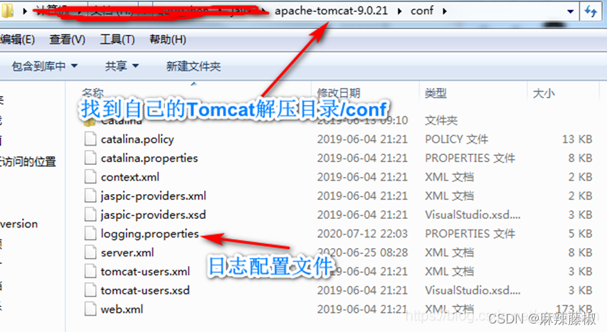
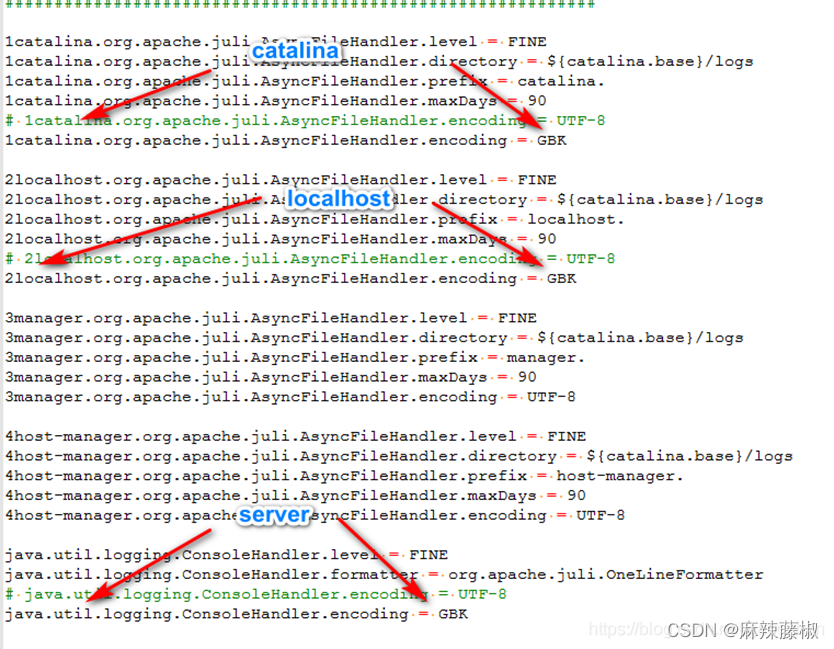
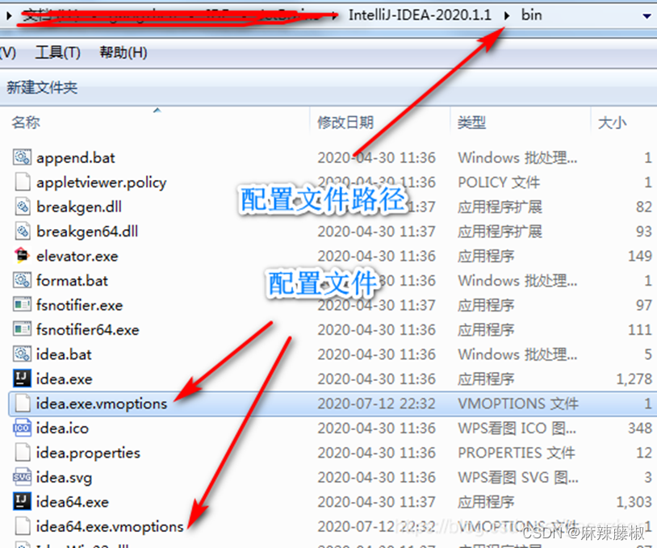
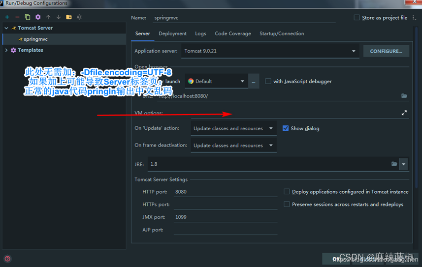

## 1、启动 Tomcat 中文乱码解决

找到 Tomcat 日志配置文件

解决控制台 3 个标签页的乱码问题，如图

## 2、IDEA 其他配置一律 UTF-8 编码配置

IDEA 配置文件 idea.exe.vmoptions 和 idea64.exe.vmoptions 最后添加：-DFile.encoding=UTF-8

位置：IDEA 安装目录/bin/

## 3、打开 IDEA ，File->Settings 搜索 File Encodings ,编码统一 UTF-8

## 4、Tomcat 配置项 VM options

