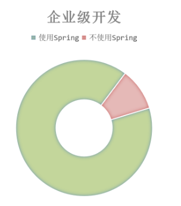
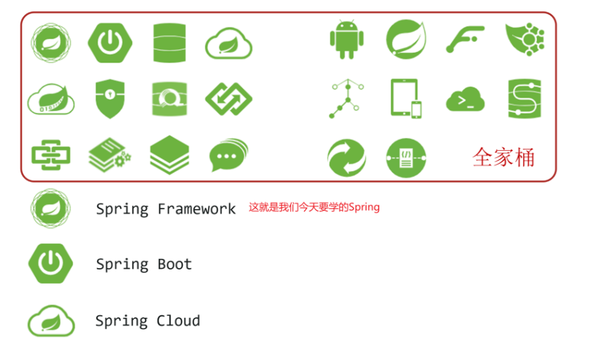
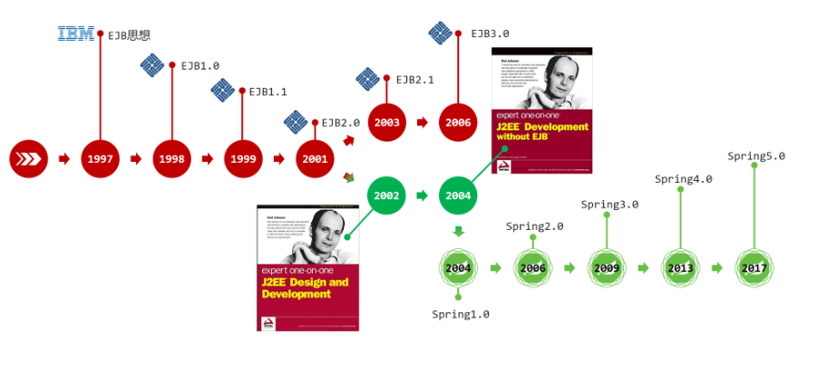
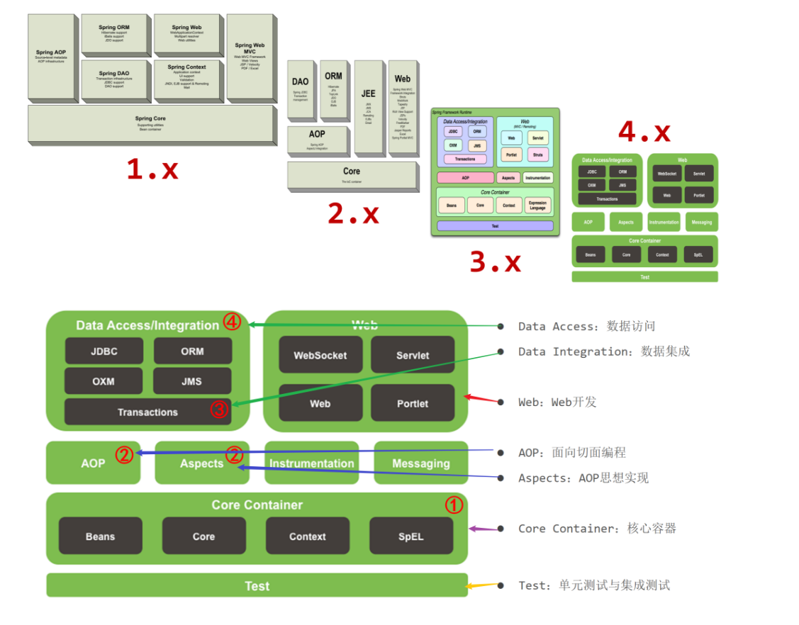
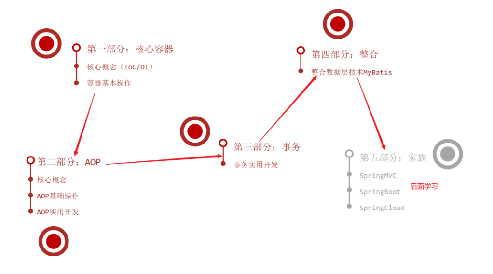
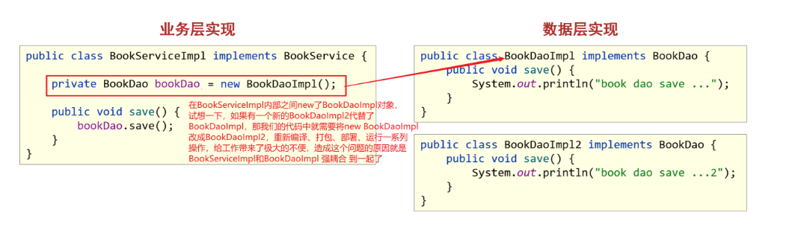
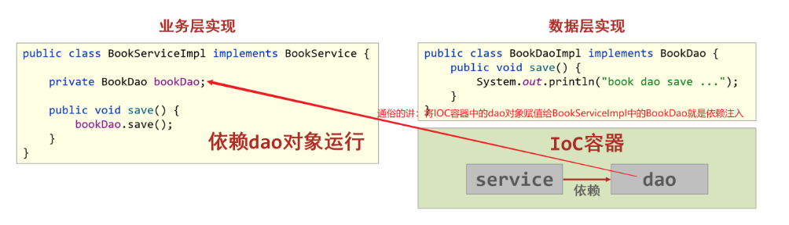

## 1 Spring 课程介绍

### 1.1 为什么要学

- Spring 技术是 JavaEE 开发必备技能，企业开发技术选型命中率>90%
- 专业角度
  - 简化开发，降低企业级开发的复杂性
  - 框架整合，高效整合其他技术，提高企业级应用开发与运行效率

### 1.2 学什么

- 简化开发
  - **IOC(反转控制)**
  - **AOP(面向切面编程)**
    - **事务处理**
- 框架整合
  - MyBatis
  - MyBatis-plus
  - Struts
  - Struts2
  - Hibernate
  - ……

### 1.3 怎么学

- 学习 Spring 框架设计思想
- 学习基础操作，思考操作与思想间的联系
- 学习案例，熟练应用操作的同时，体会思想

## 2 初识 Spring

目前我们使用的是 Spring 几版本？

### 2.1 Spring 家族

- 官网：[https://spring.io](https://spring.io)
- Spring 发展到今天已经形成了一种开发的生态圈，Spring 提供了若干个项目，每个项目用于完成特定的功能。  
  

### 2.2 Spring 发展史

## 3 Spring 体系结构

通过系统架构图，Spring 能不能进行数据层开发？Spring 能不能进行 web 层开发？

### 3.1 Spring Framework 系统架构图

- Spring Framework 是 Spring 生态圈中最基础的项目，是其他项目的根基

### 3.2 Spring Framework 课程学习路线

## 4 Spring 核心概念

问题 1：目前我们的代码存在什么问题以及怎么解决这些问题？  
问题 2：请描述什么是 IOC，什么是 DI？

### 4.1 目前我们代码存在的问题

- 代码书写现状
  - 耦合度偏高
- 解决方案
  - 使用对象时，在程序中不要主动使用 new 产生对象，转换为由外部提供对象

### 4.2 核心概念

- **IOC（Inversion of Control）控制反转**
  使用对象时，由主动 new 产生对象转换为由**外部**提供对象，此过程中对象创建控制权由程序转移到外部，此思想称为控制反转。通俗的讲就是“**将 new 对象的权利交给 Spring，我们从 Spring 中获取对象使用即可**”

- Spring 技术对 IoC 思想进行了实现

  - Spring 提供了一个容器，称为**IOC 容器**，用来充当 IoC 思想中的“外部”
  - IOC 容器负责对象的创建、初始化等一系列工作，被创建或被管理的对象在 IoC 容器中统称为**Bean**

- **DI（Dependency Injection）依赖注入**
  - 在容器中建立 bean 与 bean 之间的依赖关系的整个过程，称为依赖注入。

- 目标：充分解耦
  - 使用 IoC 容器管理 bean（IOC)
  - 在 IoC 容器内将有依赖关系的 bean 进行关系绑定（DI）
- 最终效果
  - 使用对象时不仅可以直接从 IoC 容器中获取，并且获取到的 bean 已经绑定了所有的依赖关系
