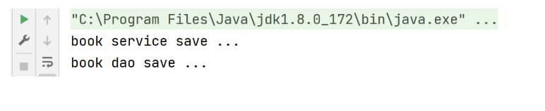
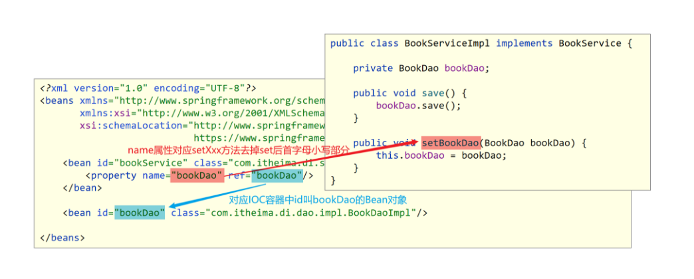

## 1 IOC 入门案例

\<bean>标签中 id 属性和 class 属性的作用是什么？

### 1.1 门案例思路分析

1. 管理什么？(Service 与 Dao)
2. 如何将被管理的对象告知 IOC 容器？(配置文件)
3. 被管理的对象交给 IOC 容器，如何获取到 IoC 容器？(接口)
4. IOC 容器得到后，如何从容器中获取 bean？(接口方法)
5. 使用 Spring 导入哪些坐标？(pom.xml)

### 1.2 实现步骤

```java
【第一步】导入Spring坐标
【第二步】定义Spring管理的类（接口）
【第三步】创建Spring配置文件，配置对应类作为Spring管理的bean对象
【第四步】初始化IOC容器（Spring核心容器/Spring容器），通过容器获取bean对象
```

### 1.3 实现代码

【第一步】导入 Spring 坐标

```xml
<dependencies>
    <!--导入spring的坐标spring-context，对应版本是5.2.10.RELEASE-->
    <dependency>
        <groupId>org.springframework</groupId>
        <artifactId>spring-context</artifactId>
        <version>5.2.10.RELEASE</version>
    </dependency>
</dependencies>
```

【第二步】定义 Spring 管理的类（接口）

- BookDao 接口和 BookDaoImpl 实现类

```java
public interface BookDao {
    public void save();
}

public class BookDaoImpl implements BookDao {
    public void save() {
        System.out.println("book dao save ...");
    }
}
```

- BookService 接口和 BookServiceImpl 实现类

```java
public interface BookService {
    public void save();
}

public class BookServiceImpl implements BookService {
    private BookDao bookDao = new BookDaoImpl();
    public void save() {
        System.out.println("book service save ...");
        bookDao.save();
    }
}
```

【第三步】创建 Spring 配置文件，配置对应类作为 Spring 管理的 bean 对象

- 定义 applicationContext.xml 配置文件并配置 BookServiceImpl

```xml
<?xml version="1.0" encoding="UTF-8"?>
<beans xmlns="http://www.springframework.org/schema/beans"
       xmlns:xsi="http://www.w3.org/2001/XMLSchema-instance"
       xsi:schemaLocation="http://www.springframework.org/schema/beans http://www.springframework.org/schema/beans/spring-beans.xsd">

    <!--
		bean标签：表示配置bean
    	id属性：表示给bean起名字
    	class属性：表示给bean定义类型
	-->
    <bean id="bookService" class="com.itheima.service.impl.BookServiceImpl"></bean>

</beans>
```

注意事项：bean 定义时 id 属性在同一个上下文中(IOC 容器中)不能重复

【第四步】初始化 IOC 容器（Spring 核心容器/Spring 容器），通过容器获取 Bean 对象

```java
public class App {
    public static void main(String[] args) {
        //1.创建IoC容器对象，加载spring核心配置文件
        ApplicationContext ctx = new ClassPathXmlApplicationContext("applicationContext.xml");
        //2 从IOC容器中获取Bean对象(BookService对象)
        BookService bookService= (BookService)ctx.getBean("bookService");
        //3 调用Bean对象(BookService对象)的方法
        bookService.save();
    }
}
```

### 1.4 运行结果



## 2 DI 入门案例

<property>标签中 name 属性和 ref 属性的作用是什么？

### 2.1 DI 入门案例思路分析

1. 基于 IOC 管理 bean
2. Service 中使用 new 形式创建的 Dao 对象是否保留？(否)
3. Service 中需要的 Dao 对象如何进入到 Service 中？(提供方法)
4. Service 与 Dao 间的关系如何描述？(配置)

### 2.2 实现步骤

【第一步】删除使用 new 的形式创建对象的代码
【第二步】提供依赖对象对应的 setter 方法
【第三步】配置 service 与 dao 之间的关系

### 2.3 实现代码

【第一步】删除使用 new 的形式创建对象的代码

```java
public class BookServiceImpl implements BookService {
    private BookDao bookDao;  //【第一步】删除使用new的形式创建对象的代码
    public void save() {
        System.out.println("book service save ...");
        bookDao.save();
    }
}
```

【第二步】提供依赖对象对应的 setter 方法

```java
public class BookServiceImpl implements BookService {
    private BookDao bookDao;
    public void save() {
        System.out.println("book service save ...");
        bookDao.save();
    }
    //【第二步】提供依赖对象对应的setter方法
    public void setBookDao(BookDao bookDao) {
        this.bookDao = bookDao;
    }
}
```

【第三步】配置 service 与 dao 之间的关系

> 在 applicationContext.xml 中配置

```xml
<?xml version="1.0" encoding="UTF-8"?>
<beans xmlns="http://www.springframework.org/schema/beans"
       xmlns:xsi="http://www.w3.org/2001/XMLSchema-instance"
       xsi:schemaLocation="http://www.springframework.org/schema/beans http://www.springframework.org/schema/beans/spring-beans.xsd">
    <!--
		bean标签：表示配置bean
    	id属性：表示给bean起名字
    	class属性：表示给bean定义类型
	-->
    <bean id="bookDao" class="com.itheima.dao.impl.BookDaoImpl"/>

    <bean id="bookService" class="com.itheima.service.impl.BookServiceImpl">
        <!--配置server与dao的关系
			property标签：表示配置当前bean的属性
        	name属性：表示配置哪一个具体的属性
        	ref属性：表示参照哪一个bean
		-->
        <property name="bookDao" ref="bookDao"/>
    </bean>
</beans>
```

### 2.4 图解演示


