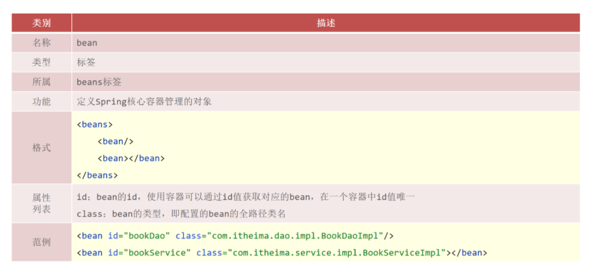
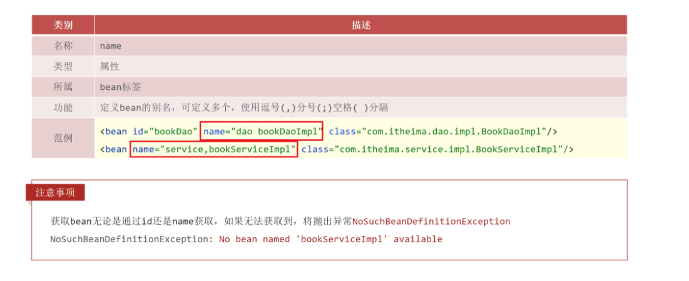
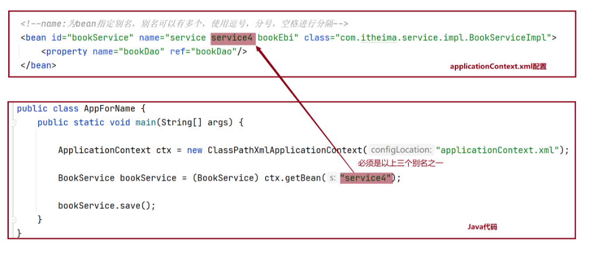
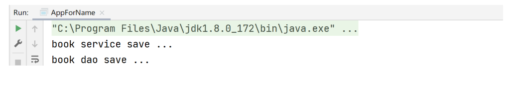
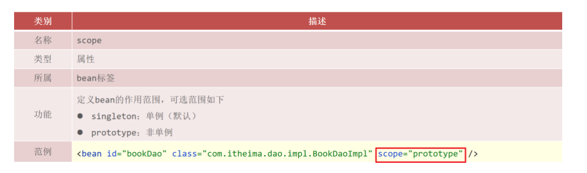
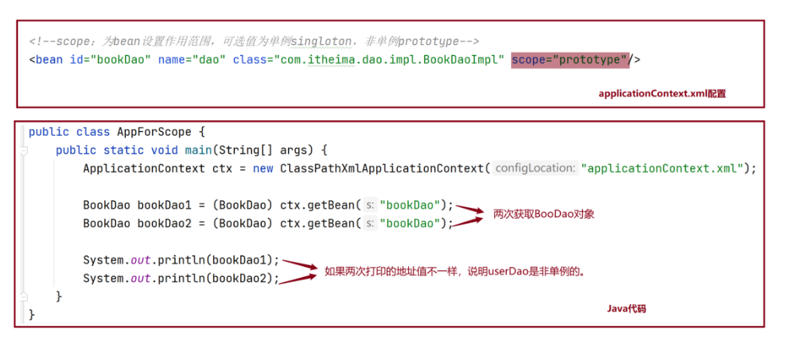
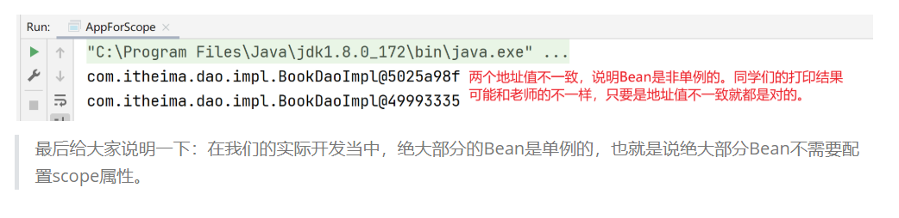

问题 1：在\<bean>标签上如何配置别名？

问题 2：Bean 的默认作用范围是什么？如何修改？

## 1 Bean 基础配置

**配置说明**

**代码演示**

> 见《IOC 入门案例》applicationContext.xml 配置

**运行结果**

> 见《IOC 入门案例》运行结果

## 2 Bean 别名配置

**配置说明**

**代码演示**

**打印结果**

## 3 Bean 作用范围配置

**配置说明**

> 扩展：scope 的取值不仅仅只有 singleton 和 prototype，还有 request、session、application、 websocket ，表示创建出的对象放置在 web 容器(tomcat)对应的位置。比如：request 表示保存到 request 域中。

**代码演示**

**打印结果**

