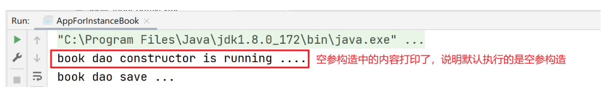
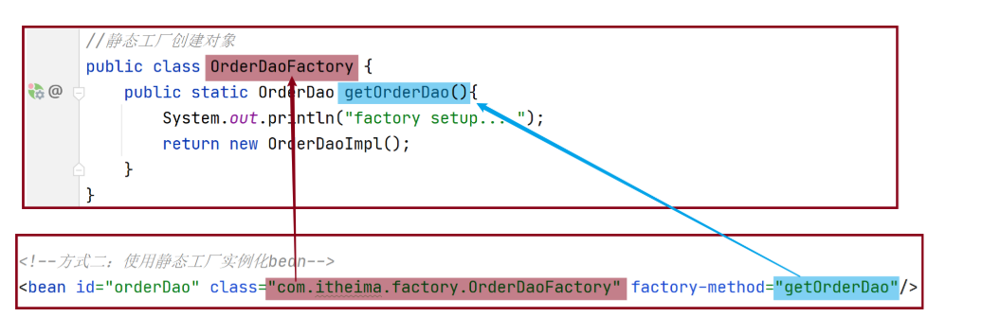
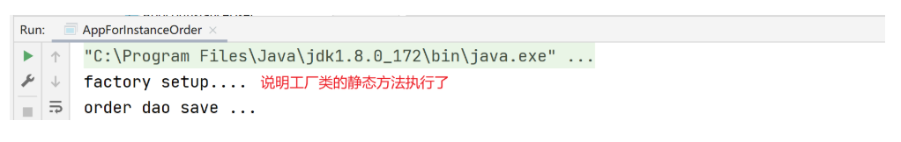
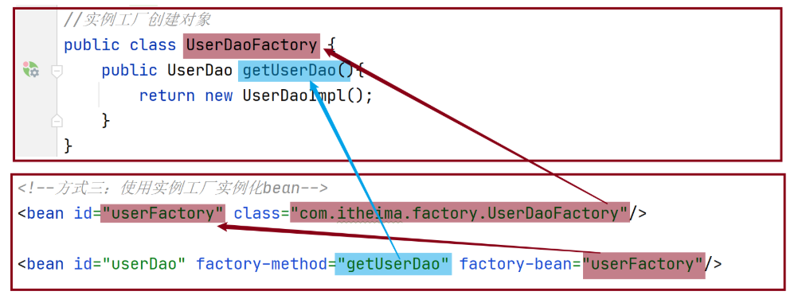
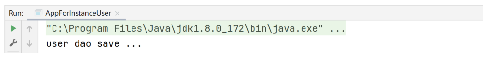

Bean 的实例化方式有几种？

## 1 Bean 是如何创建的

bean 本质上就是对象，创建 bean 使用构造方法完成

## 2 实例化 Bean 的三种方式

### 2.1 构造方法方式

- BookDaoImpl 实现类

```java
public class BookDaoImpl implements BookDao {
    public BookDaoImpl() {
        System.out.println("book dao constructor is running ....");
    }
    public void save() {
        System.out.println("book dao save ...");
    }
}
```

- applicationContext.xml 配置

```java
public class AppForInstanceBook {
    public static void main(String[] args) {
        ApplicationContext ctx = new ClassPathXmlApplicationContext("applicationContext.xml");

        BookDao bookDao = (BookDao) ctx.getBean("bookDao");

        bookDao.save();
    }
}
```

- 运行结果



> 注意：无参构造方法如果不存在，将抛出异常`BeanCreationException`

### 2.2 静态工厂方式

- OrderDao 接口和 OrderDaoImpl 实现类

```java
public interface OrderDao {
    public void save();
}
public class OrderDaoImpl implements OrderDao {
    public void save() {
        System.out.println("order dao save ...");
    }
}
```

- OrderDaoFatory 工厂类

```java
//静态工厂创建对象
public class OrderDaoFactory {
    public static OrderDao getOrderDao(){
        System.out.println("factory setup....");
        return new OrderDaoImpl();
    }
}
```

- applicationContext.xml 配置

```xml
<!--方式二：使用静态工厂实例化bean-->
<bean id="orderDao" class="com.itheima.factory.OrderDaoFactory" factory-method="getOrderDao"/>
```



- AppForInstanceOrder 测试类

```java
public class AppForInstanceOrder {
    public static void main(String[] args) {
        ApplicationContext ctx = new ClassPathXmlApplicationContext("applicationContext.xml");

        OrderDao orderDao = (OrderDao) ctx.getBean("orderDao");

        orderDao.save();
    }
}
```

- 运行结果



### 2.3 实例工厂方式

- UserDao 接口和 UserDaoImpl 实现类

```java
public interface UserDao {
    public void save();
}
public class UserDaoImpl implements UserDao {
    public void save() {
        System.out.println("user dao save ...");
    }
}
```

- UserDaoFactory 工厂类

```java
//实例工厂创建对象
public class UserDaoFactory {
    public UserDao getUserDao(){
        return new UserDaoImpl();
    }
}
```

- applicationContext.xml 配置

```xml
<!--方式三：使用实例工厂实例化bean-->
<bean id="userFactory" class="com.itheima.factory.UserDaoFactory"/>

<bean id="userDao" factory-method="getUserDao" factory-bean="userFactory"/>
```



- AppForInstanceUser 测试类

```java
public class AppForInstanceUser {
    public static void main(String[] args) {
        //        //创建实例工厂对象
        //        UserDaoFactory userDaoFactory = new UserDaoFactory();
        //        //通过实例工厂对象创建对象
        //        UserDao userDao = userDaoFactory.getUserDao();
        //        userDao.save();
        ApplicationContext ctx = new ClassPathXmlApplicationContext("applicationContext.xml");
        UserDao userDao = (UserDao) ctx.getBean("userDao");
        userDao.save();
    }
}
```

- 运行结果



### 2.4 实现 FactoryBean\<T>方式

- 定义 UserDaoFactoryBean 实现 FactoryBean\<UserDao>

> UserDaoFactoryBean 中实例化什么类型的对象泛型就是该类型。

```java
//FactoryBean创建对象
public class UserDaoFactoryBean implements FactoryBean<UserDao> {
    //代替原始实例工厂中创建对象的方法
    public UserDao getObject() throws Exception {
        return new UserDaoImpl();
    }

    public Class<?> getObjectType() {
        return UserDao.class;
    }
}
```

- applicationContext.xml 配置

```xml
<!--方式四：使用FactoryBean实例化bean-->
<bean id="userDao" class="com.itheima.factory.UserDaoFactoryBean"/>
```

> 使用之前的 AppForInstanceUser 测试类去运行看结果就行了。注意配置文件中 id="userDao"是否重复。
