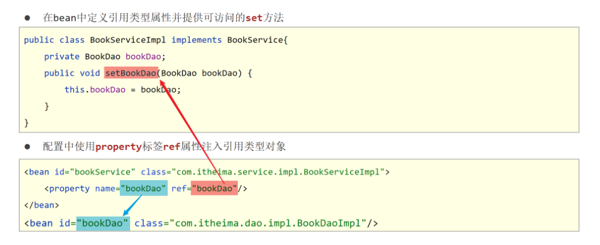
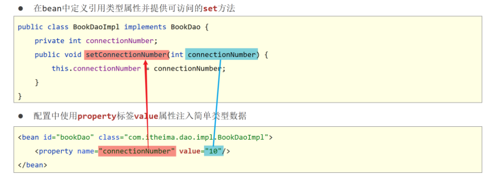
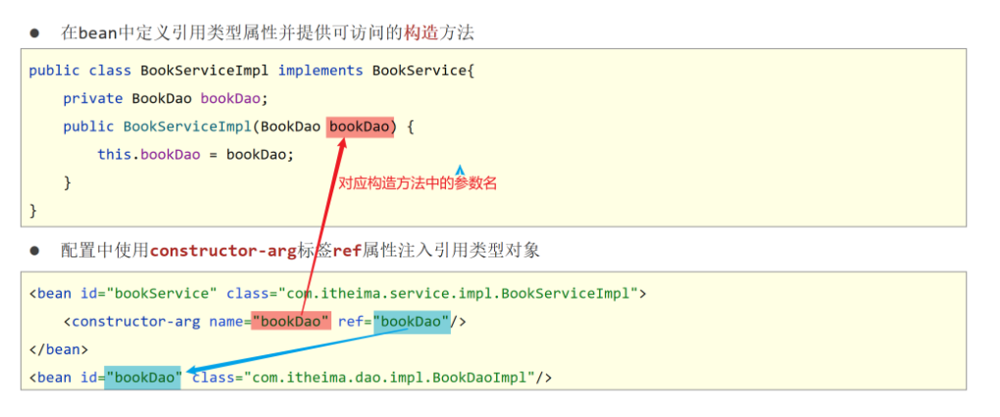
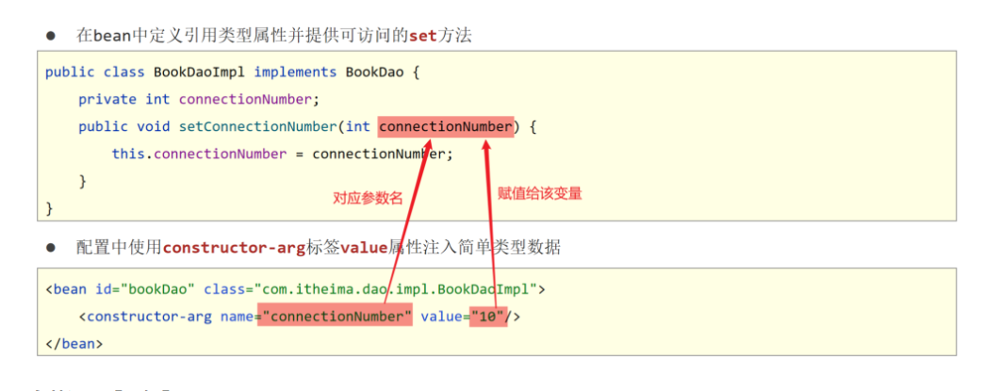
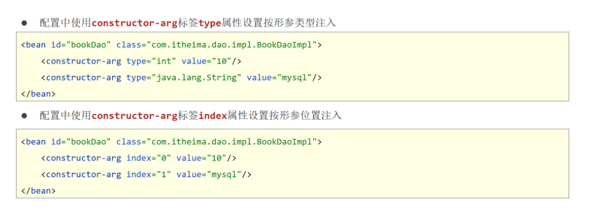

## 1 依赖注入方式

### 1.1 依赖注入的两种方式

- setter 注入  
  简单类型  
  **引用类型(很常用)**
- 构造器注入  
  简单类型  
  引用类型

### 1.2 setter 方式注入

setter 方式注入使用什么子标签？

**引用类型**



**简单类型**



### 1.3 构造方式注入

构造方式注入使用什么子标签？

**引用类型**



**简单类型**



**参数适配**



### 1.4 依赖注入方式选择

1. 强制依赖使用构造器进行，使用 setter 注入有概率不进行注入导致 null 对象出现
2. 可选依赖使用 setter 注入进行，灵活性强
3. Spring 框架倡导使用构造器，第三方框架内部大多数采用构造器注入的形式进行数据初始化，相对严谨
4. 如果有必要可以两者同时使用，使用构造器注入完成强制依赖的注入，使用 setter 注入完成可选依赖的注入
5. 实际开发过程中还要根据实际情况分析，如果受控对象没有提供 setter 方法就必须使用构造器注入
6. **自己开发的模块推荐使用 setter 注入**

## 2 依赖自动装配

如何配置按照类型自动装配？

### 2.1 自动装配概念

- IoC 容器根据 bean 所依赖的资源在容器中自动查找并注入到 bean 中的过程称为自动装配
- 自动装配方式  
  **按类型（常用）**  
  按名称  
  按构造方法  
  不启用自动装配

### 2.2 自动装配类型

依赖自动装配

> 配置中使用 bean 标签 autowire 属性设置自动装配的类型

```xml
<bean id="bookDao" class="com.itheima.dao.impl.BookDaoImpl"/>
<bean id="bookService" class="com.itheima.service.impl.BookServiceImpl" autowire="byType"/>
```

依赖自动装配特征

1. 自动装配用于引用类型依赖注入，不能对简单类型进行操作
2. 使用按类型装配时（byType）必须保障容器中相同类型的 bean 唯一，推荐使用
3. 使用按名称装配时（byName）必须保障容器中具有指定名称的 bean，因变量名与配置耦合，不推荐使用
4. 自动装配优先级低于 setter 注入与构造器注入，同时出现时自动装配配置失效

## 3 集合注入

### 3.1 注入数组类型数据

```xml
<property name="array">
    <array>
        <value>100</value>
        <value>200</value>
        <value>300</value>
    </array>
</property>
```

### 3.2 注入 List 类型数据

```xml
<property name="list">
    <list>
        <value>itcast</value>
        <value>itheima</value>
        <value>boxuegu</value>
        <value>chuanzhihui</value>
    </list>
</property>
```

### 3.3 注入 Set 类型数据

```xml
<property name="set">
    <set>
        <value>itcast</value>
        <value>itheima</value>
        <value>boxuegu</value>
        <value>boxuegu</value>
    </set>
</property>
```

### 3.4 注入 Map 类型数据

```xml
<property name="map">
    <map>
        <entry key="country" value="china"/>
        <entry key="province" value="henan"/>
        <entry key="city" value="kaifeng"/>
    </map>
</property>
```

### 3.5 注入 Properties 类型数据

```xml
<property name="properties">
    <props>
        <prop key="country">china</prop>
        <prop key="province">henan</prop>
        <prop key="city">kaifeng</prop>
    </props>
</property>
```

> 说明：property 标签表示 setter 方式注入，构造方式注入 constructor-arg 标签内部也可以写\<array>、\<list>、\<set>、\<map>、\<props>标签
