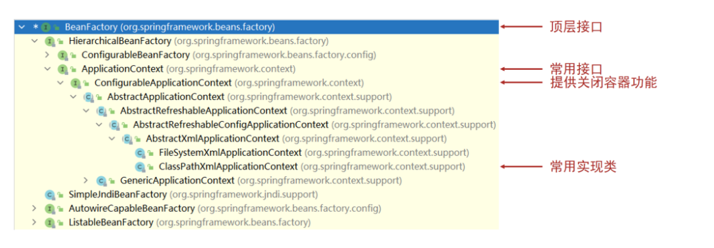
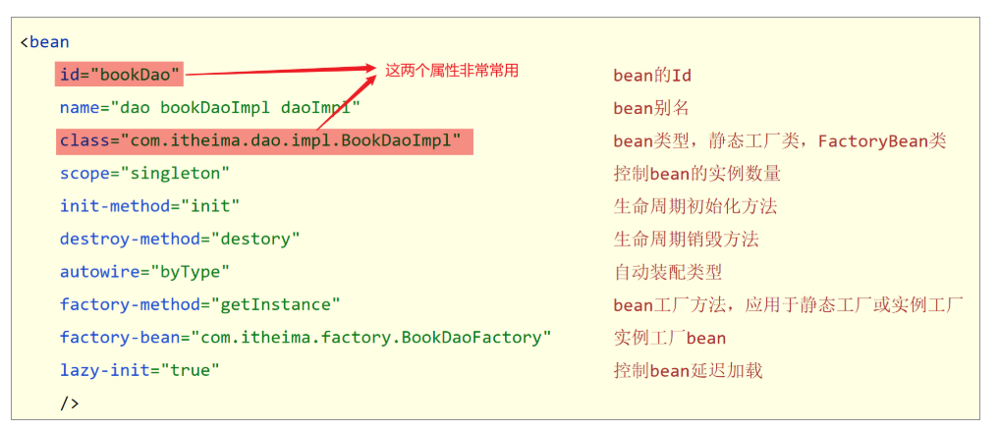
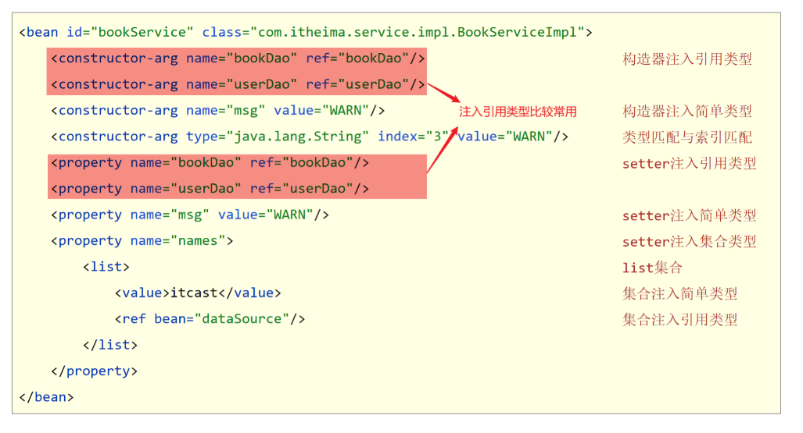

## 1 Spring 核心容器介绍

### 问题导入

问题：按照 Bean 名称获取 Bean 有什么弊端，按照 Bean 类型获取 Bean 有什么弊端？

### 1.1 创建容器

- 方式一：类路径加载配置文件

```java
ApplicationContext ctx = new ClassPathXmlApplicationContext("applicationContext.xml");
```

- 方式二：文件路径加载配置文件

```java
ApplicationContext ctx = new FileSystemXmlApplicationContext("D:\\applicationContext.xml");
```

- 加载多个配置文件

```java
ApplicationContext ctx = new ClassPathXmlApplicationContext("bean1.xml", "bean2.xml");
```

### 1.2 获取 bean 对象

- 方式一：使用 bean 名称获取

> 弊端：需要自己强制类型转换

```java
BookDao bookDao = (BookDao) ctx.getBean("bookDao");
```

- **方式二：使用 bean 名称获取并指定类型**

> 弊端：推荐使用

```java
BookDao bookDao = ctx.getBean("bookDao", BookDao.class);
```

- 方式三：使用 bean 类型获取

> 弊端：如果 IOC 容器中同类型的 Bean 对象有多个，此处获取会报错

```java
BookDao bookDao = ctx.getBean(BookDao.class);
```

### 1.3 容器类层次结构



### 1.4 BeanFactory

- 类路径加载配置文件

```java
Resource resources = new ClassPathResource("applicationContext.xml");
BeanFactory bf = new XmlBeanFactory(resources);
BookDao bookDao = bf.getBean("bookDao", BookDao.class);
bookDao.save();
```

- BeanFactory 创建完毕后，所有的 Bean 均为延迟加载，也就是说我们调用 getBean()方法获取 Bean 对象时才创建 Bean 对象并返回给我们

## 2 Spring 核心容器总结

### 2.1 容器相关

- BeanFactory 是 IoC 容器的顶层接口，初始化 BeanFactory 对象时，加载的 bean 延迟加载
- ApplicationContext 接口是 Spring 容器的核心接口，初始化时 bean 立即加载
- ApplicationContext 接口提供基础的 bean 操作相关方法，通过其他接口扩展其功能
- ApplicationContext 接口常用初始化类
  - **ClassPathXmlApplicationContext(常用)**
  - FileSystemXmlApplicationContext

### 2.2 bean 相关



### 2.3 依赖注入相关


