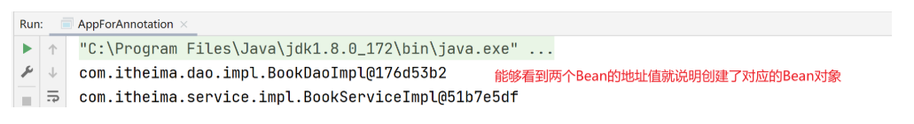
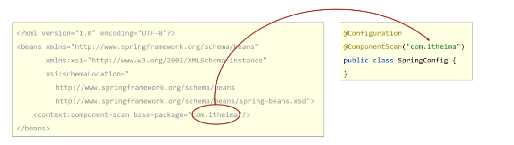
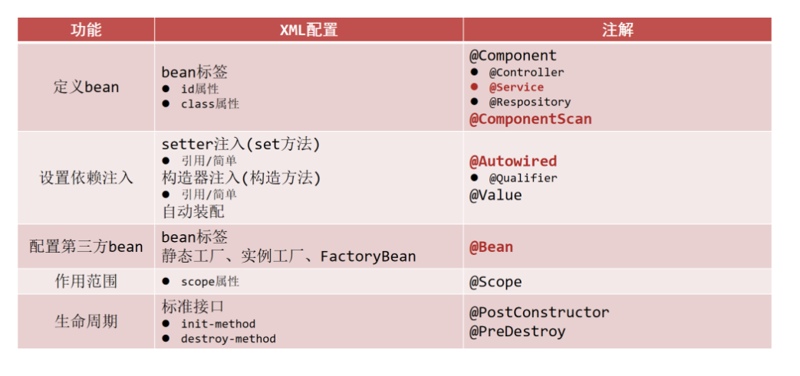

## 1 注解开发定义 Bean 对象

> 目的：xml 配置 Bean 对象有些繁琐，使用注解简化 Bean 对象的定义

### 问题导入

问题 1：使用什么标签进行 Spring 注解包扫描？

问题 2：@Component 注解和@Controller、@Service、@Repository 三个衍生注解有什么区别？

### 1.1 基本使用

**【第一步】在 applicationContext.xml 中开启 Spring 注解包扫描**

```xml
<?xml version="1.0" encoding="UTF-8"?>
<beans xmlns="http://www.springframework.org/schema/beans"
       xmlns:context="http://www.springframework.org/schema/context"
       xmlns:xsi="http://www.w3.org/2001/XMLSchema-instance"
       xsi:schemaLocation="
        http://www.springframework.org/schema/beans http://www.springframework.org/schema/beans/spring-beans.xsd
        http://www.springframework.org/schema/context http://www.springframework.org/schema/context/spring-context.xsd">
	 <!--扫描com.itheima包及其子包下的类中注解-->
    <context:component-scan base-package="com.itheima"/>
</beans>
```

**【第二步】在类上使用@Component 注解定义 Bean。**

```java
//@Component定义bean
@Component("bookDao")
public class BookDaoImpl implements BookDao {
    public void save() {
        System.out.println("book dao save ...");
    }
}
@Component
public class BookServiceImpl implements BookService {
    private BookDao bookDao;

    public void setBookDao(BookDao bookDao) {
        this.bookDao = bookDao;
    }

    public void save() {
        System.out.println("book service save ...");
        bookDao.save();
    }
}

```

> 补充说明：如果@Component 注解没有使用参数指定 Bean 的名称，那么类名首字母小写就是 Bean 在 IOC 容器中的默认名称。例如：BookServiceImpl 对象在 IOC 容器中的名称是 bookServiceImpl。

**【第三步】在测试类中获取 Bean 对象**

```java
public class AppForAnnotation {
    public static void main(String[] args) {
        ApplicationContext ctx = new ClassPathXmlApplicationContext("applicationContext.xml");
        BookDao bookDao = (BookDao) ctx.getBean("bookDao");
        System.out.println(bookDao);
        //按类型获取bean
        BookService bookService = ctx.getBean(BookService.class);
        System.out.println(bookService);
    }
}
```

> 注意：在测试类中不要调用 bookService 的 save 方法，因为还没有给 BookServiceImpl 中的 bookDao 赋值，调用 bookService 的 save 方法会出现空指针异常。

**运行结果**



### 1.2 @Component 三个衍生注解

> 说明：加粗的注解为常用注解

- Spring 提供**`@Component`**注解的三个衍生注解
  - **`@Controller`**：用于表现层 bean 定义
  - **`@Service`**：用于业务层 bean 定义
  - `@Repository`：用于数据层 bean 定义

```java
@Repository("bookDao")
public class BookDaoImpl implements BookDao {
}

@Service
public class BookServiceImpl implements BookService {
}

```

## 2 纯注解开发模式

### 问题导入

问题 1：配置类上使用什么注解表示该类是一个配置类？

问题 2：配置类上使用什么注解进行 Spring 注解包扫描？

### 2.1 纯注解开发模式介绍

- Spring3.0 开启了纯注解开发模式，使用 Java 类替代配置文件，开启了 Spring 快速开发赛道
- Java 类代替 Spring 核心配置文件



- @Configuration 注解用于设定当前类为配置类
- @ComponentScan 注解用于设定扫描路径，此注解只能添加一次，多个数据请用数组格式

```java
@ComponentScan({com.itheima.service","com.itheima.dao"})
```

- 读取 Spring 核心配置文件初始化容器对象切换为读取 Java 配置类初始化容器对象

```java
//加载配置文件初始化容器
ApplicationContext ctx = new ClassPathXmlApplicationContext("applicationContext.xml");
//加载配置类初始化容器
ApplicationContext ctx = new AnnotationConfigApplicationContext(SpringConfig.class);
```

### 2.2 代码演示

**【第一步】定义配置类代替配置文件**

```java
//声明当前类为Spring配置类
@Configuration
//Spring注解扫描，相当于<context:component-scan base-package="com.itheima"/>
@ComponentScan("com.itheima")
//设置bean扫描路径，多个路径书写为字符串数组格式
//@ComponentScan({"com.itheima.service","com.itheima.dao"})
public class SpringConfig {
}
```

**【第二步】在测试类中加载配置类，获取 Bean 对象并使用**

```java
public class AppForAnnotation {
    public static void main(String[] args) {
        //AnnotationConfigApplicationContext加载Spring配置类初始化Spring容器
        ApplicationContext ctx = new AnnotationConfigApplicationContext(SpringConfig.class);
        BookDao bookDao = (BookDao) ctx.getBean("bookDao");
        System.out.println(bookDao);
        //按类型获取bean
        BookService bookService = ctx.getBean(BookService.class);
        System.out.println(bookService);
    }
}
```

## 3 注解开发 Bean 作用范围和生命周期管理

### 问题导入

在类上使用什么注解定义 Bean 的作用范围？

### 3.1 bean 作用范围注解配置

- 使用@Scope 定义 bean 作用范围

```java
@Repository
@Scope("singleton")
public class BookDaoImpl implements BookDao {
}
```

### 3.2 bean 生命周期注解配置

- 使用@PostConstruct、@PreDestroy 定义 bean 生命周期

```java
@Repository
@Scope("singleton")
public class BookDaoImpl implements BookDao {
    public BookDaoImpl() {
        System.out.println("book dao constructor ...");
    }
    @PostConstruct
    public void init(){
        System.out.println("book init ...");
    }
    @PreDestroy
    public void destroy(){
        System.out.println("book destory ...");
    }
}
```

**注意：@PostConstruct 和@PreDestroy 注解是 jdk 中提供的注解，从 jdk9 开始，jdk 中的 javax.annotation 包被移除了，也就是说这两个注解就用不了了，可以额外导入一下依赖解决这个问题。**

```xml
<dependency>
  <groupId>javax.annotation</groupId>
  <artifactId>javax.annotation-api</artifactId>
  <version>1.3.2</version>
</dependency>
```

## 4 注解开发依赖注入

### 问题导入

问题 1：请描述@Autowired 注解是如何进行自动装配的？

问题 2：请描述@Qualifier 注解的作用

### 4.1 使用@Autowired 注解开启自动装配模式（按类型）

```java
@Service
public class BookServiceImpl implements BookService {
    //@Autowired：注入引用类型，自动装配模式，默认按类型装配
    @Autowired
    private BookDao bookDao;

    public void save() {
        System.out.println("book service save ...");
        bookDao.save();
    }
}
```

> 说明：不管是使用配置文件还是配置类，都必须进行对应的 Spring 注解包扫描才可以使用。@Autowired 默认按照类型自动装配，如果 IOC 容器中同类的 Bean 有多个，那么默认按照变量名和 Bean 的名称匹配，建议使用@Qualifier 注解指定要装配的 bean 名称

注意：自动装配基于反射设计创建对象并暴力反射对应属性为私有属性初始化数据，因此无需提供 setter 方法。

### 4.2 使用@Qualifier 注解指定要装配的 bean 名称

> 目的：解决 IOC 容器中同类型 Bean 有多个装配哪一个的问题

```java
@Service
public class BookServiceImpl implements BookService {
    //@Autowired：注入引用类型，自动装配模式，默认按类型装配
    @Autowired
    //@Qualifier：自动装配bean时按bean名称装配
    @Qualifier("bookDao")
    private BookDao bookDao;

    public void save() {
        System.out.println("book service save ...");
        bookDao.save();
    }
}
```

注意：@Qualifier 注解无法单独使用，必须配合@Autowired 注解使用

### 4.3 使用@Value 实现简单类型注入

```java
@Repository("bookDao")
public class BookDaoImpl implements BookDao {
    //@Value：注入简单类型（无需提供set方法）
    @Value("${name}")
    private String name;

    public void save() {
        System.out.println("book dao save ..." + name);
    }
}
```

以上@Value 注解中使用${name}从属性文件中读取 name 值，那么就需要在配置类或者配置文件中加载属性文件。

```java
@Configuration
@ComponentScan("com.itheima")
//@PropertySource加载properties配置文件
@PropertySource({"classpath:jdbc.properties"}) //{}可以省略不写
public class SpringConfig {
}
```

注意：@PropertySource()中加载多文件请使用数组格式配置，不允许使用通配符\*

## 5 注解开发管理第三方 Bean

### 问题导入

导入自己定义的配置类有几种方式？

### **【第一步】单独定义配置类**

```java
public class JdbcConfig {
    //@Bean：表示当前方法的返回值是一个bean对象，添加到IOC容器中
    @Bean
    public DataSource dataSource(){
        DruidDataSource ds = new DruidDataSource();
        ds.setDriverClassName("com.mysql.jdbc.Driver");
        ds.setUrl("jdbc:mysql://localhost:3306/spring_db");
        ds.setUsername("root");
        ds.setPassword("root");
        return ds;
    }
}
```

### **【第二步】将独立的配置类加入核心配置**

#### 方式 1：@Import 注解导入式

```java
@Configuration
@ComponentScan("com.itheima")
//@Import:导入配置信息
@Import({JdbcConfig.class})
public class SpringConfig {
}
```

#### 方式 2：@ComponentScan 扫描式

```java
@Configuration
@ComponentScan({"com.itheima.config","com.itheima.service","com.itheima.dao"})  //只要com.itheima.config包扫到了就行，三个包可以合并写成com.itheima
public class SpringConfig {
}
```

## 6 注解开发为第三方 Bean 注入资源

### 问题导入

配置类中如何注入简单类型数据，如何注入引用类型数据？

### 6.1 简单类型依赖注入

```java
public class JdbcConfig {
    //1.定义一个方法获得要管理的对象
    @Value("com.mysql.jdbc.Driver")
    private String driver;
    @Value("jdbc:mysql://localhost:3306/spring_db")
    private String url;
    @Value("root")
    private String userName;
    @Value("root")
    private String password;
    //2.@Bean：表示当前方法的返回值是一个bean对象，添加到IOC容器中
    @Bean
    public DataSource dataSource(){
        DruidDataSource ds = new DruidDataSource();
        ds.setDriverClassName(driver);
        ds.setUrl(url);
        ds.setUsername(userName);
        ds.setPassword(password);
        return ds;
    }
}
```

> 说明：如果@Value()中使用了 EL 表达式读取 properties 属性文件中的内容，那么就需要加载 properties 属性文件。

### 6.2 引用类型依赖注入

```java
//Spring会自动从IOC容器中找到BookDao对象赋值给参数bookDao变量，如果没有就会报错。
@Bean
public DataSource dataSource(BookDao bookDao){
    System.out.println(bookDao);
    DruidDataSource ds = new DruidDataSource();
    ds.setDriverClassName(driver);
    ds.setUrl(url);
    ds.setUsername(userName);
    ds.setPassword(password);
    return ds;
}
```

> 说明：引用类型注入只需要为 bean 定义方法设置形参即可，容器会根据类型自动装配对象

## 7 注解开发总结


