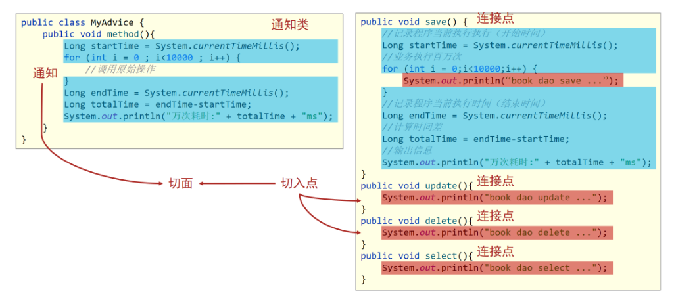
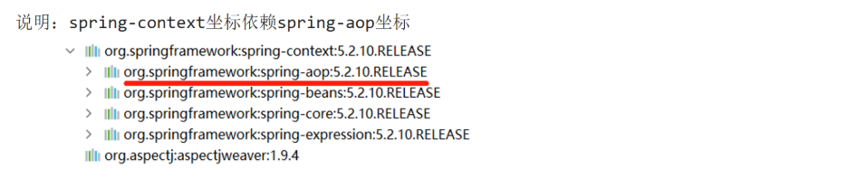
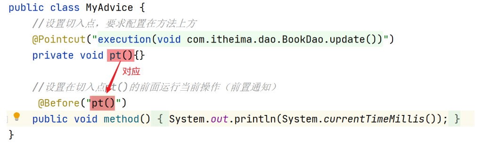
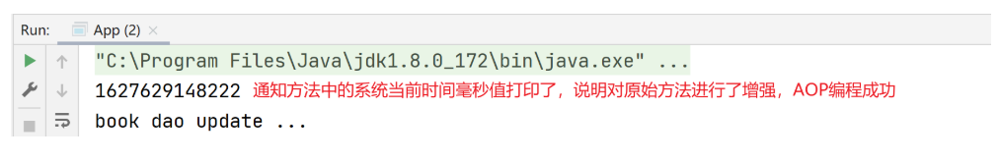
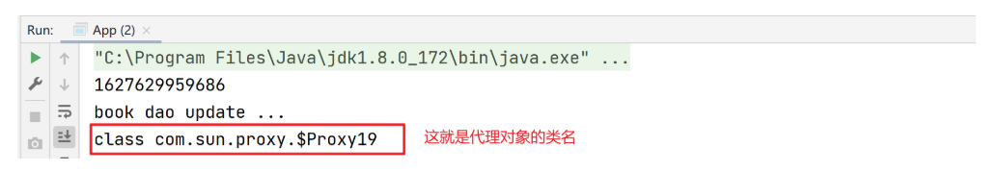

## 1 AOP 简介

### 问题导入

问题 1：AOP 的作用是什么？

问题 2：连接点和切入点有什么区别，二者谁的范围大？

问题 3：请描述什么是切面？

### 1.1 AOP 简介和作用

- AOP(Aspect Oriented Programming)面向切面编程，一种编程范式，指导开发者如何组织程序结构
  - OOP(Object Oriented Programming)面向对象编程
- 作用：在不惊动原始设计的基础上为其进行功能增强。简单的说就是在不改变方法源代码的基础上对方法进行功能增强。
- Spring 理念：无入侵式/无侵入式

### 1.2 AOP 中的核心概念



- 连接点（JoinPoint）：正在执行的方法，例如：update()、delete()、select()等都是连接点。
- 切入点（Pointcut）：进行功能增强了的方法，例如:update()、delete()方法，select()方法没有被增强所以不是切入点，但是是连接点。
  - 在 SpringAOP 中，一个切入点可以只描述一个具体方法，也可以匹配多个方法
    - 一个具体方法：com.itheima.dao 包下的 BookDao 接口中的无形参无返回值的 save 方法
    - 匹配多个方法：所有的 save 方法，所有的 get 开头的方法，所有以 Dao 结尾的接口中的任意方法，所有带有一个参数的方法
- 通知（Advice）：在切入点前后执行的操作，也就是增强的共性功能
  - 在 SpringAOP 中，功能最终以方法的形式呈现
- 通知类：通知方法所在的类叫做通知类
- 切面（Aspect）：描述通知与切入点的对应关系，也就是哪些通知方法对应哪些切入点方法。

## 2 AOP 入门案例

### 问题导入

问题 1：在通知方法中如何定义切入点表达式？

问题 2：如何配置切面？

问题 3：在配置类上如何开启 AOP 注解功能？

### 2.1 AOP 入门案例思路分析

- 案例设定：测定接口执行效率
- 简化设定：在接口执行前输出当前系统时间
- 开发模式：XML or **注解**
- 思路分析：
  1. 导入坐标（pom.xml）
  2. 制作连接点方法（原始操作，dao 接口与实现类）
  3. 制作共性功能（通知类与通知）
  4. 定义切入点
  5. 绑定切入点与通知关系（切面）

### 2.2 AOP 入门案例实现

#### 【第一步】导入 aop 相关坐标

```xml
<dependencies>
    <!--spring核心依赖，会将spring-aop传递进来-->
    <dependency>
        <groupId>org.springframework</groupId>
        <artifactId>spring-context</artifactId>
        <version>5.2.10.RELEASE</version>
    </dependency>
    <!--切入点表达式依赖，目的是找到切入点方法，也就是找到要增强的方法-->
    <dependency>
        <groupId>org.aspectj</groupId>
        <artifactId>aspectjweaver</artifactId>
        <version>1.9.4</version>
    </dependency>
</dependencies>
```



#### 【第二步】定义 dao 接口与实现类

```java
public interface BookDao {
    public void save();
    public void update();
}

@Repository
public class BookDaoImpl implements BookDao {

    public void save() {
        System.out.println(System.currentTimeMillis());
        System.out.println("book dao save ...");
    }
    public void update(){
        System.out.println("book dao update ...");
    }
}
```

#### 【第三步】定义通知类，制作通知方法

```java
//通知类必须配置成Spring管理的bean
@Component
public class MyAdvice {
    public void method(){
        System.out.println(System.currentTimeMillis());
    }
}
```

#### 【第四步】定义切入点表达式、配置切面(绑定切入点与通知关系)

```java
//通知类必须配置成Spring管理的bean
@Component
//设置当前类为切面类类
@Aspect
public class MyAdvice {
    //设置切入点，@Pointcut注解要求配置在方法上方
    @Pointcut("execution(void com.itheima.dao.BookDao.update())")
    private void pt(){}

    //设置在切入点pt()的前面运行当前操作(前置通知)
    @Before("pt()")
    public void method(){
        System.out.println(System.currentTimeMillis());
    }
}
```



#### 【第五步】在配置类中进行 Spring 注解包扫描和开启 AOP 功能

```java
@Configuration
@ComponentScan("com.itheima")
//开启注解开发AOP功能
@EnableAspectJAutoProxy
public class SpringConfig {
}
```

#### 测试类和运行结果

```java
public class App {
    public static void main(String[] args) {
        ApplicationContext ctx = new AnnotationConfigApplicationContext(SpringConfig.class);
        BookDao bookDao = ctx.getBean(BookDao.class);
        bookDao.update();
    }
}
```



## 3 AOP 工作流程

### 问题导入

什么是目标对象？什么是代理对象？

### 3.1 AOP 工作流程

1. Spring 容器启动
2. 读取所有切面配置中的切入点
3. 初始化 bean，判定 bean 对应的类中的方法是否匹配到任意切入点
   - 匹配失败，创建原始对象
   - 匹配成功，创建原始对象（目标对象）的代理对象
4. 获取 bean 执行方法
   - 获取的 bean 是原始对象时，调用方法并执行，完成操作
   - 获取的 bean 是代理对象时，根据代理对象的运行模式运行原始方法与增强的内容，完成操作

### 3.2 AOP 核心概念

目标对象（Target）：被代理的对象，也叫原始对象，该对象中的方法没有任何功能增强。
代理对象（Proxy）：代理后生成的对象，由 Spring 帮我们创建代理对象。

### 3.3 在测试类中验证代理对象

```java
public class App {
    public static void main(String[] args) {
        ApplicationContext ctx = new AnnotationConfigApplicationContext(SpringConfig.class);
        BookDao bookDao = ctx.getBean(BookDao.class);
        bookDao.update();
		//打印对象的类名
        System.out.println(bookDao.getClass());
    }
}
```



## 4 AOP 切入点表达式

### 问题导入

在切入点表达式中如何简化包名和参数类型书写？

### 4.1 语法格式

- 切入点：要进行增强的方法

- 切入点表达式：要进行增强的方法的描述方式

  - 描述方式一：执行 com.itheima.dao 包下的 BookDao 接口中的无参数 update 方法

  ```java
  execution(void com.itheima.dao.BookDao.update())
  ```

  - 描述方式二：执行 com.itheima.dao.impl 包下的 BookDaoImpl 类中的无参数 update 方法

  ```java
  execution(void com.itheima.dao.impl.BookDaoImpl.update())
  ```

- 切入点表达式标准格式：动作关键字(访问修饰符 返回值 包名.类/接口名.方法名(参数) 异常名）

  ```
  execution(public User com.itheima.service.UserService.findById(int))
  ```

  - 动作关键字：描述切入点的行为动作，例如 execution 表示执行到指定切入点
  - 访问修饰符：public，private 等，可以省略
  - 返回值：写返回值类型
  - 包名：多级包使用点连接
  - 类/接口名：
  - 方法名：
  - 参数：直接写参数的类型，多个类型用逗号隔开
  - 异常名：方法定义中抛出指定异常，可以省略

### 4.2 通配符

> 目的：可以使用通配符描述切入点，快速描述。

- ：单个独立的任意符号，可以独立出现，也可以作为前缀或者后缀的匹配符出现

> 匹配 com.itheima 包下的任意包中的 UserService 类或接口中所有 find 开头的带有一个参数的方法

```java
execution（public * com.itheima.*.UserService.find*(*))
```

- .. ：多个连续的任意符号，可以独立出现，常用于简化包名与参数的书写

> 匹配 com 包下的任意包中的 UserService 类或接口中所有名称为 findById 的方法

```java
execution（public User com..UserService.findById(..))
```

- +：专用于匹配子类类型

```java
execution(* *..*Service+.*(..))

```

### 4.3 书写技巧

- 所有代码按照标准规范开发，否则以下技巧全部失效
- 描述切入点通**常描述接口**，而不描述实现类
- 访问控制修饰符针对接口开发均采用 public 描述（**可省略访问控制修饰符描述**）
- 返回值类型对于增删改类使用精准类型加速匹配，对于查询类使用\*通配快速描述
- **包名**书写**尽量不使用..匹配**，效率过低，常用\*做单个包描述匹配，或精准匹配
- **接口名/类名**书写名称与模块相关的**采用\*匹配**，例如 UserService 书写成\*Service，绑定业务层接口名
- **方法名**书写以**动词**进行**精准匹配**，名词采用*匹配，例如 getById 书写成 getBy*,selectAll 书写成 selectAll
- 参数规则较为复杂，根据业务方法灵活调整
- 通常**不使用异常**作为**匹配**规则

## 5 AOP 通知类型

### 问题导入

请描述一下如何定义环绕通知方法？

### 5.1 AOP 通知分类

- AOP 通知描述了抽取的共性功能，根据共性功能抽取的位置不同，最终运行代码时要将其加入到合理的位置
- AOP 通知共分为 5 种类型
  - 前置通知：在切入点方法执行之前执行
  - 后置通知：在切入点方法执行之后执行，无论切入点方法内部是否出现异常，后置通知都会执行。
  - **环绕通知(重点)：**手动调用切入点方法并对其进行增强的通知方式。
  - 返回后通知(了解)：在切入点方法执行之后执行，如果切入点方法内部出现异常将不会执行。
  - 抛出异常后通知(了解)：在切入点方法执行之后执行，只有当切入点方法内部出现异常之后才执行。

### 5.2 AOP 通知详解

#### 5.2.1 前置通知

- 名称：@Before
- 类型：**方法注解**
- 位置：通知方法定义上方
- 作用：设置当前通知方法与切入点之间的绑定关系，当前通知方法在原始切入点方法前运行
- 范例：

```java
@Before("pt()")
public void before() {
    System.out.println("before advice ...");
}
```

#### 5.2.2 后置通知

- 名称：@After
- 类型：**方法注解**
- 位置：通知方法定义上方
- 作用：设置当前通知方法与切入点之间的绑定关系，当前通知方法在原始切入点方法后运行
- 范例：

```java
@After("pt()")
public void after() {
    System.out.println("after advice ...");
}
```

#### 5.2.3 返回后通知

- 名称：@AfterReturning（了解）
- 类型：**方法注解**
- 位置：通知方法定义上方
- 作用：设置当前通知方法与切入点之间的绑定关系，当前通知方法在原始切入点方法正常执行完毕后运行
- 范例：

```java
@AfterReturning("pt()")
public void afterReturning() {
    System.out.println("afterReturning advice ...");
}
```

#### 5.2.4 抛出异常后通知

- 名称：@AfterThrowing（了解）
- 类型：**方法注解**
- 位置：通知方法定义上方
- 作用：设置当前通知方法与切入点之间的绑定关系，当前通知方法在原始切入点方法运行抛出异常后执行
- 范例：

```java
@AfterThrowing("pt()")
public void afterThrowing() {
    System.out.println("afterThrowing advice ...");
}
```

#### 5.2.5 环绕通知

- 名称：@Around（重点，常用）
- 类型：**方法注解**
- 位置：通知方法定义上方
- 作用：设置当前通知方法与切入点之间的绑定关系，当前通知方法在原始切入点方法前后运行
- 范例：：

```java
@Around("pt()")
public Object around(ProceedingJoinPoint pjp) throws Throwable {
    System.out.println("around before advice ...");
    Object ret = pjp.proceed();
    System.out.println("around after advice ...");
    return ret;
}
```

**环绕通知注意事项**

1. 环绕通知方法形参必须是 ProceedingJoinPoint，表示正在执行的连接点，使用该对象的 proceed()方法表示对原始对象方法进行调用，返回值为原始对象方法的返回值。
2. 环绕通知方法的返回值建议写成 Object 类型，用于将原始对象方法的返回值进行返回，哪里使用代理对象就返回到哪里。
