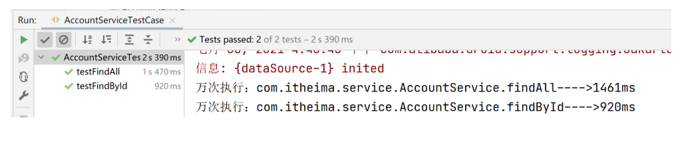

## 1 案例-测量业务层接口万次执行效率

### 问题导入

能不能描述一下环绕通知里面的实现步骤？

### 1.1 需求和分析

需求：任意业务层接口执行均可显示其执行效率（执行时长）

分析：

​ ①：业务功能：业务层接口执行前后分别记录时间，求差值得到执行效率
​ ②：通知类型选择前后均可以增强的类型——环绕通知

### 1.2 代码实现

#### 【前置工作】环境准备

1. Spring 整合 mybatis 对 spring_db 数据库中的 Account 进行 CRUD 操作
2. Spring 整合 Junit 测试 CRUD 是否 OK。
3. 在 pom.xml 中添加 aspectjweaver 切入点表达式依赖
4. ... ...

#### 【第一步】编写通知类

```java
@Component
@Aspect
public class ProjectAdvice {
    //匹配业务层的所有方法
    @Pointcut("execution(* com.itheima.service.*Service.*(..))")
    private void servicePt(){}

    //设置环绕通知，在原始操作的运行前后记录执行时间
    @Around("ProjectAdvice.servicePt()") //本类类名可以省略不写
    public void runSpeed(ProceedingJoinPoint pjp) throws Throwable {
        //获取执行的签名对象
        Signature signature = pjp.getSignature();
        //获取接口/类全限定名
        String className = signature.getDeclaringTypeName();
        //获取方法名
        String methodName = signature.getName();
        //记录开始时间
        long start = System.currentTimeMillis();
        //执行万次操作
        for (int i = 0; i < 10000; i++) {
           pjp.proceed();
        }
        //记录结束时间
        long end = System.currentTimeMillis();
        //打印执行结果
        System.out.println("万次执行："+ className+"."+methodName+"---->" +(end-start) + "ms");
    }
}
```

#### 【第二步】在 SpringConfig 配置类上开启 AOP 注解功能

```java
@Configuration
@ComponentScan("com.itheima")
@PropertySource("classpath:jdbc.properties")
@Import({JdbcConfig.class,MybatisConfig.class})
@EnableAspectJAutoProxy //开启AOP注解功能
public class SpringConfig {
}
```

#### 【第三步】运行测试类，查看结果

```java
@RunWith(SpringJUnit4ClassRunner.class)
@ContextConfiguration(classes = SpringConfig.class)
public class AccountServiceTestCase {
    @Autowired
    private AccountService accountService;
    @Test
    public void testFindById(){
        Account account = accountService.findById(2);
    }
    @Test
    public void testFindAll(){
        List<Account> list = accountService.findAll();
    }
}
```



## 2 AOP 切入点数据获取

### 问题导入

在环绕通知中可以获取到哪些数据？

### 2.1 获取参数

> 说明：在前置通知和环绕通知中都可以获取到连接点方法的参数们

- JoinPoint 对象描述了连接点方法的运行状态，可以获取到原始方法的调用参数

```java
@Before("pt()")
public void before(JoinPoint jp) {
    Object[] args = jp.getArgs(); //获取连接点方法的参数们
    System.out.println(Arrays.toString(args));
}
```

- ProccedJointPoint 是 JoinPoint 的子类

```java
@Around("pt()")
public Object around(ProceedingJoinPoint pjp) throws Throwable {
    Object[] args = pjp.getArgs(); //获取连接点方法的参数们
    System.out.println(Arrays.toString(args));
    Object ret = pjp.proceed();
    return ret;
}
```

### 2.2 获取返回值

> 说明：在返回后通知和环绕通知中都可以获取到连接点方法的返回值

- 抛出异常后通知可以获取切入点方法中出现的异常信息，使用形参可以接收对应的异常对象

```java
@AfterReturning(value = "pt()",returning = "ret")
public void afterReturning(String ret) { //变量名要和returning="ret"的属性值一致
    System.out.println("afterReturning advice ..."+ret);
}
```

- 环绕通知中可以手工书写对原始方法的调用，得到的结果即为原始方法的返回值

```java
@Around("pt()")
public Object around(ProceedingJoinPoint pjp) throws Throwable {
    // 手动调用连接点方法，返回值就是连接点方法的返回值
    Object ret = pjp.proceed();
    return ret;
}
```

### 2.3 获取异常

> 说明：在抛出异常后通知和环绕通知中都可以获取到连接点方法中出现的异常

- 抛出异常后通知可以获取切入点方法中出现的异常信息，使用形参可以接收对应的异常对象

```java
@AfterThrowing(value = "pt()",throwing = "t")
public void afterThrowing(Throwable t) {//变量名要和throwing = "t"的属性值一致
    System.out.println("afterThrowing advice ..."+ t);
}
```

- 抛出异常后通知可以获取切入点方法运行的异常信息，使用形参可以接收运行时抛出的异常对象

```java
@Around("pt()")
public Object around(ProceedingJoinPoint pjp)  {
    Object ret = null;
    //此处需要try...catch处理，catch中捕获到的异常就是连接点方法中抛出的异常
    try {
        ret = pjp.proceed();
    } catch (Throwable t) {
        t.printStackTrace();
    }
    return ret;
}
```

## 3 案例-百度网盘密码数据兼容处理

### 问题导入

请说出我们该使用什么类型的通知来完成这个需求？

### 3.1 需求和分析

需求：对百度网盘分享链接输入密码时尾部多输入的空格做兼容处理


分析：
①：在业务方法执行之前对所有的输入参数进行格式处理——trim()
②：使用处理后的参数调用原始方法——环绕通知中存在对原始方法的调用

### 3.2 代码实现

#### 【前置工作】环境准备

```java
//-------------service层代码-----------------------
public interface ResourcesService {
    public boolean openURL(String url ,String password);
}
@Service
public class ResourcesServiceImpl implements ResourcesService {
    @Autowired
    private ResourcesDao resourcesDao;

    public boolean openURL(String url, String password) {
        return resourcesDao.readResources(url,password);
    }
}
//-------------dao层代码-----------------------
public interface ResourcesDao {
    boolean readResources(String url, String password);
}
@Repository
public class ResourcesDaoImpl implements ResourcesDao {
    public boolean readResources(String url, String password) {
        System.out.println(password.length());
        //模拟校验
        return password.equals("root");
    }
}
```

#### 【第一步】编写通知类

```java
@Component
@Aspect
public class DataAdvice {

    @Pointcut("execution(boolean com.itheima.service.*Service.*(*,*))")
    private void servicePt(){}

    @Around("DataAdvice.servicePt()")
    public Object trimStr(ProceedingJoinPoint pjp) throws Throwable {
        Object[] args = pjp.getArgs();
        for (int i = 0; i < args.length; i++) {
            //判断参数是不是字符串
            if(args[i].getClass().equals(String.class)){
                args[i] = args[i].toString().trim();
            }
        }
        Object ret = pjp.proceed(args);
        return ret;
    }
}
```

#### 【第二步】在 SpringConfig 配置类上开启 AOP 注解功能

```java
@Configuration
@ComponentScan("com.itheima")
@EnableAspectJAutoProxy
public class SpringConfig {
}
```

#### 【第三步】运行测试类，查看结果

```java
public class App {
    public static void main(String[] args) {
        ApplicationContext ctx = new AnnotationConfigApplicationContext(SpringConfig.class);
        ResourcesService resourcesService = ctx.getBean(ResourcesService.class);
        boolean flag = resourcesService.openURL("http://pan.baidu.com/haha", "root ");
        System.out.println(flag);
    }
}
```

## 4 AOP 开发总结

### 4.1 AOP 的核心概念

- 概念：AOP(Aspect Oriented Programming)面向切面编程，一种编程范式
- 作用：在不惊动原始设计的基础上为方法进行功能增强
- 核心概念
  - 代理（Proxy）：SpringAOP 的核心本质是采用代理模式实现的
  - 连接点（JoinPoint）： 在 SpringAOP 中，理解为任意方法的执行
  - 切入点（Pointcut）：匹配连接点的式子，也是具有共性功能的方法描述
  - 通知（Advice）：若干个方法的共性功能，在切入点处执行，最终体现为一个方法
  - 切面（Aspect）：描述通知与切入点的对应关系
  - 目标对象（Target）：被代理的原始对象成为目标对象

### 4.2 切入点表达式语法

- 切入点表达式标准格式：动作关键字(访问修饰符 返回值 包名.类/接口名.方法名（参数）异常名)

  - execution(* com.itheima.service.*Service.\*(..))

- 切入点表达式描述通配符：

  - 作用：用于快速描述，范围描述
  - \*：匹配任意符号（常用）
  - .. ：匹配多个连续的任意符号（常用）
  - +：匹配子类类型

- 切入点表达式书写技巧

  1.按标准规范开发 2.查询操作的返回值建议使用\*匹配 3.减少使用..的形式描述包 4.对接口进行描述，使用\*表示模块名，例如 UserService 的匹配描述为\*Service 5.方法名书写保留动词，例如 get，使用\*表示名词，例如 getById 匹配描述为 getBy\* 6.参数根据实际情况灵活调整

### 4.3 五种通知类型

- 前置通知
- 后置通知
  - 环绕通知（重点）
  - 环绕通知依赖形参 ProceedingJoinPoint 才能实现对原始方法的调用
  - 环绕通知可以隔离原始方法的调用执行
  - 环绕通知返回值设置为 Object 类型
  - 环绕通知中可以对原始方法调用过程中出现的异常进行处理
- 返回后通知
- 抛出异常后通知
