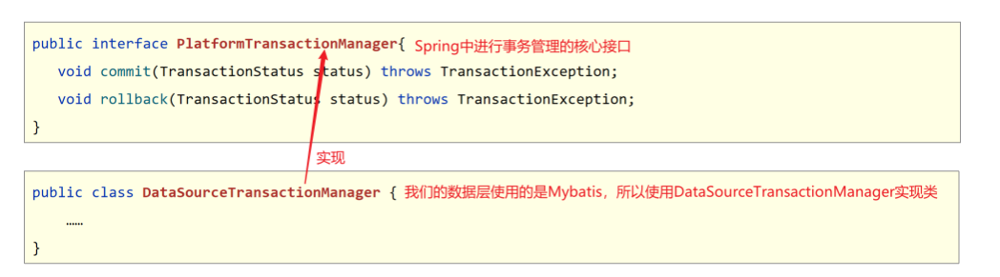

## 1 Spring 事务简介

### 问题导入

Spring 提供的事务管理是数据层的事务还是业务层的事务?

### 1.1 Spring 事务作用

- 事务作用：在数据层保障一系列的数据库操作同成功同失败
- Spring 事务作用：在数据层或**业务层**保障一系列的数据库操作同成功同失败



### 1.2 需求和分析

- 需求：实现任意两个账户间转账操作
- 需求微缩：A 账户减钱，B 账户加钱
- 分析：
  ①：数据层提供基础操作，指定账户减钱（outMoney），指定账户加钱（inMoney）
  ②：业务层提供转账操作（transfer），调用减钱与加钱的操作
  ③：提供 2 个账号和操作金额执行转账操作
  ④：基于 Spring 整合 MyBatis 环境搭建上述操作
- 结果分析：
  ①：程序正常执行时，账户金额 A 减 B 加，没有问题
  ②：程序出现异常后，转账失败，但是异常之前操作成功，异常之后操作失败，整体业务失败

### 1.3 代码实现

#### 【前置工作】环境准备

> Spring 整合 Mybatis 相关代码(依赖、JdbcConfig、MybatisConfig、SpringConfig)省略。

```java
public interface AccountDao {

    @Update("update tbl_account set money = money + #{money} where name = #{name}")
    void inMoney(@Param("name") String name, @Param("money") Double money);

    @Update("update tbl_account set money = money - #{money} where name = #{name}")
    void outMoney(@Param("name") String name, @Param("money") Double money);
}

public interface AccountService {
    /**
     * 转账操作
     * @param out 传出方
     * @param in 转入方
     * @param money 金额
     */
    public void transfer(String out,String in ,Double money) ;
}

@Service
public class AccountServiceImpl implements AccountService {
    @Autowired
    private AccountDao accountDao;

    public void transfer(String out,String in ,Double money) {
        accountDao.outMoney(out,money);
        int i = 1/0;
        accountDao.inMoney(in,money);
    }
}
```

#### 【第一步】在业务层接口上添加 Spring 事务管理

```java
public interface AccountService {
    //配置当前接口方法具有事务
    @Transactional
    public void transfer(String out,String in ,Double money) ;
}
```

注意事项

1. Spring 注解式事务通常添加在业务层接口中而不会添加到业务层实现类中，降低耦合
2. 注解式事务可以添加到业务方法上表示当前方法开启事务，也可以添加到接口上表示当前接口所有方法开启事务

#### 【第二步】设置事务管理器(将事务管理器添加到 IOC 容器中)

> 说明：可以在 JdbcConfig 中配置事务管理器

```java
//配置事务管理器，mybatis使用的是jdbc事务
@Bean
public PlatformTransactionManager transactionManager(DataSource dataSource){
    DataSourceTransactionManager dtm = new DataSourceTransactionManager();
    transactionManager.setDataSource(dataSource);
    return transactionManager;
}
```

注意事项

1. 事务管理器要根据实现技术进行选择
2. MyBatis 框架使用的是 JDBC 事务

#### 【第三步】开启注解式事务驱动

```java
@Configuration
@ComponentScan("com.itheima")
@PropertySource("classpath:jdbc.properties")
@Import({JdbcConfig.class,MybatisConfig.class})
//开启注解式事务驱动
@EnableTransactionManagement
public class SpringConfig {
}
```

#### 【第四步】运行测试类，查看结果

```java
@RunWith(SpringJUnit4ClassRunner.class)
@ContextConfiguration(classes = SpringConfig.class)
public class AccountServiceTest {

    @Autowired
    private AccountService accountService;

    @Test
    public void testTransfer() throws IOException {
        accountService.transfer("Tom","Jerry",100D);
    }
}
```

## 2 Spring 事务角色

### 问题导入

什么是事务管理员，什么是事务协调员？

### 2.1 Spring 事务角色

- 事务管理员：发起事务方，在 Spring 中通常指代业务层开启事务的方法
- 事务协调员：加入事务方，在 Spring 中通常指代数据层方法，也可以是业务层方法


## 3 Spring 事务相关配置

### 问题导入

什么样的异常，Spring 事务默认是不进行回滚的？

### 3.1 事务配置


> 说明：对于 RuntimeException 类型异常或者 Error 错误，Spring 事务能够进行回滚操作。但是对于编译器异常，Spring 事务是不进行回滚的，所以需要使用 rollbackFor 来设置要回滚的异常。

### 3.2 案例：转账业务追加日志

#### 需求和分析

- 需求：实现任意两个账户间转账操作，并对每次转账操作在数据库进行留痕
- 需求微缩：A 账户减钱，B 账户加钱，数据库记录日志
- 分析：
  ①：基于转账操作案例添加日志模块，实现数据库中记录日志
  ②：业务层转账操作（transfer），调用减钱、加钱与记录日志功能
- 实现效果预期：
  无论转账操作是否成功，均进行转账操作的日志留痕
- 存在的问题：
  日志的记录与转账操作隶属同一个事务，同成功同失败
- 实现效果预期改进：
  无论转账操作是否成功，日志必须保留
- 事务传播行为：事务协调员对事务管理员所携带事务的处理态度


#### 【准备工作】环境整备

```sql
USE spring_db;
CREATE TABLE tbl_log(
	id INT PRIMARY KEY AUTO_INCREMENT,
	info VARCHAR(255),
	createDate DATE
);
```

```java
public interface LogService {
    //propagation设置事务属性：传播行为设置为当前操作需要新事务
    @Transactional
    void log(String out, String in, Double money);
}

@Service
public class LogServiceImpl implements LogService {

    @Autowired
    private LogDao logDao;
    public void log(String out,String in,Double money ) {
        logDao.log("转账操作由"+out+"到"+in+",金额："+money);
    }
}

public interface LogDao {
    @Insert("insert into tbl_log (info,createDate) values(#{info},now())")
    void log(String info);
}
```

#### 【第一步】在 AccountServiceImpl 中调用 logService 中添加日志的方法

```java
@Service
public class AccountServiceImpl implements AccountService {
    @Autowired
    private AccountDao accountDao;

    @Autowired
    private LogService logService;

    public void transfer(String out,String in ,Double money) {
        try{
            accountDao.outMoney(out,money);
            int i = 1/0;
            accountDao.inMoney(in,money);
        }finally {
            logService.log(out,in,money);
        }
    }
}
```

#### 【第二步】在 LogService 的 log()方法上设置事务的传播行为

```java
public interface LogService {
    //propagation设置事务属性：传播行为设置为当前操作需要新事务
    @Transactional(propagation = Propagation.REQUIRES_NEW)
    void log(String out, String in, Double money);
}
```

#### 【第三步】运行测试类，查看结果

```java
@RunWith(SpringJUnit4ClassRunner.class)
@ContextConfiguration(classes = SpringConfig.class)
public class AccountServiceTest {
    @Autowired
    private AccountService accountService;

    @Test
    public void testTransfer() throws IOException {
        accountService.transfer("Tom","Jerry",50D);
    }
}
```

### 3.3 事务传播行为


