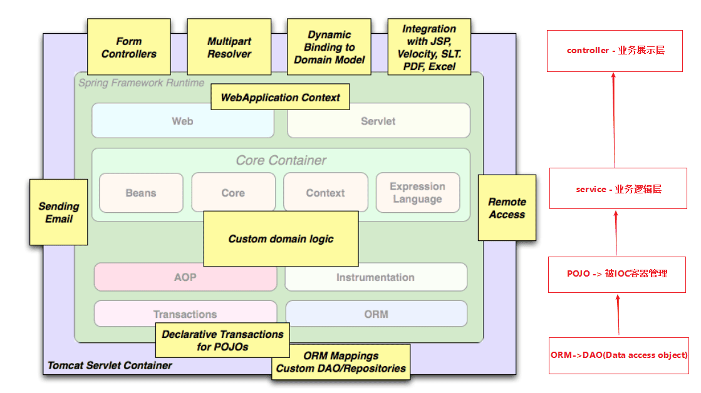
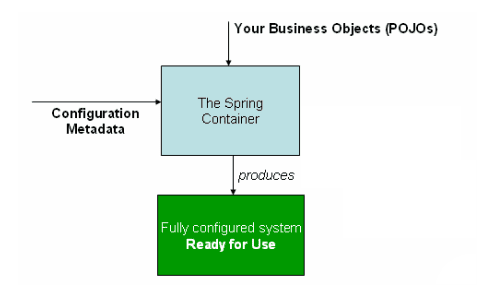

## Spring 框架如何应用

如下是官方在解释 Spring 框架的常用场景的图



## 设计一个 Spring 的 Hello World

> 见例 spring_01_core

## 这个例子体现了 Spring 的哪些核心要点

### 控制反转 - IOC

如果没有 Spring 框架，我们需要自己创建 User/Dao/Service 等，比如：

```java
UserDaoImpl userDao = new UserDaoImpl();
UserSericeImpl userService = new UserServiceImpl();
userService.setUserDao(userDao);
List<User> userList = userService.findUserList();
```

有了 Spring 框架，可以将原有 Bean 的创建工作转给框架, 需要用时从 Bean 的容器中获取即可，这样便简化了开发工作

Bean 的创建和使用分离了。

```java
// create and configure beans
ApplicationContext context =
        new ClassPathXmlApplicationContext("aspects.xml", "daos.xml", "services.xml");

// retrieve configured instance
UserServiceImpl service = context.getBean("userService", UserServiceImpl.class);

// use configured instance
List<User> userList = service.findUserList();
```



更进一步，你便能理解为何会有如下的知识点了：

- Spring 框架管理这些 Bean 的创建工作，即由用户管理 Bean 转变为框架管理 Bean，这个就叫控制反转 - Inversion of Control (IoC)
- Spring 框架托管创建的 Bean 放在哪里呢？ 这便是 IoC Container;
- Spring 框架为了更好让用户配置 Bean，必然会引入不同方式来配置 Bean？ 这便是 xml 配置，Java 配置，注解配置等支持
- Spring 框架既然接管了 Bean 的生成，必然需要管理整个 Bean 的生命周期等；
- 应用程序代码从 Ioc Container 中获取依赖的 Bean，注入到应用程序中，这个过程叫 依赖注入(Dependency Injection，DI) ； 所以说控制反转是通过依赖注入实现的，其实它们是同一个概念的不同角度描述。通俗来说就是 IoC 是设计思想，DI 是实现方式
- 在依赖注入时，有哪些方式呢？这就是构造器方式，@Autowired, @Resource, @Qualifier... 同时 Bean 之间存在依赖（可能存在先后顺序问题，以及循环依赖问题等）

### 面向切面 - AOP

## Spring 框架设计如何逐步简化开发的

### Java 配置方式改造

### 注解配置方式改造

### SpringBoot 托管配置

### 结合 Spring 历史版本和 SpringBoot 看发展
