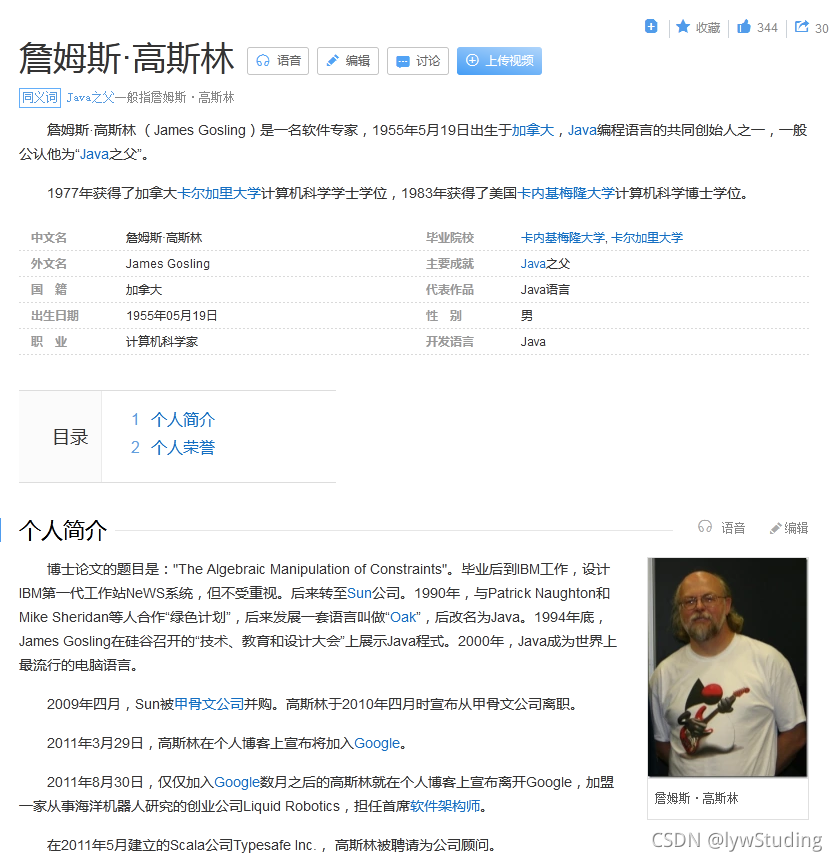
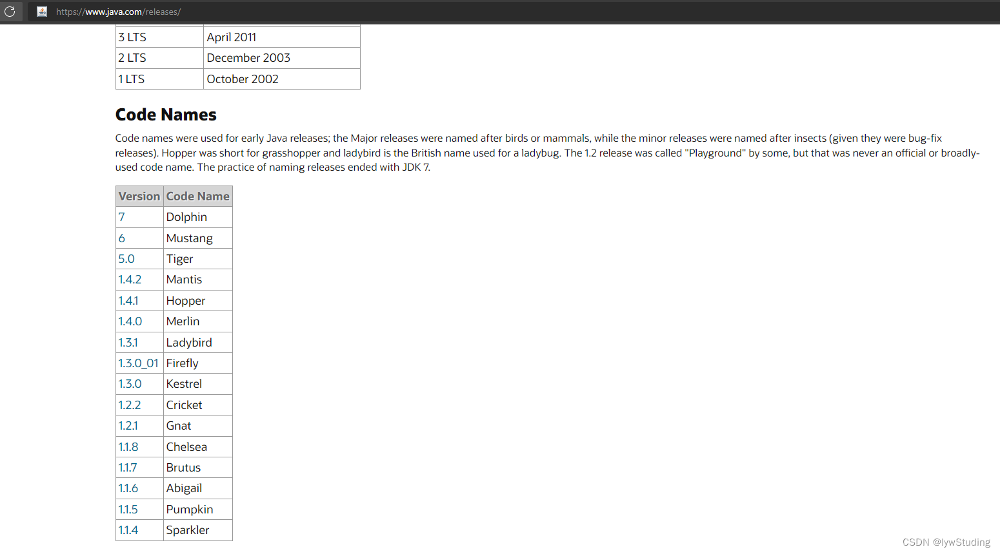
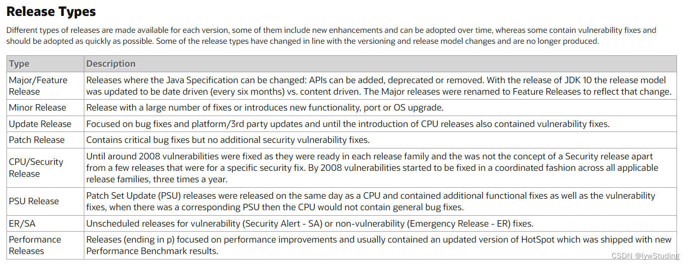
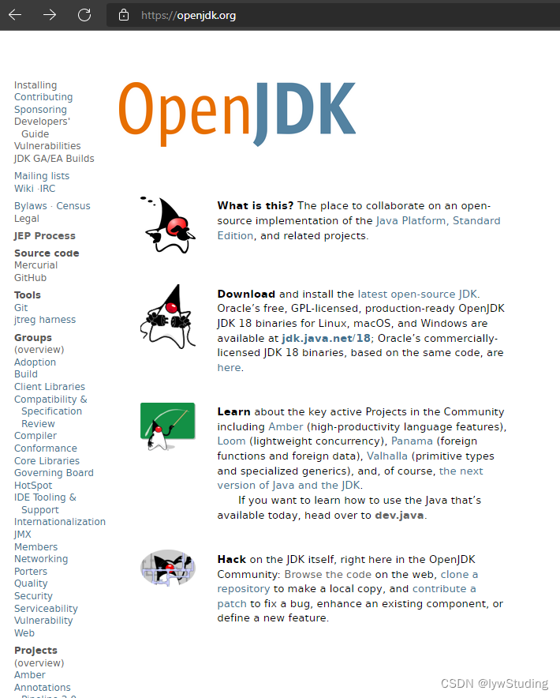
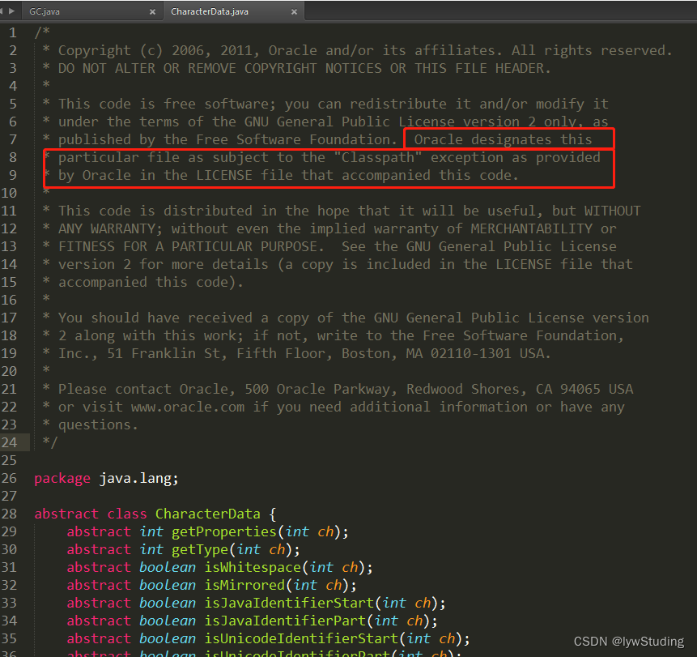
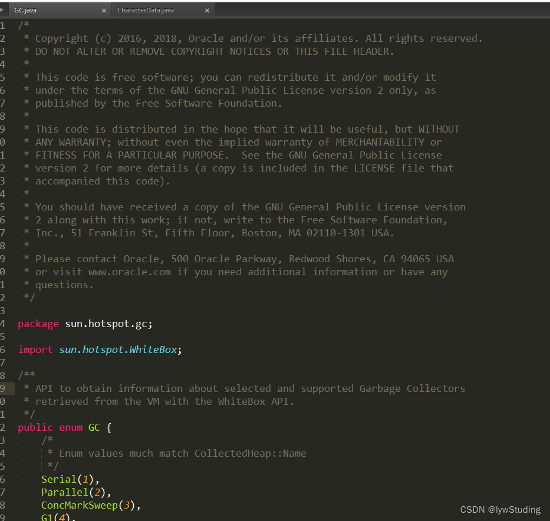
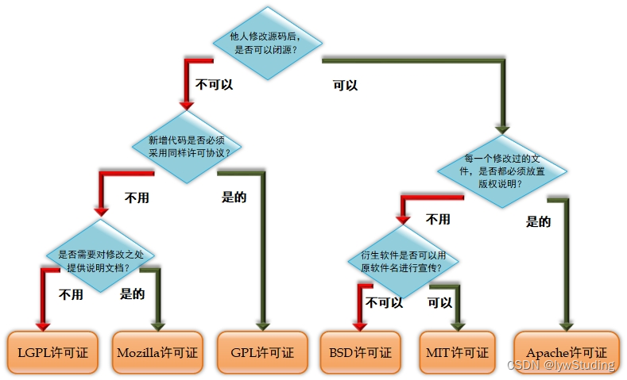

## 一、C 语言和 C++

> Java 的诞生离不开 C 语言和 C++,C++是在 C 语言的基础上改造的，后来 Sun 公司又对 C++ 进行改写，产生了 Java。也可以说 Java 源自于 C 和 C++。

### 1.1 C 语言的诞生

1956 年，美国计算机科学家约翰·巴克斯带领团队开发出了世界上第一个高级编程语言 FORTRAN

FORTRAN 语言是世界上第一个被正式推广使用的高级语言。它是 1954 年被提出来的，1956 年开始正式使用，直到 2022 年已有六十六年的历史，但仍历久不衰，FORTRAN 始终是数值计算领域所使用的主要语言。

1958 年，ALGOL（ALGOrithmic Language）算法语言委员会小组成立，后续发表了 ALGOL 系列算法语言，对后来的高级语言（C、Pascal 等）产生了深远的影响

- 1958 年，ALGOL 58 诞生
- 1960 年，ALGOL 60 诞生
- 1966 年，ALGOL W 出现，碍于调整与改进幅度略显保守，委员会并未以此作为 ALGOL 60 的后继者
- 1968 年，ALGOL 68 诞生

ALGOL 是算法语言（ALGOrithmic Language）的简称，是在计算机发展史上首批清晰定义的高级语言，由欧美计算机学家合力所组成的联席大会于 1950 年代（晶体管计算机流行的年代）所开发。

由于 ALGOL 语句和普通语言表达式接近，更适于数值计算，所以 ALGOL 多用于科学计算机。

1950 年代末期，大量的新增计算机语言涌现，而这些新语言大都围绕单个体系结构如 UNIVAC 计算机、IBM700 系列计算机等开发，使不同系统用 户间的交流变得困难。

1955 年，德国的应用数学和力学学会(Gesellschaft für Angewandte Mathematik und Mechanik,GAMM) 因力拒 IBM 在计算机领域的主导地位，特设置一个专责于设计一通用但与计算机无关的算法语言的开发委员会。

针对这种计算机专用语言大量增多情况，美国一些主要的计算机用户组，在 1957 年 5 月 10 日向国际计算机学会(Association for Computing Machinery，ACM)提交申请，建议研究与开发适用于与计算机无关的科学用程序设计语言。

1957 年末，因在美国涌现多方计算机高级语言，GAMM 原小组委员会认为应该包揽美国同道中人而向 ACM 发出邀请，1958 年 4 月，两个小组正式同意加入这一联合语言设计项目。

1958 年 ALGOL 58 出现

1958 年 5 月 27 日至 6 月 1 日，GAMM 和 ACM 各有 4 人出席在苏黎世举行第一次设计会议，为新语言定下目标。他们把关于算法表示法的建议综合为一，被命名为 IAL（国际代数语言，International Algebraic Language），后来改称 Algol 58。是 ALGOL 家族的第一个成员。

1960 年 ALGOL 60 出现

图灵奖获得者：艾伦.佩利（Alan J.Perlis）在巴黎举行的有全世界一流软件专家参加的讨论会上，发表了"算法语言 Algol 60 报告"，确定了程序设计语言 Algol 60。Algol60 语言的第一个编译器由 Edsger W. Dijkstra 来实现。

Algol 60 引进了许多新的概念如：局部性概念、动态、递归、巴科斯-诺尔范式 BNF（Backus-Naur Form）等等。

Algol 60 是程序设计语言发展史上的一个里程碑，它标志着程序设计语言成为一门独立的科学学科，并为后来软件自动化及软件可靠性的发展奠定了基础。

ALGOL60 语言是计算机发展史上首批产生的高级程式语言家族

1963 年 CPL 语言（Combined Programming Langurage）诞生

1963 年英国剑桥大学推出了 CPL（Combined Programming Langurage）语言，是基于 ALGOL 60 实现的高级语言。CPL 语言在 ALGOL 60 的基础上接近硬件一些，但规模比较大，难以实现。

1967 年 BCPL 语言（the Basic Combined Programming Language）诞生

1967 年英国剑桥大学的 Matin Richards 对 CPL 语言做了简化，推出了 BCPL （the Basic Combined Programming Language）语言。

1969 年 B 语言（The B Programming Language）诞生

20 世纪 60 年代，美国 AT&T 公司贝尔实验室（AT&T Bell Laboratories）的研究员肯·汤普森（Kenneth Lane Thompson）闲来无事，手痒难耐，想玩一个他自己编的，模拟在太阳系航行的电子游戏——Space Travel。他背着老板，找到了台空闲的小型计算机——PDP-7。但这台电脑没有操作系统，而游戏必须使用操作系统的一些功能，于是他着手为 PDP-7 开发操作系统。后来，这个操作系统被命名为——UNICS（Uniplexed Information and Computing Service）。

1969 年，美国贝尔实验室的肯·汤普森（Kenneth Lane Thompson），以 BCPL 语言为基础，又作了进一步的简化，设计出了很简单而且很接近硬件的 B 语言（取 BCPL 的首字母），并且用 B 语言写了初版 UNIX 操作系统（又叫 UNICS）。但 B 语言过于简单，功能有限。

1972 年 C 语言（The C Programming Language）诞生

ALGOL 60 -----------> CPL----------> BCPL-----------> B 语言-----------> C 语言

- 1960 年，ALGOL 60 诞生
- 1963 年，英国剑桥大学基于 ALGOL 60 推出了 CPL（Combined Programming Langurage）语言
- 1967 年，英国剑桥大学的 Matin Richards 对 CPL 语言做了简化，推出了 BCPL （the Basic Combined Programming Language）语言
- 1969 年，美国贝尔实验室的肯·汤普森（Kenneth Lane Thompson），以 BCPL 语言为基础，又作了进一步的简化，设计出了很简单而且很接近硬件的 B 语言（取 BCPL 的首字母），并且用 B 语言写了初版 UNIX 操作系统（又叫 UNICS）。
- 1972 年，美国贝尔实验室的丹尼斯·里奇（D.M.Ritchie ）在 B 语言的基础上最终设计出了一种新的语言，他取了 BCPL 的第二个字母作为这种语言的名字，这就是 C 语言。1973 年初，C 语言的主体完成。汤普森和里奇迫不及待地开始用它完全重写了 UNIX 操作系统。

研制 C 语言的初衷是用它编写 UNIX 系统程序，因此，它实际上是 UNIX 的“副产品”。它充分结合了汇编语言和高级语言的优点，高效而灵活，又容易移植。

1971 年，同样酷爱 Space Travel 的丹尼斯·里奇（D.M.Ritchie ）为了能早点儿玩上游戏，加入了汤普森的开发项目，合作开发 UNIX。他的主要工作是改造 B 语言，使其更成熟。

1972 年，美国贝尔实验室的丹尼斯·里奇（D.M.Ritchie ）在 B 语言的基础上最终设计出了一种新的语言，他取了 BCPL 的第二个字母作为这种语言的名字，这就是 C 语言。

1973 年初，C 语言的主体完成。汤普森和里奇迫不及待地开始用它完全重写了 UNIX（第一个真正的操作系统）。此时，编程的乐趣使他们已经完全忘记了那个“Space Travel”，一门心思地投入到了 UNIX 和 C 语言的开发中。

C 语言既保持 BCPL 语言和 B 语言的优点（精练、接近硬件），又克服了他们的缺点（过于简单，数据无类型等）。

C 语言是一门面向过程的、抽象化的通用程序设计语言，广泛应用于底层开发。C 语言能以简易的方式编译、处理低级存储器。

C 语言是仅产生少量的机器语言以及不需要任何运行环境支持便能运行的高效率程序设计语言。尽管 C 语言提供了许多低级处理的功能，但仍然保持着跨平台的特性，以一个标准规格写出的 C 语言程序可在包括类似嵌入式处理器以及超级计算机等作业平台的许多计算机平台上进行编译。

1970 年，瑞士计算机科学家 Niklaus Wirth 研制出了第一个结构化编程语言 Pascal

ALGOL W ——————> Pascal

Pascal 由瑞士苏黎世联邦工业大学的 Niklaus Wirth 教授于六十年代末设计并创立，Pascal 基于 ALGOL 算法语言实现。1966 年，WG 2.1 工作小组中的 Niklaus Wirth 与 C. A. R. Hoare 以 ALGOL X 为基础作出修改与完善形成 ALGOL W，碍于调整与改进幅度略显保守，委员会并未以此作为 ALGOL 60 的後继者。然而，Niklaus Wirth 在史丹福大学，透过他所撰写的 PL/360 在 IBM/360 上成功运行 ALGOL W。由于 Niklaus Wirth 对的 ALGOL W 研发，使得 1970 年 Pascal 的诞生。

1971 年，Niklaus Wirth 以电脑先驱帕斯卡 pascal 的名字为之命名。Pascal 是最早出现的结构化编程语言，具有丰富的数据类型和简洁灵活的操作语句。高级语言发展过程中，Pascal 是一个重要的里程碑。Pascal 语言是第一个系统地体现了 E.W.Dijkstra 和 C.A.R.Hoare 定义的结构化程序设计概念的语言。

### 1.2 C++ 的诞生

C 语言——————> C++

1983 年 C++（The C++ Programming Language/c plus plus ）诞生

20 世纪 70 年代中期，本贾尼·斯特劳斯特卢普（Bjarne Stroustrup）在剑桥大学计算机中心工作。他使用过 Simula 和 ALGOL，接触过 C。他对 Simula 的类体系感受颇深，对 ALGOL 的结构也很有研究，深知运行效率的意义。既要编程简单、正确可靠，又要运行高效、可移植，是 Bjarne Stroustrup 的初衷。以 C 为背景，以 Simula 思想为基础，正好符合他的设想。

1979 年，本贾尼·斯特劳斯特卢普（Bjame Sgoustrup）到了 Bell 实验室，开始从事将 C 改良为带类的 C（C with classes）的工作。1983 年该语言被正式命名为 C++。

C++是 C 语言的继承，它既可以进行 C 语言的过程化程序设计，又可以进行以抽象数据类型为特点的基于对象的程序设计，还可以进行以继承和多态为特点的面向对象的程序设计。C++擅长面向对象程序设计的同时，还可以进行基于过程的程序设计。

后来 Sun 公司又对 C++ 进行改写，产生了 Java。而微软公司发现 Java 很流行，就造出了一个类似的语言——C#。所以 Java 和 C# 都源自于 C++。

## 二、Java 的诞生

1991 年 Java 的前身"Oak"语言开始着手研发

20 世纪 90 年代（1990 年代），硬件领域出现了单片式计算机系统，这种价格低廉的系统一出现就立即引起了自动控制领域人员的注意，因为使用它可以大幅度提升消费类电子产品（如电视机顶盒、面包烤箱、移动电话等）的智能化程度。美国 Sun 公司（Stanford University Network Microsystems 它其实是斯坦福大学校园网首字母缩写）为了抢占市场先机，在 1991 年成立了一个称为 Green 的项目小组，帕特里克、詹姆斯·高斯林（一个全能的计算机奇才,计算机科学博士，Java 创始人之一，一般公认他为“Java 之父”）、麦克·舍林丹和其他几个工程师一起组成的工作小组在加利福尼亚州门罗帕克市沙丘路的一个小工作室里面研究开发新技术，专攻计算机在家电产品上的嵌入式应用。



由于 Sun 公司的人有 Unix 系统的应用背景，而且 C++所具有的优势，该项目组的研究人员首先考虑采用 C++来编写程序。但对于硬件资源极其匮乏的单片式系统来说，C++程序过于复杂和庞大。另外由于消费电子产品所采用的嵌入式处理器芯片的种类繁杂，如何让编写程序跨平台运行也是个难题。为了解决困难，他们首先着眼于语言的开发，假设了一种结构简单、符合嵌入式应用需要的硬件平台体系结构并为其制定了相应的规范，其中就定义了这种硬件平台的二进制机器码指令系统（即后来成为“字节码”的指令系统），以待语言开发成功后，能有半导体芯片生产商开发和生产这种硬件平台。对于新语言的设计，Sun 公司研发人员并没有开发一种全新的语言，而是根据嵌入式软件的要求，对 C++进行了改造，去除了留在 C++的一些不太实用及影响安全的成分并结合嵌入式系统的实时性要求，开发了一种称为 Oak（Java 的前身代号“橡树”，詹姆斯·高斯林这么起名大概是因为非常喜欢自己办公室外的一颗橡树）的面向对象语言。

1992 年 "Oak"语言开发成功后，由于各种原因无法进入市场，被搁置了下来

由于在开发 Oak 语言时，尚且不存在运行字节码的硬件平台，所以为了在开发时可以对这种语言进行试验研究，他们就在已有的硬件和软件平台基础上，按照自己所指定的规范，用软件建设了一个运行平台，整个系统除了比 C++更加简单之外，没有什么大的区别。1992 年的夏天，当 Oak 语言开发成功后（开发这个版本花费了 18 个月），研究者们向硬件生产商演示了 Green 操作系统、Oak 的程序设计语言、类库和其硬件，以说服他们使用 Oak 语言生产硬件芯片，但是，硬件生产商并未对此产生极大的热情。因为他们认为，在所有人对 Oak 语言还一无所知的情况下，就生产硬件产品的风险实在太大了，所以 Oak 的语言也就因为缺乏硬件的支持而无法进入市场，从而被搁置了下来。

1992 年， Green 项目发了第一个产品，称之为“\*7”，这个产品可以提供非常智能的远程控制，遗憾的是， Sun 公司对这个产品并不感兴趣。Green 项目组的人员必须找出其他的方法来将他们的技术推向市场。然而，仍然没有任何一-家标准 消费品电此感兴趣。于是，Green 项目组投标了一个设计有线电视盒的项目，它能提供视频点播等多型有线服务，但他们没能拿到这个合同(有趣的是，得到这个项目的公司的领导恰恰是开始 Netscape 公司的 Jim Clark。Netscape 公司后来对 Java 的成功给予了很大的帮助)。

1993 年，Green 项目（这时换了一个新名字—— “First Person 公司”）在一这一整年以及 1994 年上半年， 一直苦苦寻求买家购买他们的技术。 然后一个也没有找到(Patrick Naughton 他项目组的创始人之一，也是完成大多数营销工作的人，声称为了销售这项技术，已累计飞行了 300,000 英里)， 然后在 1994 年，Frist Person 公司解散了。

而且在这一年，1994 年 4 月 20 日，一条 64K 的国际专线从中科院计算机网络中心（NCFC 工程）通过美国 Sprint 公司连入 Internet，实现了中国与 Internet 的全功能连接。从此中国被国际上正式承认为第 77 个真正拥有全功能 Internet 的国家。

此时 Internet 的万维网也日渐发展壮大，当时的万维网关键是把浏览器超文本页面转换到屏幕上。在 1994 年大多数都在使用 Mosaic 浏览器（NCSA Mosaic，或简称 Mosaic，是互联网历史上第一个普遍使用和能够显示图片的网页浏览器），这是 1993 年出自伊利诺伊大学超级计算中心的一个非商业化的 Web 浏览器(Mosaic 的一部分是由 Marc Andreessen 编写的。当时，他作为一名参加半工半读项目的本科生，编写了这个软件，每小时的薪水只有 6.85 美元。他后来成了 Netscape 公司的创始人之一和技术总监， 可谓名利双收)。

在接受 SunWorld 采访的时候，Gosling 说，在 1994 年中期，Java 语言的开发者意识到， 在客户/服务器（CS 框架）主流框架中，能够建立一个相当酷的浏览器， 因为浏览器恰好需要的功能：体系结构中立、实时、可靠、安全。1994 年 6、7 月间，在经历了一场历时三天的讨论之后，团队决定再一次改变了努力的目标，这次他们决定将该技术应用于万维网。他们认为随着 Mosaic 浏览器的到来，因特网正在向同样的高度互动的远景演变，而这一远景正是他们在有线电视网中看到的。

1995 年 5 月 23 日 ，在 Oak 更名为 Java 后，Java 在 Sun world 会议上正式诞生

1995 年，互联网的蓬勃发展给了 Oak 机会。业界为了使死板、单调的静态网页能够灵活起来，急需一种软件技术来开发一种程序，这种程序可以通过网络传播并且能够跨平台运行。于是，世界各大 IT 企业维持纷纷投入了大量的人力、物力和财力。这个时候，Sun 公司想起了那个被搁置起来很久的 Oak，并且重新审视了那个用软件编写的试验平台，由于它是按照嵌入式系统硬件平台体系结构进行编写的，所以非常小，特别适用于网络上的传输系统，而 Oak 也是一种精简的语言，程序非常小，适合在网络上传输。
  Sun 公司首先推出了可以嵌入网页并且可以随同网页在网络上传输的 Applet ( Applet 是一种将小程序嵌入到网页中进行执行的技术)，并将 Oak 更名为 Java(在申请注册商标时，发现 Oak 是一种已经有的计算机语言的名字，它的商标已经被使用了，在想了一系列名字之后，最终，使用了提议者在喝一杯 Java 咖啡时无意提到的 Java 词语)。

1995 年 5 月 23 日，Sun 公司在 Sun world 会议上正式发布 Java 和 HotJava 浏览器。实际的浏览器是由 Patrick Naughton 和 Jonathan Payne 开发的，并演变为 HotJava 浏路器. HotJava 浏览器采用 Java 编写，为了炫耀 Java 语言的超强能力。这个浏览器可以在网页中执行内嵌的 Java 代码，也就是 Java Applet。

随后 IBM、Apple、DEC、Adobe、HP、Oracle、Netscape 和微软等各大公司都纷纷停止了自己的相关开发项目，竞相购买了 Java 使用许可证，并为自己的产品开发了相应的 Java 平台。

在 1995 年 5 月推出的 Java 版本，仅仅只是 Alpha 和 Beta 版，API 极其不稳定。

## 三、Java 的发展

1996 年 1 月 23 日 Sun 发布 JDK 1.0 版本

```java
JDK 1.0版本代表性技术有：
	1.初版Java虚拟机——Sun Classic VM
	2.Applet——Java小应用程序
	3.AWT——Java图形设计
```

1996 年 1 月，Sun 公司发布了 Java 的第一个开发工具包（JDK 1.0），这是 Java 发展历程中的重要里程碑，标志着 Java 称为一个独立的开发工具。9 月，约 8.3 万个网页应用了 Java 技术来制作。10 月，Sun 公司发布了 Java 平台的第一个即时（JIT）编译器。JIT 编译器和传统编译器不同，传统的编译器是编译一条，运行完成后将其扔掉。而 JIT 会将经常用到的指令保存在内存中，当调用时就不需要重新编译了，效率有了较大提升。

JDK 1.0 是纯解释运行，使用外挂 JIT，性能比较差，运行速度慢。

Java 早期各版本代号如下所示，Oracle 官网参考来源：https://www.java.com/releases/



> Code names were used for early Java releases; the Major releases were named after birds or mammals, while the minor releases were named after insects (given they were bug-fix releases). Hopper was short for grasshopper and ladybird is the British name used for a ladybug. The 1.2 release was called “Playground” by some, but that was never an official or broadly-used code name. The practice of naming releases ended with JDK 7.  
> 代号用于早期的 Java 版本; 主要版本以鸟类或哺乳动物命名，而次要版本主要以昆虫命名(考虑到它们是 bug 修复版本)。 Hopper 是 grasshopper(蚱蜢)的缩写，ladybird(瓢虫)是瓢虫的英国名字。 1.2 版本被一些人称为“Playground（游乐场）”，但这从来都不是一个官方或广泛使用的代号。 而且 JDK 7（不包括 JDK7）之后不再为版本命名代号了。

<table><thead><tr><th>版本</th><th>代号</th></tr></thead><tbody><tr><td>7</td><td>Dolphin（海豚）</td></tr><tr><td>6</td><td>Mustang（野马）</td></tr><tr><td>5.0</td><td>Tiger（老虎）</td></tr><tr><td>1.4.2</td><td>Mantis（螳螂）</td></tr><tr><td>1.4.1</td><td>Hopper（蚱蜢，grasshopper的缩写）</td></tr><tr><td>1.4.0</td><td>Merlin（灰背隼）</td></tr><tr><td>1.3.1</td><td>Ladybird（瓢虫）</td></tr><tr><td>1.3.0_01</td><td>Firefly（萤火虫）</td></tr><tr><td>1.3.0</td><td>Kestrel（美洲红隼）</td></tr><tr><td>1.2.2</td><td>Cricket（蟋蟀）</td></tr><tr><td>1.2.1</td><td>Gnat（蚋蚊）</td></tr><tr><td>1.1.8</td><td>Chelsea（切尔西–城市名，伦敦自治城市，为文艺界人士聚居地）</td></tr><tr><td>1.1.7</td><td>Brutus（布鲁图–古罗马政治家和将军）</td></tr><tr><td>1.1.6</td><td>Abigail（阿比盖尔–女子名）</td></tr><tr><td>1.1.5</td><td>Pumpkin（南瓜）</td></tr><tr><td>1.1.4</td><td>Sparkler（宝石）</td></tr></tbody></table>

1997 年 2 月 18 日 Sun 发布 JDK 1.1 版本

```java
JDK 1.1 版本代表技术有：
	1.JDBC——Java数据库连接Java DataBase Connectivity
	2.JavaBeans规范
	3.RMI——远程调用
	4.JAR文件格式
语言上的新特性：
	1.Inner Class——添加内部类支持
	2.Reflection——引入反射
```

1997 年 2 月，JDK1.1 面世，在随后的 3 周时间里，达到了 22 万次的下载量。4 月 2 日，Java One 会议召开，参会者逾一万人，创当时全球同类会议规模之记录。9 月，Java Developer Connection 社区成员超过 10 万。

1998 年 12 月 4 日 Sun 发布 JDK 1.2.0 版本

```java
JDK 1.2 版本代表技术有：
	1.Swing
	2.JavaIDL——平台对象请求代理体系结构
	3.EJB
	4.Java Plug-in——Java运行插件
	5.内置JIT（Just In Time）编译器
	6.字符串常量做内存映射
	7.对打包的Java文件进行数字签名
	8.控制授权访问系统资源的策略工具
	9.JDBC中引入可滚动结果集，BLOB,CLOB，批量更新和用户自定义类型
	10.在Applet中添加声音支持
语言上的新特性：
	1.引入Collections集合类
	2.strictfp关键字（对浮点数计算使用严格的规则）
```

该版本中虚拟机第一次内置了 JIT（Just In Time） 即时编译器。  
1998 年 12 月 8 日，第二代 Java 平台的企业版 J2EE 发布。

> 摘抄自《深入理解 JVM 虚拟机——JVM 高级特性与最佳实践》

- 1996 年 1 月 23 日，JDK 1.0 发布，并提供了 Sun Classic VM 虚拟机  
  从 1996 年初 Sun 发布的 JDK 1.0 中包含 Sun Classic 虚拟机到今天，曾经涌现、湮灭过许多经典，或优秀，或有特色，或有争议的虚拟机实现。  
  以今天的视角来看，Sun Classic 虚拟机的技术已经相当原始，这款虚拟机的使命也早已终结。但仅凭它 “世界上第一款商用 Java 虚拟机” 的头衔，就足够有理由记住它。  
  Sun Classic 虚拟机只能使用纯解释器方式来执行 Java 代码，如果要使用即使编译器那就必须要进行外挂，但是加入使用外挂了即时编译器的话，即时编译器就会完全接管虚拟机的执行系统，解释器便不能工作了。由于解释器和编译器不能配合工作，这就意味着如果要使用编译执行，编译器就不得不对每一个方法、每一行代码都进行编译，而无论它们执行的频率是否具有编译的价值。基于程序响应时间的压力，这些编译器根本不敢应用编译耗时稍高的优化技术，因此这个阶段的虚拟机虽然用了即时编译器输出本地代码，其执行效率也和传统的 C/C++程序有很大差距，“Java 语言很慢” 的印象就是在这个阶段开始在用户心中树立起来的。
- Exact VM  
  Sun 的虚拟机团队努力去解决 Classic 虚拟机所面临的各种问题，提升运行效率，在 JDK 1.2 时，曾在 Solaris（Sun 公司研发的一款操作系统）平台上发布过一款名为 Exact VM 虚拟机，它的编译执行系统已经具备现代高性能虚拟机雏形，如热点探测、两级即时编译器、编译器与解释器混合工作模式等。Exact VM 因它使用准确内存管理而得名。准确内存管理是指虚拟机可以知道内存中某个位置的数据具体是什么类型。由于使用了准确内存管理，Exact VM 可以抛弃掉以前 Classic VM 基于句柄（Handle）的对象查找方式。  
  虽然 Exact VM 的技术相对 Classic VM 来说先进了许多，但是它的命运显得十分英雄气短，在商业应用上只存在了很短暂的时间，在 JDK 1.2 时，就被外部引进的 HotSpot VM 所取代。  
  在 JDK 1.2 中，曾并存过三个虚拟机，Classic VM，HotSpot VM 和 Exact VM，其中 Exact VM 只在 Solaris 平台出现过。后面两款虚拟机都是内置了 JIT 即时编译器的，而之前版本所带的 Classic VM 只能以外挂的形式使用即时编译器。  
  Classic VM 的生命周期则相对要长不少，它在 JDK 1.2 之前是 JDK 中唯一的虚拟机，在 JDK 1.2 时，它与 HotSpot VM 并存，但默认是使用 Classic VM（用户可以通过参数切换至 HotSpot VM）。而在 JDK 1.3 时，HotSpot VM 成为默认虚拟机，Classic VM 作为备用选择发布。知道 JDK 1.4 的时候，Classic VM 才完全退出商用虚拟机的历史舞台，与 Exact VM 一起进入了 Sun Labs Research VM 之中。
- 1999 年 4 月 27 日 HotSpot 虚拟机发布  
  1999 年 4 月 27 日，HotSpot 虚拟机发布。HotSpot 最初由一家名为 “Longview Technologies” 的小公司开发，由于 HotSpot 的优异表现，这家公司在 1997 年 被 Sun 公司收购。 HotSpot 虚拟机发布时是作为 JDK 1.2 的附加程序提供的，后来它成为了 JDK 1.3 及之后所有版本的 Sun JDK 的默认虚拟机，同时也是后来 OpenJDK 默认使用的 Java 虚拟机。  
  Oracle 收购 Sun 之后，把原来 BEA JRockit 中的优秀特性融合到 HotSpot 之中，到了 2014 年的 JDK 8 时，HotSpot 在这个过程里移除掉永久代，吸收了 JRockit 的 Java Mission Control 监控工具等功能。

在 JDK 1.2 版本中 sun 公司把 Java 体系分为 J2SE、J2ME、J2EE 三个方向

```java
1999年6月，Sun 公司发布了第二代Java平台（简称Java2）的3个版本。
第二代Java平台的三个方向：
	J2SE（Java 2 Standard Edition，Java2平台的标准版）
	J2ME（Java 2 Micro Edition，Java2平台的微型版）
	J2EE（Java 2 Enterprise Edition，Java 2平台的企业版）

在Java SE 6（包含）发布之后，Sun 公司把 Java 平台的三个方向名称修改如下：
	Java SE（Java Platform, Standard Edition）：
		支持面向桌面级应用（如 Windows 下的应用程序）的 Java 平台，提供了完整的 Java 核心 API。
	Java EE（Java Platform, Enterprise Edition）：
		支持使用多层架构的企业应用（如 ERP、MIS、CRM 应用）的 Java 平台，除了提供 Java SE API 外，
		还对其做了大量有针对性的扩充，并提供了相关部署的支持。
	Java ME（Java Platform, Micro Edition）
		支持 Java 程序运行在移动终端（手机、PDA）上的平台，对 Java API 有所精简，并加入了移动终端的针对性支持。
		但是需要注意的是，主要使用 Java 语言开发程序的 Android 并不属于 Java ME。

Oracle 后面还有一个 Java Card：支持 Java 小程序（Applets）运行在小内存设备（如智能卡）上的平台。
```

Java 2 平台的发布，是 Java 发展过程中最重要的一个里程碑，标志着 Java 的应用开始普及。

2000 年 5 月 8 日 Sun 发布 J2SE 1.3.0 版本，代号 Kestrel（美洲红隼）

```java
JDK 1.3 版本代表性技术有：
	1.新添加了 Java Sound 类库
	2.引入jar文件索引
	3.Java Platform Debugger Architecture用于 Java 调式的平台。
	4.新的 Timer API
	5.使用 CORBA IIOP 来实现RMI的通信协议
	6.提供了大量新的 Java 2D API
	7.JNDI 服务 从 JDK 1.3 开始被作为一项平台级服务提供（以前是一项扩展服务）
	8
性能增强：
	1.提供了性能更好的数学运算（提供了java.lang.StrictMath和java.lang.Math类）
```

[JDK 1.3 Performance Enhancements（性能增强）详情参考官方解释](https://docs.oracle.com/javase/1.5.0/docs/guide/performance/speed.html)

2000 年 5 月，JDK 1.3 、JDK 1.4 和 J2SE 1.3 相继发布，几周后其获得了 Apple 公司 Mac OS X 的工业标准支持。2001 年 9 月 24 日，J2EE1.3 发布。JDK 1.3 和后面的 JDK 1.4 在官网看到也有称为：J2SDK 1.3、J2SDK 1.4

2002 年 2 月 13 日 Sun 发布 J2SE 1.4.0 版本，代号 Merlin（灰背隼）

```java
JDK 1.4 版本代表技术有：
	1.添加XML处理
	2.添加Java打印服务（Java Print Service API）
	3.引入Logging API
	4.引入Java Web Start
	5.引入JDBC 3.0 API
	6.引入Preferences API
	7.引入链式异常处理
	8.支持IPV6
	9.支持正则表达式
	10.引入Image I/O API
	11.NIO（New I/O），非阻塞的 IO，优化 Java 的 IO 读取
	12.XSLT转换器（可扩展样式表转换语言 Extensible Stylesheet Language Transformations，是一种样式转换标记语言，可以将XML数据档转换为另外的XML或其它格式，如HTML网页，纯文字）

语言新特性（New Language Features）：
	Assertion Facility——断言工具，断言是程序员认为有关计算机程序状态的布尔表达式。
	例如，在对list集合进行排序后，程序员可能会断言该list集合是按升序排列的。
	在运行时评估断言以确认其有效性是提高代码质量的最强大工具之一，因为它可以快速揭示程序员对程序行为的误解。
```

[JDK 1.4 Performance Enhancements（性能增强）详情参考官方解释<——](https://docs.oracle.com/javase/1.5.0/docs/guide/performance/speed.html)  
[JDK 1.4 New Language Features（语言新特性）详情参考官方解释<——](https://docs.oracle.com/javase/1.5.0/docs/guide/language/index.html)

2002 年 2 月 26 日，J2SE 1.4 发布。自此 Java 的计算能力有了大幅提升，与 J2SE 1.3 相比，其多了近 62%的类和接口。在这些新特性中，还提供了广泛的 XML 支持，安全套接字（Socket）支持（通过 SSL 与 TLS 协议）、全新的 I/O API、正则表达式、日志与断言。
2002 年前后还发生一件与 Java 没有直接关系，但事实上对 Java 的发展进程影响很大的事件，就是微软的 .NET Framework 发布。这个无论是技术实现还是目标用户上都与 Java 有很多相近之处的技术平台给 Java 带来了很多讨论、比较与竞争，.NET 平台 和 Java 平台之间声势浩大的孰优孰劣的论战到今天为止都仍然没有完全平息。

2004 年 9 月 30 日 Sun 发布 Java SE 5.0 版本，代号 Tiger（老虎）

```java
JDK 5.0 版本语言新特性有：
	1.Generics——泛型
	2.Enhanced for Loop——增强for循环
	3.Autoboxing/Unboxing——自动装箱/拆箱
	4.Typesafe Enums——类型安全的枚举
	5.Varargs——可变长参数
	6.Static Import——静态引入
	7.Annotations——注解
在虚拟机和 API 层面上：
	1、这个版本改进了 Java 的内存模型
	2、提供了 java.util.concurrent 并发包等
```

[JDK 5.0 Performance Enhancements（性能增强）详情参考官方解释<——](https://docs.oracle.com/javase/1.5.0/docs/guide/performance/speed.html)  
[JDK 5.0 New Language Features（语言新特性）详情参考官方解释<——](https://docs.oracle.com/javase/1.5.0/docs/guide/language/index.html)

2004 年 9 月 30 日，J2SE 1.5 发布，成为 Java 语言发展史上的又一里程碑。为了表示该版本的重要性，J2SE 1.5 更名为 Java SE 5.0（内部版本号 1.5.0），代号为“Tiger”，Tiger 包含了从 1996 年发布 1.0 版本以来的最重大的更新，其中包括泛型支持、基本类型的自动装箱、改进的循环、枚举类型、格式化 I/O 及可变参数。

> 摘抄自《深入理解 Java 虚拟机 ——JVM 高级特性与最佳实践 第三版》
> 其实 Sun 公司自 JDK 5 时代起，就曾以 JRL（Java Research License）的形式公开过 Java 的源码，主要是开放给研究人员阅读使用，这种 JRL 许可证的开放源代码一直持续到 JDK 6 Update 23 才因 OpenJDK 项目日渐成熟而终止。

2006 年 12 月 12 日 Sun 发布 Java SE 6 版本（这个版本开始没有后缀.0），代号 Mustang（野马）

```java
JDK 6 版本主要更新内容有：
	1.引入了一个支持脚本引擎的新框架（基于 Mozilla Rhino 的 JavaScript 脚本引擎）
	2.UI的增强
	3.对WebService支持的增强（JAX-WS2.0 和 JAXB2.0）
	4.引入JDBC4.0API
	5.引入Java Compiler API
	6.通用的Annotations注解支持
这个版本对 Java 虚拟机内部做了大量改进：
	1、锁与同步
	2、垃圾收集
	3、类加载
	等方面的实现都有相当多的改动。
```

[JDK 6 Features and Enhancements（特性和增强功能）详情参考官方解释<——](https://www.oracle.com/java/technologies/javase/features.html)

2006 年 12 月 12 日 Sun 发布 Java SE 6 版本（这个版本开始没有后缀 .0 ，之前的 JDK 5.0 中的 .0 也被去除）。此时的各种版本已经更名，已取消其中的数字 2，如 J2EE 更名为 JavaEE（Java Platform, Enterprise Edition），J2SE 更名为 JavaSE（Java Platform, Standard Edition），J2ME 更名为 JavaME（Java Platform, Micro Edition）。

摘抄自《Java 核心技术 卷 1》：

> Java 开发工具包（Java Development Kit ，简称 JDK），这个工具包在版本 1.2~版本 1.4 被称为 Java SDK (Java 软件开发包，Software Development Kit)。

> Java 2 这种提法始于 1998 年，当时 Sun 公司的销售人员感觉增加小数点后面的数值改变版本号并没有反映出 JDK1.2 的重大改进。  
> 由于在发布之后才意识到这个问题，所以决定开发工具包的版本号任然沿用 1.2，接下来的版本是 1.3、1.4 和 5.0。但是，Java 平台被重新命名为 Java 2。  
> 因此，就有了 Java 2 Standard Edition Software Development Kit (Java 2 标准版软件开发包) 的 5.0 版，即 J2SE SDK 5.0  
> 幸运的是，2006 年版本号得到简化。Java 标准版的下一个版本取名为 Java SE 6，后来又有了 Java SE 7 和 Java SE 8。不过，内部版本号分别是 1.6.0、1.7.0 和 1.8.0
> 当 Oracle 为解决一些紧急问题作出某些微小的版本改变时，将其称为更新。  
> 例如：Java SE 8u31 是 Java SE 8 的第 31 次更新，它的内部版本号是 1.8.0_31。另外，并不是所有更新都公开发布，所以如果“更新 31”之后没有"更新 32"，也不必惊慌

官方参考来源：[https://www.java.com/releases/](https://www.java.com/releases/)

When first released Java was named Java Development Kit, abbreviated JDK. With the release of version 2 there was a rebranding to Java 2 - full name: Java 2 Software Development Kit, abbreviated to Java 2 SDK or J2SDK. This was reverted back to JDK with JDK 6 and has stayed that way since.

第一次发布时，Java 被命名为 Java Development Kit，缩写为 JDK。 随着版本 2 的发布，重新命名为 Java 2——全名:Java 2 软件开发工具包，缩写为 Java 2SDK 或 J2SDK。 在 JDK 6 中又恢复了这种情况，并一直保持至今。

Java SE 各版本类型名词解释如下，

官方参考来源：

[1、https://www.java.com/releases/](https://www.java.com/releases/)  
[2、Oracle 官网重要补丁更新、安全警报和公告](https://www.oracle.com/security-alerts/)



<table><thead><tr><th>类型</th><th>描述</th></tr></thead><tbody><tr><td>Major/Feature Release</td><td>表示每个大版本的更新。可以更改Java规范的版本:可以添加、弃用或删除api。 随着JDK 10的发布，发布模型被更新为日期驱动(每六个月一次)而不是内容驱动。 主要版本被重命名为特性版本以反映这种变化。</td></tr><tr><td>Minor Release</td><td>带有大量修复或引入新功能、端口或操作系统升级的版本。</td></tr><tr><td>Update Release</td><td>专注于bug修复和平台/第三方更新，直到CPU版本的引入也包含漏洞修复。</td></tr><tr><td>Patch Release</td><td>包含关键的bug修复，但没有附加的安全漏洞修复。</td></tr><tr><td>CPU（Critical Patch Updates）/Security Release</td><td>Java SE 重要补丁更新（CPU，奇数版本，如 8u201）包含对安全漏洞和关键错误修复的修复。 Oracle 强烈建议所有 Java SE 用户在可用时升级到最新的 CPU 版本。Java SE CPU 版本是奇数版本（即 7u71，7u65 - 请参阅<a href="https://link.ld246.com/forward?goto=https%3A%2F%2Fwww.oracle.com%2Ftechnetwork%2Fjava%2Fjava-update-release-numbers-change-1836624.html">此处</a>有关 Java SE 版本编号方案的更多<a href="https://link.ld246.com/forward?goto=https%3A%2F%2Fwww.oracle.com%2Ftechnetwork%2Fjava%2Fjava-update-release-numbers-change-1836624.html">信息</a>）。</td></tr><tr><td>PSU（Patch Set Update） Release</td><td>Java SE 补丁集更新（PSU，偶数版本，如 8u202）包含相应 CPU 中的所有修复程序，以及其他非关键修复程序。 只有在您受到该版本中修复的其他错误之一的影响时，才应使用 Java PSU 版本。补丁集更新(Patch Set Update, PSU)版本与CPU同一天发布，包含额外的功能补丁和漏洞补丁，当有对应的PSU时，CPU就不会包含一般的bug补丁。 参考网址：<a href="https://ld246.com/article/1547793619176">https://ld246.com/article/1547793619176</a> 但是从 JDK 11 和 JDK 17 的版本号来看似乎没有奇数和偶数这样的版本了。</td></tr><tr><td>ER/SA</td><td>漏洞(安全警报- SA)或非漏洞(紧急发布- ER)修复的计划外发布。</td></tr><tr><td>Performance Releases</td><td>发行版(以p结尾)关注性能改进，通常包含HotSpot的更新版本，并附带新的性能基准测试结果。</td></tr><tr><td>GA Release</td><td>General Availability Release，可供商用的版本</td></tr><tr><td>EA Release</td><td>Early-Access Release，最近通过发布的使用版本</td></tr><tr><td>BPR</td><td>Bundled Patch Release，补丁版本</td></tr></tbody></table>

2006 年 11 月 13 日，Sun 公司宣布，它将在 GNU 通用公共许可第二版，类路径例外（即 GNU General Public License, version 2, with the Classpath Exception）下，将 Java 技术作为免费开源软件对外发布，并陆续开放源代码。

2006 年 11 月 13 日，Java 技术的发明者 Sun 公司宣布，它将在 GNU 通用公共许可第二版，类路径例外（即 GNU General Public License, version 2, with the Classpath Exception）下，将 Java 技术作为免费开源软件对外发布。

Sun 公司正式发布的有 Java SE（Java Platform, Standard Edition） 的第一批源代码，以及 Java ME（Java Platform, Micro Edition） 的可执行源代码。

> 疑问：Java 彻底开源了吗？ 参考来源：[开源中国](https://www.oschina.net/news/79031/is-java-opensource)  
>   2006 年 11 月 13 日，Sun Microsystems 正式开源 Java。事实上 Java 的源代码在发布第一天就可以访问，这一策略帮助 Java 在早年推动了平台的建立。  
>   Java 之父 James Gosling 称，他们公开源代码的意图是让社区帮助进行安全分析、bug 报告、增强性能、了解偏僻个案等。Java 最早使用的许可证允许内部使用源代码但不能分发。  
>   IBM 当时呼吁将 Java 捐给 Apache 软件基金会，使用 Apache 许可证分发，但 Sun 最终决定在 GPL 许可证下开源 Java。GPL 许可证要求衍生版本需要公开分发。Gosling 称这能让 Java 更好的适应开源社区。Sun 在 2010 年被甲骨文收购，Java 也落到了甲骨文手中，由甲骨文主导 Java 的演化。  
>    然而 Java 开源十年之后仍然引起争议，因为 Java 的开源被认为是打了折扣。批评者称，Sun 只开源了 JDK，Java SE 和 Java EE TCKs 仍然是闭源的。

2006 年 11 月 Sun 公司成立了 OpenJDK 开源社区组织（不只有 OpenJDK 中的 jdk 项目，还有和 Java 相关的其它开源项目），对源码进行独立管理

2006 年 11 月 Sun 公司 成立了 OpenJDK 开源组织 对这些源码进行独立管理。只有极少量的产权代码除外（Encumbered Code,这部分代码大多是 Sun 公司本身也无权进行开源处理的，后来被替换为功能相同的开源代码 ），从此 OpenJDK 诞生。

2007 年 3 月起，全世界所有的开发人员均可对 Java 源代码进行修改。

OpenJDK 社区 是协作实现 JavaSE 和 相关项目 的开源实现的地方。

OpenJDK（Open Java Development Kit）是 Java SE（Java Platform，Standard Edition）的开源实现。

参见：[https://openjdk.org/guide/#introduction](https://openjdk.org/guide/#introduction)



> 注意：  
> 1、这里说的 【OpenJDK】 一般是指 【OpenJDK 开源社区】 中的 【jdk 项目】，OpenJDK 开源社区 还有很多其它跟 Java 相关的开源项目  
> 2、这里说的 【许可证】、【许可协议】、【协议】、【许可】 表示都是一个意思

OpenJDK 的许可协议主要包含了 GPL v2（GNU General Public License, version 2）以及 GPL v2 + ClassPath Exception (GNU General Public License, version 2,with the Classpath Exception)， 还有一些是其他协议以及没有协议的文件。

GPL v2 开源协议用一句话解释就是：我给你源码，你给我它的修改。

参考来源：[stackoverflow：OpenJDK 是在什么开源许可证下发布的？](https://stackoverflow.com/questions/16167562/jdk-source-code-license-inconsistency)

What open-source license is OpenJDK published under?

GPL v2 for almost all of the virtual machine, and GPL v2 + the Classpath Exception for the class libraries and those parts of the virtual machine that expose public APIs.

OpenJDK 是在什么开源许可证下发布的？

GPL v2 适用于几乎所有的虚拟机，GPL v2 + ClassPath Exception 适用于类库和虚拟机中暴露公共 API 的部分。

参考来源：为什么 ClassPath Exception 如此重要？

Well, OpenJDK, the open-source implementation of the Java platform, is also licensed under the GPLv2. At least, most of it is; several components have been contributed to the project that uses other licenses like the BSD, Apache or MIT ones. Without some modification, the copyleft nature of the GPL would also extend to any code using the JVM, i.e. any Java application would need to be licensed under the GPLv2!

Clearly, that would not have been good for the Java ecosystem, and we would have seen significantly less adoption than we have since the creation of the OpenJDK project in 2007.

Some people who look at this assume that all GPLv2 licensed code in OpenJDK includes the CPE, but this is not the case. If you search the hotspot source code directory (I took the one from jdk16u), of the 3291 files, only five include the Classpath exception. Conversely, looking at the java.base source directory, only 54 of the 3351 files don’t have the Classpath exception. This is because the Classpath exception is only required when application code touches JDK code directly.

OpenJDK 最早大多数都是在 GPL v2 协议下开源的，OpenJDK 这个项目中已经有几个组件使用了其它的的许可，例如 BSD、Apache 或 MIT 的许可。 如果不做一些修改，GPL 的 copyleft 特性也会扩展到任何使用 JVM 的代码，也就是说，任何 Java 应用程序都需要在 GPL v2 许可下开源!

很明显，这对 Java 生态系统来说不是好事，如果不使用 ClassPath Exception, 我们将会看到自 2007 年 OpenJDK 项目创建以来，采用 Java 的人会明显减少。

有些人认为 OpenJDK 中所有 GPLv2 许可的代码都包含 CPE（ClassPath Exception，类路径例外），但事实并非如此。 搜索 HotSpot 源代码目录(我从 jdk16u 获取了该目录)，在 3291 个文件中，只有 5 个文件包含 ClassPath Exception。 相反，看看 java。 在基本源目录下，3351 个文件中只有 54 个没有 ClassPath Exception。 这是因为只有当应用程序代码直接接触 JDK 代码时才需要 ClassPath Exception。

下面是 ClassPath Exception 原文：

```java
"CLASSPATH" EXCEPTION TO THE GPL

Certain source files distributed by Oracle America and/or its affiliates are
subject to the following clarification and special exception to the GPL, but
only where Oracle has expressly included in the particular source file's header
the words "Oracle designates this particular file as subject to the "Classpath"
exception as provided by Oracle in the LICENSE file that accompanied this code."

    Linking this library statically or dynamically with other modules is making
    a combined work based on this library.  Thus, the terms and conditions of
    the GNU General Public License cover the whole combination.

    As a special exception, the copyright holders of this library give you
    permission to link this library with independent modules to produce an
    executable, regardless of the license terms of these independent modules,
    and to copy and distribute the resulting executable under terms of your
    choice, provided that you also meet, for each linked independent module,
    the terms and conditions of the license of that module.  An independent
    module is a module which is not derived from or based on this library.  If
    you modify this library, you may extend this exception to your version of
    the library, but you are not obligated to do so.  If you do not wish to do
    so, delete this exception statement from your version.
```

翻译总结如下：

1、OpenJDK 项目中只有在源代码文件中包含（一般在源代码开头）【 Oracle designates this particular file as subject to the “Classpath” exception as provided by Oracle in the LICENSE file that accompanied this code.】这句话，这个源代码文件才是 GPL v2 + ClassPath Exception 协议的。

2、将自己写的独立模块（不是从 Java 类库派生的或者基于此类库修改后的）的代码动态或者静态的链接到含有 ClassPath Exception 代码，不受 GPL 影响，不用开放源代码（例如，import 一个 Java 类库包）。而且可以使用自己许可协议进行商业收费。

3、如果有必要，你也可以将 ClassPath Exception 扩展包含到自己写的类库中。

> 注意：开源不等于免费，有些厂商利用开源软件，提供维护支持，漏洞补丁更新等商业服务来赚钱

这么做的好处就是，基于 OpenJDK 开发的 应用程序不用受到 GPL 的影响，且不用开源自己写的程序代码，还可以进行商业收费。只有对于 OpenJDK 项目 本身进行源代码二次开发，修改了源代码的 ，在网上发行的话，才需要开源，或者把源代码修改的部分提供给 OpenJDK 社区。

更多关于 GNU ClassPath Exception 的问题，参见：

1、[https://www.mend.io/resources/blog/top-9-gpl-with-the-classpath-exception-questions-answered/](https://www.mend.io/resources/blog/top-9-gpl-with-the-classpath-exception-questions-answered/)  
2、[https://softwareengineering.stackexchange.com/questions/119436/what-does-gpl-with-classpath-exception-mean-in-practice](https://softwareengineering.stackexchange.com/questions/119436/what-does-gpl-with-classpath-exception-mean-in-practice)  
3、[https://qastack.cn/software/119436/what-does-gpl-with-classpath-exception-mean-in-practice](https://qastack.cn/software/119436/what-does-gpl-with-classpath-exception-mean-in-practice)

```java
注意：
Herein lies the question that all JDK users should consider,
 “How sure are you that all the files that need the CPE have the CPE?”
 If even one file is missing the CPE that needs it, it’s the same as no CPE at all.
```

值得注意的是，直接使用 OpenJDK 不能保证你所有 链接的 Java 类库 都包含 ClassPath Exception，即使你使用 OpenJDK 开发的程序中，只有一个链接的类库文件没有 ClassPath Exception，也等于你的项目都没有 CPE ，为此可能会带来 商业纠纷，特别是 Oracle 要找你扯皮。所以在使用 OpenJDK 开发商业软件 时要注意链接的类库是否包含 CPE。

OpenJDK 常用的核心类库中，源代码开头一般都包含了 ClassPath Exception



但是 hotspot 虚拟机中源代码 GC.java 文件并没有包含 ClassPath Exception ，值得注意



2006 年 12 月，Sun 公司发布了 Java EE 6。

2009 年，甲骨文（Oracle）公司宣布收购 Sun（Stanford University Network Microsystems）公司

2009 年，甲骨文（Oracle）公司宣布收购 Sun。

2010 年，Java 编程语言的共同创始人之一詹姆斯·高斯林从 Oracle 公司辞职。
由于此前 Oracle 已经收购了另外一家大型的中间件企业 BEA 公司，当完成对 Sun 公司收购之后，Oracle 分别从 BEA 和 Sun 手中取得了世界三大商用虚拟机的其中两个：JRockit 和 HotSpot。（另外一个是 IBM 公司的 IBM J9 虚拟机，它的职责分离与模块化做得比 HotSpot 更好）

当时 Oracle 宣布要在未来一段时间内，把这两个优秀的 Java 虚拟机合二为一。两者合并的结果差强人意，JRockit 的 JMC（Java Mission Control，能够监视和管理 Java 应用程序的监控工具）、JFR（Java Flight Recorder，OpenJDK 从 11 版本开始支持。它是一个低开销的数据收集框架，可用于在生产环境中分析 Java 应用和 JVM 运行状况及性能问题。）被移植到了 HotSpot，HotSpot 用本地内存代替永久代实现方法区，支持本地内存使用情况追踪（NMT） 等功能也是从 JRockit 借鉴过来的。

Oracle 收购 Sun 公司之后，OpenJDK 开源社区主要由 Oracle 领导，Sun JDK 也变成了 Oracle JDK，自然 Oracle JDK 就是 Java SE 的闭源实现。

疑问点：为什么有些基于 OpenJDK 构建发行的 JDK 没有开放源代码？

OpenJDK

OpenJDK 每六个月提供一次新功能发布，每三个月提供一次基于每个活动版本的维护/安全更新。安全更新发布日期通常是最接近 1 月，4 月，7 月和 10 月的第 17 天的星期二。

参考来源：[https://adoptium.net/zh-CN/support/](https://adoptium.net/zh-CN/support/)

```java
这里需要注意的是，Oracle 一直直接掌控着 OpenJDK 的漏洞管理，
专门成立了一个 漏洞修复组，并且要求在 Oracle 发布漏洞修复程序之前，他们不会发布该漏洞。
由此可见，Oracle 公司自己家的护城河挖得很深，只有等 Oralce 内部修复之后，开源社区才会发布该漏洞。
参考来源：https://openjdk.org/groups/vulnerability/report
```

OpenJDK 中 JDK GA/EA Builds 是什么意思呢？  
GA ：General availability is the phase of the software release life cycle where the software is made available for sale.  
一般可用性是软件发布生命周期的一个阶段，在这个阶段，软件可供销售。

GA Release ：General Availability Release  
可供商用的版本，正式发布的大的版本

EA Release：Early-Access Release  
最近早期通过发布的版本，例如，JDK 20 还没正式 GA 版本，但是有早期 EA 版本

BPR ：Bundled Patch Release  
补丁版本

这里说的 OpenJDK 是 OpenJDK 开源社区中 jdk 项目，遵循 GPL v2 + ClassPath Exception 开源协议

对于常用的开源协议，可以从下图了解之间的区别（乌克兰程序员 Paul Bagwell 创作的一幅流程图）：

OSI 开源组织官网：https://opensource.org/


