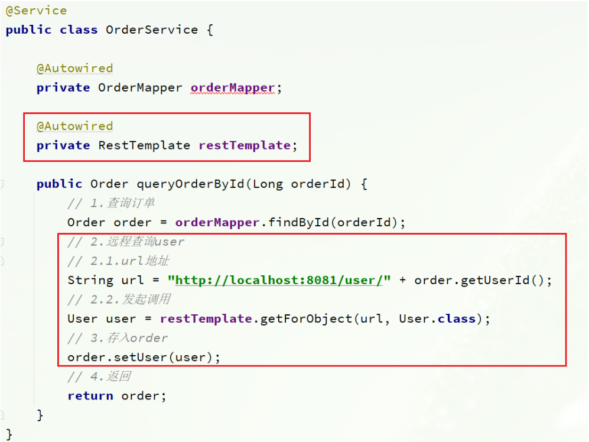

> 任何分布式架构都离不开服务的拆分，微服务也是一样。

## 2.1.服务拆分原则

这里我总结了微服务拆分时的几个原则：

- 不同微服务，不要重复开发相同业务
- 微服务数据独立，不要访问其它微服务的数据库
- 微服务可以将自己的业务暴露为接口，供其它微服务调用


## 2.2.服务拆分示例

以课前资料中的微服务 cloud-demo 为例，其结构如下：


cloud-demo：父工程，管理依赖

- order-service：订单微服务，负责订单相关业务
- user-service：用户微服务，负责用户相关业务

要求：

- 订单微服务和用户微服务都必须有各自的数据库，相互独立
- 订单服务和用户服务都对外暴露 Restful 的接口
- 订单服务如果需要查询用户信息，只能调用用户服务的 Restful 接口，不能查询用户数据库

### 2.2.1.导入 Sql 语句

首先，将课前资料提供的`cloud-order.sql`和`cloud-user.sql`导入到 mysql 中：


cloud-user 表中初始数据如下：


cloud-order 表中初始数据如下：


cloud-order 表中持有 cloud-user 表中的 id 字段。

### 2.2.2.导入 demo 工程

用 IDEA 导入课前资料提供的 Demo：


项目结构如下：


导入后，会在 IDEA 右下角出现弹窗：


点击弹窗，然后按下图选择：


会出现这样的菜单：


配置下项目使用的 JDK：


## 2.3.实现远程调用案例

在 order-service 服务中，有一个根据 id 查询订单的接口：


根据 id 查询订单，返回值是 Order 对象，如图：


其中的 user 为 null

在 user-service 中有一个根据 id 查询用户的接口：


查询的结果如图：


### 2.3.1.案例需求：

修改 order-service 中的根据 id 查询订单业务，要求在查询订单的同时，根据订单中包含的 userId 查询出用户信息，一起返回。


因此，我们需要在 order-service 中 向 user-service 发起一个 http 的请求，调用 http://localhost:8081/user/{userId}这个接口。

大概的步骤是这样的：

- 注册一个 RestTemplate 的实例到 Spring 容器
- 修改 order-service 服务中的 OrderService 类中的 queryOrderById 方法，根据 Order 对象中的 userId 查询 User
- 将查询的 User 填充到 Order 对象，一起返回

### 2.3.2.注册 RestTemplate

首先，我们在 order-service 服务中的 OrderApplication 启动类中，注册 RestTemplate 实例：

```java
package cn.itcast.order;

import org.mybatis.spring.annotation.MapperScan;
import org.springframework.boot.SpringApplication;
import org.springframework.boot.autoconfigure.SpringBootApplication;
import org.springframework.context.annotation.Bean;
import org.springframework.web.client.RestTemplate;

@MapperScan("cn.itcast.order.mapper")
@SpringBootApplication
public class OrderApplication {

    public static void main(String[] args) {
        SpringApplication.run(OrderApplication.class, args);
    }

    @Bean
    public RestTemplate restTemplate() {
        return new RestTemplate();
    }
}
```

### 2.3.3.实现远程调用

修改 order-service 服务中的 cn.itcast.order.service 包下的 OrderService 类中的 queryOrderById 方法：



## 2.4.提供者与消费者

在服务调用关系中，会有两个不同的角色：

**服务提供者**：一次业务中，被其它微服务调用的服务。（提供接口给其它微服务）

**服务消费者**：一次业务中，调用其它微服务的服务。（调用其它微服务提供的接口）


但是，服务提供者与服务消费者的角色并不是绝对的，而是相对于业务而言。

如果服务 A 调用了服务 B，而服务 B 又调用了服务 C，服务 B 的角色是什么？

- 对于 A 调用 B 的业务而言：A 是服务消费者，B 是服务提供者
- 对于 B 调用 C 的业务而言：B 是服务消费者，C 是服务提供者

因此，服务 B 既可以是服务提供者，也可以是服务消费者
