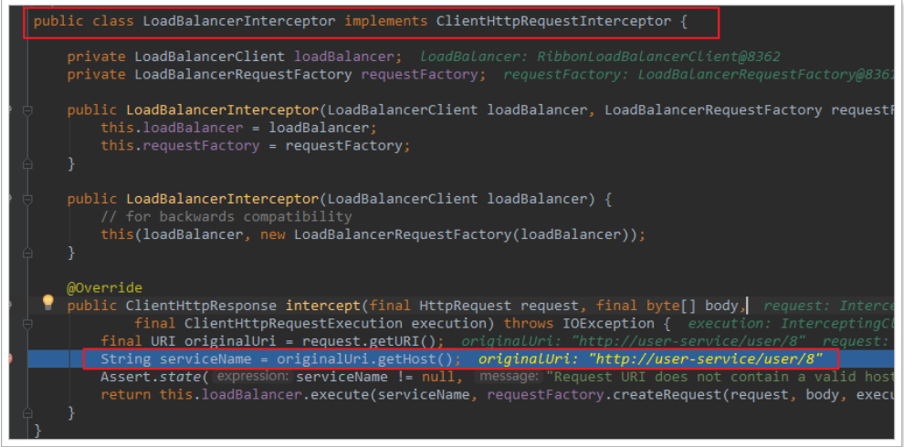
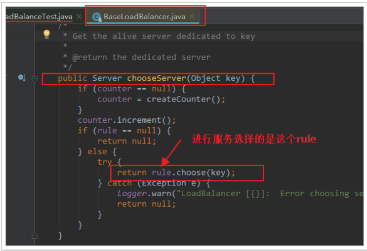
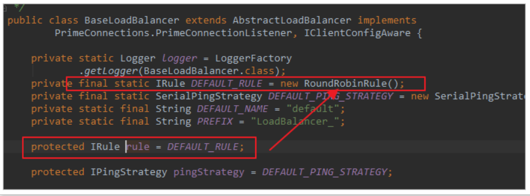
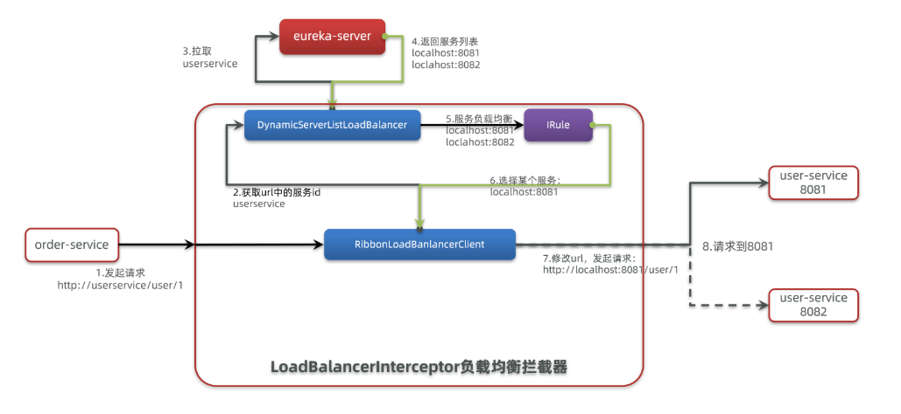

上一节中，我们添加了@LoadBalanced 注解，即可实现负载均衡功能，这是什么原理呢？

## 4.1.负载均衡原理

SpringCloud 底层其实是利用了一个名为 Ribbon 的组件，来实现负载均衡功能的。


那么我们发出的请求明明是 http://userservice/user/1，怎么变成了 http://localhost:8081 的呢？

## 4.2.源码跟踪

为什么我们只输入了 service 名称就可以访问了呢？之前还要获取 ip 和端口。

显然有人帮我们根据 service 名称，获取到了服务实例的 ip 和端口。它就是`LoadBalancerInterceptor`，这个类会在对 RestTemplate 的请求进行拦截，然后从 Eureka 根据服务 id 获取服务列表，随后利用负载均衡算法得到真实的服务地址信息，替换服务 id。

我们进行源码跟踪：

### 1）LoadBalancerIntercepor



可以看到这里的 intercept 方法，拦截了用户的 HttpRequest 请求，然后做了几件事：

- `request.getURI()`：获取请求 uri，本例中就是 http://user-service/user/8
- `originalUri.getHost()`：获取 uri 路径的主机名，其实就是服务 id，`user-service`
- `this.loadBalancer.execute()`：处理服务 id，和用户请求。

这里的`this.loadBalancer`是`LoadBalancerClient`类型，我们继续跟入。

### 2）LoadBalancerClient

继续跟入 execute 方法：


代码是这样的：

- getLoadBalancer(serviceId)：根据服务 id 获取 ILoadBalancer，而 ILoadBalancer 会拿着服务 id 去 eureka 中获取服务列表并保存起来。
- getServer(loadBalancer)：利用内置的负载均衡算法，从服务列表中选择一个。本例中，可以看到获取了 8082 端口的服务

放行后，再次访问并跟踪，发现获取的是 8081：


果然实现了负载均衡。

### 3）负载均衡策略 IRule

在刚才的代码中，可以看到获取服务使通过一个`getServer`方法来做负载均衡:


我们继续跟入：


继续跟踪源码 chooseServer 方法，发现这么一段代码：



我们看看这个 rule 是谁：



这里的 rule 默认值是一个`RoundRobinRule`，看类的介绍：


这不就是轮询的意思嘛。

到这里，整个负载均衡的流程我们就清楚了。

### 4）总结

SpringCloudRibbon 的底层采用了一个拦截器，拦截了 RestTemplate 发出的请求，对地址做了修改。用一幅图来总结一下：



基本流程如下：

- 拦截我们的 RestTemplate 请求 http://userservice/user/1
- RibbonLoadBalancerClient 会从请求 url 中获取服务名称，也就是 user-service
- DynamicServerListLoadBalancer 根据 user-service 到 eureka 拉取服务列表
- eureka 返回列表，localhost:8081、localhost:8082
- IRule 利用内置负载均衡规则，从列表中选择一个，例如 localhost:8081
- RibbonLoadBalancerClient 修改请求地址，用 localhost:8081 替代 userservice，得到 http://localhost:8081/user/1，发起真实请求

## 4.3.负载均衡策略

### 4.3.1.负载均衡策略

负载均衡的规则都定义在 IRule 接口中，而 IRule 有很多不同的实现类：


不同规则的含义如下：

| **内置负载均衡规则类**    | **规则描述**                                                                                                                                                                                                                                                                                                                                                                                                           |
| ------------------------- | ---------------------------------------------------------------------------------------------------------------------------------------------------------------------------------------------------------------------------------------------------------------------------------------------------------------------------------------------------------------------------------------------------------------------- |
| RoundRobinRule            | 简单轮询服务列表来选择服务器。它是 Ribbon 默认的负载均衡规则。                                                                                                                                                                                                                                                                                                                                                         |
| AvailabilityFilteringRule | 对以下两种服务器进行忽略： （1）在默认情况下，这台服务器如果 3 次连接失败，这台服务器就会被设置为“短路”状态。短路状态将持续 30 秒，如果再次连接失败，短路的持续时间就会几何级地增加。 （2）并发数过高的服务器。如果一个服务器的并发连接数过高，配置了 AvailabilityFilteringRule 规则的客户端也会将其忽略。并发连接数的上限，可以由客户端的\<clientName>.\<clientConfigNameSpace>.ActiveConnectionsLimit 属性进行配置。 |
| WeightedResponseTimeRule  | 为每一个服务器赋予一个权重值。服务器响应时间越长，这个服务器的权重就越小。这个规则会随机选择服务器，这个权重值会影响服务器的选择。                                                                                                                                                                                                                                                                                     |
| **ZoneAvoidanceRule**     | 以区域可用的服务器为基础进行服务器的选择。使用 Zone 对服务器进行分类，这个 Zone 可以理解为一个机房、一个机架等。而后再对 Zone 内的多个服务做轮询。                                                                                                                                                                                                                                                                     |
| BestAvailableRule         | 忽略那些短路的服务器，并选择并发数较低的服务器。                                                                                                                                                                                                                                                                                                                                                                       |
| RandomRule                | 随机选择一个可用的服务器。                                                                                                                                                                                                                                                                                                                                                                                             |
| RetryRule                 | 重试机制的选择逻辑                                                                                                                                                                                                                                                                                                                                                                                                     |

默认的实现就是 ZoneAvoidanceRule，是一种轮询方案

### 4.3.2.自定义负载均衡策略

通过定义 IRule 实现可以修改负载均衡规则，有两种方式：

1. 代码方式：在 order-service 中的 OrderApplication 类中，定义一个新的 IRule：

```java
@Bean
public IRule randomRule(){
    return new RandomRule();
}
```

2. 配置文件方式：在 order-service 的 application.yml 文件中，添加新的配置也可以修改规则：

```yaml
userservice: # 给某个微服务配置负载均衡规则，这里是userservice服务
  ribbon:
    NFLoadBalancerRuleClassName: com.netflix.loadbalancer.RandomRule # 负载均衡规则
```

> **注意**，一般用默认的负载均衡规则，不做修改。

## 4.4.饥饿加载

Ribbon 默认是采用懒加载，即第一次访问时才会去创建 LoadBalanceClient，请求时间会很长。

而饥饿加载则会在项目启动时创建，降低第一次访问的耗时，通过下面配置开启饥饿加载：

```yaml
ribbon:
  eager-load:
    enabled: true
    clients: userservice
```
